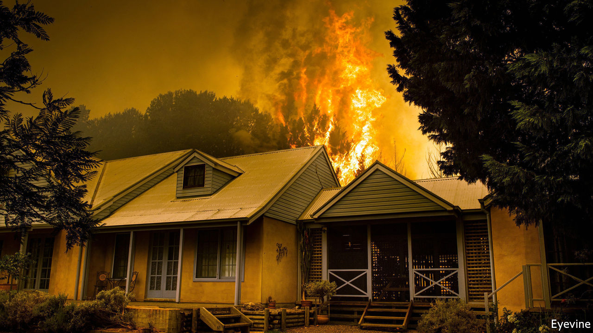

## Summer inferno

# Australia’s bushfires intensify its debate about climate change

> The government that scrapped a carbon tax has no plans to bring it back

> Jan 2nd 2020SYDNEY

THE FIRES eased over Christmas. But as 2020 neared, Australia’s inferno blazed anew. In the state of Victoria, thousands of people fled to the seashore on New Year’s Eve as bushfires ringed the coastal town of Mallacoota. Samuel McPaul, a volunteer firefighter, died earlier in neighbouring New South Wales when a “fire tornado”, as colleagues described it, overturned his vehicle. The federal government has called in military planes and ships to help evacuate people sheltering on beaches in both states. Experts say the fires are the most extensive in Australia’s history and are far from over. They have sparked heated debate about the impact of climate change and the government’s equivocal commitment to tackling it.

New South Wales is the country’s most populous state and has suffered some of the biggest losses: 15 lives and about 1,300 homes. (Pictured is a house under threat in Lake Conjola.) The state’s bushfires have covered almost 40,000 square kilometres, nearly the area of Denmark. That is greater than the total area during the past three years’ fire seasons. These usually start in October, Australia’s mid-spring. In 2019 the fires began in July. A drought that started in eastern Australia three years ago had left plenty of dry fuel. On December 18th Australia as a whole had its hottest day on record, at 41.9°C. The fires have spread across the country, at one point closing the highway to the Nullarbor Plain that links Western Australia to the east coast.

In early December former fire chiefs called on the government to help organise an emergency meeting to discuss the growing threat of wildfires amid global warming. Scott Morrison, the prime minister, had different plans. He took his family on a holiday to Hawaii, without telling the public. After an outcry, and the deaths of two firefighters during his absence, he returned just before Christmas. But he rejected requests to change the approach his conservative Liberal-National coalition takes to climate change.

The government’s climate policy takes its tone from John Howard, a former Liberal prime minister, who once dismissed calls for action as “the latest progressive cause” and a “substitute religion”. As the fires took hold in November, Michael McCormack, the deputy prime minister, blamed “inner-city raving lunatics” for linking them to climate policy and Australia’s coal industry. Coal, a big source of carbon emissions, is Australia’s second-biggest export, and is used to generate almost two-thirds of its electricity. The coalition abolished a carbon tax imposed by the former Labor government. In place of this market-driven mechanism it set up a public fund worth A$3.5bn ($2.5bn), partly to pay polluters to cut emissions.

Critics say such measures are inadequate. Greta Thunberg, a Swedish climate activist, cited the fires when tweeting criticism of Australia’s climate policy. Mr Morrison retorted that he was “not here to try and impress people overseas”. As the fires raged, some countries at a recent UN climate conference in Madrid grumbled about Australia’s apparent sleight of hand, involving the use of carbon credits linked to its emission-reduction targets for 2020 as a way of meeting its higher targets for 2030. Angus Taylor, the energy minister, argues that because Australia produces just 1.3% of global emissions, it “can’t single-handedly have a meaningful impact”.

The fires are raising the temperature of Australia’s climate-change debate. Mr Morrison says climate change is just one of “many factors” behind the inferno. Greg Mullins, a former fire chief, retorts that these factors all relate to climate change. He and fellow ex-chiefs still plan to convene a meeting to discuss the problem, even if the government stays aloof. “We’ll invite the prime minister,” he says, wryly. Some business leaders also want the government to adopt a tougher climate policy. Peter Harmer, the head of IAG, an insurance firm, speaks of an “urgent need for Australia to prepare for and adapt to climate change”. With no end to the bushfires in sight, such calls are bound to grow. ■

Sign up to our new fortnightly climate-change newsletter [here](https://www.economist.com//theclimateissue/)

## URL

https://www.economist.com/asia/2020/01/02/australias-bushfires-intensify-its-debate-about-climate-change
