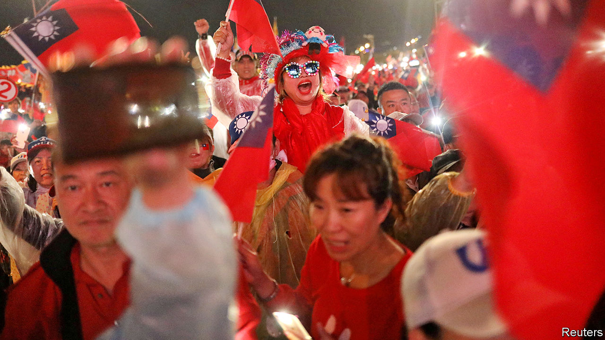

## The Hong Kong effect

# Taiwan’s China-sceptic president, Tsai Ing-wen, may win again

> But the threat from Beijing is not going away

> Jan 2nd 2020KAOHSIUNG AND TAIPEI

ELECTION RALLIES in Taiwan often feel like festivals with a dash of politics thrown in. At a recent one in Taiwan’s capital, Taipei, thousands of people watched a fireworks display, then heard a blind blues singer. Eventually the show’s political star took to the stage: Enoch Wu, a young would-be legislator for the ruling Democratic Progressive Party (DPP). China’s leader, Xi Jinping, “is watching to see if we are sure to defend our homeland,” he told the crowd. “We are,” his fans roared back.

One question always looms largest in Taiwan’s elections for president and parliament, held simultaneously every four years, this time on January 11th: how to handle the island’s twitchy relations with an ever more powerful China. Many of Taiwan’s nearly 24m people have been warily watching the unrest in Hong Kong. Twice in 2019 Mr Xi declared that Taiwan should reunify with the mainland under a “one country, two systems” formula, as Hong Kong did. China’s ability to force such a solution on Taiwan is increasingly plain. On December 26th China sent its newly commissioned aircraft-carrier, the Shandong, through the Taiwan Strait for the second time in as many months.

Since 2000 Taiwanese voters’ main choice for president has been either a candidate who leans toward independence from China, thereby incurring China’s wrath, or one who wants closer ties despite the risk of ensnarement by the mainland’s Communists. So far the China-sceptic, pro-independence DPP has won three times and the China-embracing Kuomintang (KMT) twice. The legislature, however, has usually been controlled by China-friendly types—until 2016, when the DPP secured both the presidency—with Tsai Ing-wen becoming Taiwan’s first female leader—and a majority in the Legislative Yuan, as the parliament is known.

Ms Tsai’s support for Hong Kong’s protesters seems to have boosted her chance of winning again. American talk of “decoupling” from China’s economy, particularly in technology, has helped her, too. Taiwan’s tech giants do not want to risk losing access to Western markets by siding with China. Some are moving out of China and are investing more in South-East Asia and in Taiwan itself. Less focused on the mainland, some Taiwanese businessmen are becoming keener on the DPP.

Ms Tsai’s main opponent is the KMT’s Han Kuo-yu, the mayor of the southern port city of Kaohsiung, which is usually a DPP stronghold. His chances dipped in November when another China-friendly politician, James Soong of the People First Party, entered the fray. Mr Soong may peel away some of Mr Han’s supporters.

The president hammers home her China point. In a televised presidential debate she read out a letter from a young Hong Konger. “I ask Taiwan’s people not believe the Chinese Communists,” the author said. “Don’t fall into China’s money trap.” Ms Tsai also boasts that the economy under the DPP has grown, following a recession under the previous KMT government.

Some voters are not persuaded. Salaries, they grumble, have been virtually flat for almost two decades. The average monthly full-time wage is NT$49,170 ($1,635), including bonuses, far lower than in other rich countries in the region, such as Singapore where it is about S$4,560 ($3,390). Poorer and older people tend to back Mr Han, who harks back to the boom years of the 1970s and 1980s under the KMT. (He avoids reminding them that Taiwan was then a one-party dictatorship).

Mr Han is unlikely to win the presidency, but there is more of a question-mark over the legislature. Mr Wu, the DPP candidate who tried to whip up support with fireworks and blues, may have excited his backers with talk of a Chinese threat. But that is because his KMT rival is Wayne Chiang—a great-grandson of Chiang Kai-shek and grandson of Chiang Ching-kuo, rulers of Taiwan during nearly four decades of martial law. Though the Chiangs hated the Communists for ousting them from China, DPP loyalists consider them China incarnate: mainland-born autocrats who tried to crush Taiwanese culture. All the same, Wayne Chiang, an incumbent MP with a local following, will be hard to beat.

If the DPP loses control of the 113-strong parliament, where it now has 68 seats, Ms Tsai will have a hard time ruling. The KMT and its allies could block bills disliked by China, such as a law passed on December 31st making it illegal to accept Chinese funds for political activities. The KMT says it supports measures to strengthen national security, but condemns the recent bill as too sweeping.

China has denounced it, too, but has largely refrained from sabre-rattling during the campaign to avoid playing into Ms Tsai’s hands. After she was elected, China bolstered its military posturing, for instance with bomber-jets flying around the island. It also persuaded seven of Taiwan’s diplomatic allies to switch to China, reducing the number to 15. But since the middle of 2019 the jets have stopped their exercises. The aircraft-carrier’s transits raised eyebrows in Taiwan, but Andrew Yang, a former deputy defence minister for the KMT, says they were routine tests.

Should the DPP win both the presidency and legislature, China will certainly be unhappy. But Ms Tsai is a pragmatist. She would probably use a new mandate to keep Taiwan on the same course, rebuffing China’s political demands while trying not to pick quarrels that could risk a military conflict. American diplomats would welcome this. They were rattled by the more confrontational approach of the DPP’s Chen Shui-bian, Taiwan’s president from 2000 to 2008, who enraged China with his efforts to assert Taiwan’s separate identity.

But four more years of Ms Tsai would not guarantee peace. President Donald Trump appears to have little interest in sparring with China over Taiwan, but some of his appointees, egged on by many members of Congress, are keen to strengthen America’s unofficial ties with the island. In August the State Department approved the sale of 66 F-16 fighter jets to Taiwan. China’s patience may one day wear thin. ■