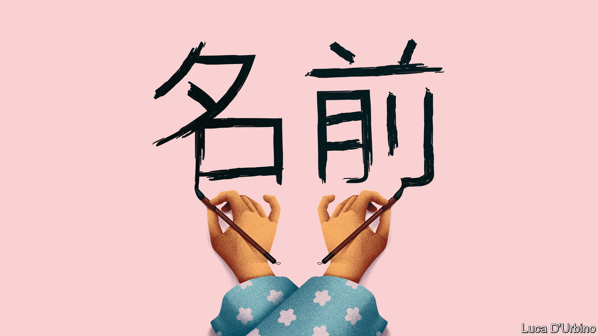

## Banyan

# Why Japanese names have flipped

> They will now be written in English in the same order as in Japanese

> Jan 2nd 2020

ON JANUARY 1ST a minor lexical revolution rolled through Japan. A new decree ordained that official documents should reverse the order of Japanese people’s names when they are rendered in the Latin alphabet. Hitherto in, say, English documents, Japanese names have been written with the given name first, using the Western practice. Henceforth the family name will come first and, to banish any ambiguity, may be entirely capitalised. One backer of the change is the prime minister. From now on The Economist will refer to him as Abe Shinzo rather than Shinzo Abe.

Like other newspapers, we have long followed the convention of writing Japanese names in the Western order (while scholarly publications have tended to use the Japanese order). If Japan wants to change, why should anyone object? As is common in East Asian cultures, in Japanese the family name always comes first.

National pride motivates many advocates of the change. From a Japanese perspective, writes Peter Tasker, a Tokyo-based commentator, in the Nikkei Asian Review, it represents “authenticity and normalisation”. The fact that Asian powers are on the rise, both geopolitically and culturally, is part of the point, Mr Tasker argues.

Japanese conservatives do not see why they should say their names backwards just for the convenience of Western minds too lazy to grasp a basic facet of Japanese culture. Some 59% of Japanese in a recent opinion poll favoured reverting to surname-first. Yet there is an irony. Japan first decided to put given names first when talking to foreigners way back in the 1870s, during the Meiji era. It was actually a gesture by nationalist reformers who wanted to keep Western imperialists at bay.

Japan, they argued, could keep its independence only by abandoning the paternalism of Confucius, imported from China, which had long governed society and family life. Instead it should rapidly learn modern Western ways in everything from military affairs to education, both to ward off Western powers and to impress them. English name-order was a tiny part of the package. Reformists had drunk deeply of the social Darwinism then prevailing in the West, which taught that only the strongest societies would survive. One, Mori Arinori, even proposed adopting English as Japan’s language.

In 1885 a friend of Mori’s, Fukuzawa Yukichi, penned a polemic, “Goodbye Asia”, arguing that Western civilisation was like measles: if it didn’t kill you, it would make you stronger and should be embraced. He said the static cultures of China and Korea would make those countries more vulnerable to Western conquest. He urged Japan to cut its spiritual and civilisational ties with them. It was, with hindsight, a small step from there to a sense of Japanese exceptionalism, and then to militarism. (And among many other humiliations, Japanese occupiers forced their Korean subjects to scrap their names for Japanese ones.)

Chinese reformers and revolutionaries were later inspired by Fukuzawa and his like to reform or abandon the Chinese language. The great novelist Lu Xun argued in the 1920s that the Confucian ideologies holding China back were being subconsciously reinforced by the archaic Chinese used in writing. He called for a new vernacular. Chen Duxiu, a co-founder of the Communist Party, urged the use of Roman letters to replace the thousands of Chinese characters.

As for Japan, defeat after the second world war aggravated what a Japanese writer, Mizumura Minae, in “The Fall of Language in the Age of English”, deems an inferiority complex among Japanese intellectuals regarding their own tongue. One novelist, Shiga Naoya, even blamed the Japanese language for the start of the war (he advocated a switch to French).

Mr Abe and his allies, by contrast, have no truck with self-loathing. With China on the rise and America proving a wobbly ally, he believes it is time for Japan to stand tall again and celebrate tradition. As in China, shades of Confucianism are back. Mr Abe wants to change the constitution to emphasise family over the individual.

Still, asks Jeffrey Kingston of Temple University in Tokyo, is name order “the big naming question facing Japan in the 21st century?” Surely, he says, that is the official ban on married couples retaining separate family names, a rule that in practice means wives nearly always take their husbands’ names. Mr Abe may be a traditionalist, but didn’t he promise to empower women?