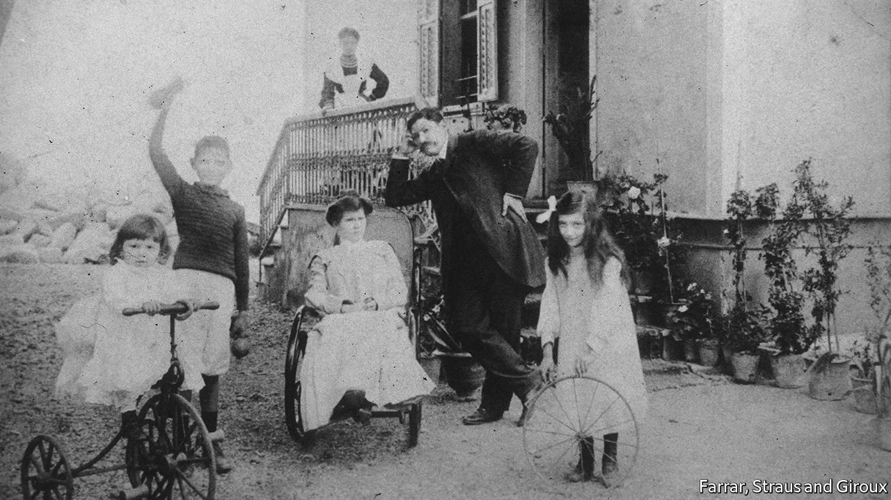

## Writing wrongs

# An intimate chronicle of Sephardic Jewish history

> Sarah Abrevaya Stein brings the Levy clan of Salonika to life

> Jan 2nd 2020

Family Papers: A Sephardic Journey through the Twentieth Century. By Sarah Abrevaya Stein. Farrar, Straus and Giroux; 336 pages; $28.

WHEN THE sultan came to Salonika, David Levy was waiting. As befitted an Ottoman official and president of a local Jewish organisation, he greeted Mehmed V at the port when he landed in the summer of 1911. The next day, as the sultan was preparing to leave, he gave David a pair of diamond cufflinks. Yet all this pageantry was the wheeze of a dying world. Soon the Ottomans lost Salonika (now Thessaloniki) to the Greeks; their empire crumbled. And David, once dignified with the Turkish honorific effendi, would die in Auschwitz with much of his family in 1943. 

David Levy’s path from Salonika to his murder is just one strand of a remarkable book in which, through years of research and thousands of documents, Sarah Abrevaya Stein tells the story of the whole Levy clan. She follows the prominent Sephardic family through interwar Greece and the Holocaust to the contemporary diaspora. For a while, one family member lived in Paris on pommes frites, getting into fistfights with anti-Dreyfusards. When another quit Salonika for a new life in Manchester, she left behind one of her 13 suitcases “so as not to jinx the voyage”. 

By mining the Levy family archives, from photographs and birth certificates to medical records and passports, Ms Stein is able to summon her characters with the depth and feeling of a novelist. Thoughtfully, she notes that even the handwriting in letters can open windows into their authors’ lives. A dignified bureaucrat to the end, David Levy signed his name in elegant flourishes. Estherina, his daughter-in-law, composed “long, impassioned, if unintelligible letters in her loping hand”. This was not just sloppiness: she continued to write long after she went blind in middle age. 

The languages the Levys used were as varied as their personalities. Ottoman Turkish, Hebrew and French all appear, but the principal one is Ladino, the tongue of Sephardic Jews expelled from Iberia in the 1490s. Well into the 20th century the family continued to employ this blend of Spanish, Hebrew, French, Italian, Turkish and Greek (among other elements). When Vida Levy dictated a letter to her son in the 1930s, she repeated the Ladino phrase “mi karo ijo” (“my dear son”) six times.

This focus on the traditional language of Sephardic culture reflects Ms Stein’s broader, underlying theme—for what begins as an intimate tale of the Levys becomes a far wider chronicle. Like the Levys, many Sephardic families would spend the 20th century tugged between secularism and faith, and between loyalty to old empires and a new nationalism. Many would meet the same desperate fate: 98% of Salonikan Jews died in the Holocaust. 

“Family Papers” climaxes in the second world war—including the outlandish career of one Levy who helped the Nazis—but Ms Stein finishes her story in gentler times. Some Levys survived the war in hiding; others had already emigrated. Today, she says, the descendants of the original clan are “amiable, generous souls living culturally vibrant lives” from Lisbon to Berkeley. One became a French ambassador. Another played Miss Moneypenny in a James Bond film. Most have no contact with each other, nor any idea of their shared history. Yet through their inherited idiosyncrasies, they retain a family resemblance—even if the passion for writing letters has gone the way of Ottoman Salonika. ■