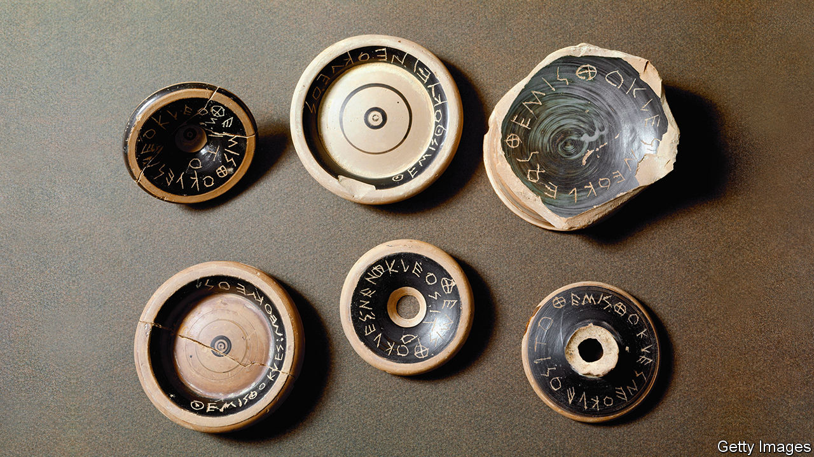

## And stay out

# In ancient Athens, ostracism did the job of impeachment

> When the system of temporary exile fell into disuse, Athenian democracy degenerated

> Jan 2nd 2020ATHENS

AS EVERY AMERICAN knows, democracies need a means to deal with office-holders whose behaviour seems so terrible that they simply have to go. Modern states have impeachment; ancient Athens had ostracism, a gloriously simple device that gave voters the annual right to impose a decade of exile on a reviled individual.

The word ostracism comes from the ostrakon or potsherd (the equivalent of scrap paper) on which a candidate’s name was incised. With every new dig and discovery, fragments of pottery, bearing scratched names and sometimes a drawing or an insult, are deepening knowledge of the procedure among archaeologists and historians. It has become clear that the tool was at the heart of the Athenian political system.

It worked like this. At the beginning of each year, the electorate (adults who were neither female, enslaved or foreign) voted on whether the atmosphere would be improved by throwing out a dislikeable character. If the answer was yes, there would be an unpopularity contest two months later. Whoever received most votes had to leave.

What sort of person got the boot? The surviving works of ancient authors enumerate only a dozen figures who suffered ostracism or narrowly escaped it. The creator of the Athenian navy, Themistocles, endured the sanction; Pericles, the master statesman, used the weapon against enemies but avoided it himself. But now archaeologists are finding that those targeted for temporary expulsion were far more numerous than the textual record suggests.

In 471BC, for instance, the poll’s winner (or rather loser) was a blue-blood called Megakles, notorious—as ancient graffiti reveal—for his pushy mother and extravagant spending on horses. This was his second expulsion. Yet more than 100 other people may have been candidates for ostracism that year. This has been demonstrated by Stefan Brenne of Giessen University in Germany, who has just published the fruits of two decades’ meticulous reassembly and analysis of nearly 9,000 ostraka discovered in the Kerameikos cemetery in Athens in the late 1960s.

Often Mr Brenne found himself piecing together fragments that came from a single pot, perhaps deliberately broken by a group of friends who turned up to vote together. The sherds vary widely in size and quality: from 2cm (just under an inch) to ten times that length, from potters’ garbage to bits of high-class tableware. The round black base of a drinking-cup was a popular choice. “When I look at an ostrakon, I can hear the voters discussing what insults to write,” Mr Brenne says.

Meanwhile James Sickinger of Florida State University, the other world authority on ostraka, has been cataloguing the 80 or so found since 2010, mostly in the Agora, or market-place, where voting took place in Athens, with citizens queuing in a roped-off area to cast their sherds. These new fragments show how quickly ostracism caught on. As soon as the procedure came into use, in the mid-480s BC, Athenians adopted it with gusto, aiming at candidates high and low. The latest finds name bigwigs such as Xanthippus, father of Pericles, as well as a man called Habron about whom little besides his unpopularity is known.

Around 11,000 ostraka have been unearthed altogether. A few are beautiful. In one, the inscription is fired with the skilled techniques of black-figured pottery; another makes its point in verse. But most are amateurish, often featuring mistakes and obscenity. Victims are taunted for being adulterous, for being sodomised, and (in one case with an illustration) for being crypto-Persian. One ostrakon attacks the commander Kimon, who lived, amid rumours of incest, with his half-sister Elpinike: “Take Elpinike and Go!”

This Athenian system recalls the role played in other ancient societies by exorcism and witch-hunts, or the Israelites’ dispatch of a scapegoat, who bore the people’s sins, into the desert. Other than in a national emergency, the penalty for returning early was death. Look closely, though, and what seems a primitive punishment turns out to have been a mild and sophisticated way to release public discontent.

The victim was not deemed guilty of any crime—like modern impeachment, this was an essentially political business. He lost no assets, and could enjoy income from his property in exile. A nobleman could live out his banishment comfortably in another Greek city-state; once the decade was over, he could re-enter public life. (Some tried to get their own back instead: Themistocles defected to the Persians.) The fact that only a single person could be ostracised precluded wholesale purges. The careful counting of the sherds by the city’s archons, respected figures who rotated annually, meant verdicts were accepted.

It was a genuinely democratic process. From the start, powerful figures organised campaigns to expel adversaries, but the device’s legitimacy depended on ordinary voters being able to vent their whims and caprices. A well-known story, related by the historian Plutarch, describes a “boorish fellow” who came to the Agora and asked someone to incise the name Aristides. The someone was Aristides himself, who obliged but inquired as to the grievance. “None,” came the answer. “I am just tired of hearing that man called Aristides the Just.” Sarcastically or desperately, some sherds denounce an impersonal woe, such as “limos”, meaning hunger or poverty.

While it lasted, ostracism served many purposes. It was a warning to prominent types not to overreach—and to aspirants to tread carefully. And it was an effective safety-valve. The mood in the weeks between decisions to hold an ostracism and the votes was electric, as people spread salacious tales. According to Mr Brenne, the rumbustious comedies of Aristophanes, in which any bigwig could be lampooned, form a single genre with scribblings on the ostraka. But, in contrast to today’s political tussles, after the vote things calmed down.

In the final years of the fifth century BC, as democracy degenerated, ostracism lost its usefulness. The last occurred around 417BC, by which time war-weary Athenians had been seduced by demagogues. The dominant characters were the populist Alcibiades and the more moderate Nicias. It seemed likely that one or other would be expelled, but the powerful duo briefly buried their rivalry and had another politician, Hyperbolus, ejected instead. According to Plutarch, “the people felt disgruntled, because the procedure had been abused…and they abandoned it.” Votes on whether to conduct an ostracism were held for another century, but it never seemed to be worthwhile.

In the years that followed, Athens became a rougher place. The city mostly observed the outward form of democracy but often felt more like a militarised oligarchy. The interaction between social classes and individuals that enlivened the fifth century was over. And the idea that removing one person could solve the republic’s problems belonged to a more innocent age. ■

## URL

https://www.economist.com/books-and-arts/2020/01/02/in-ancient-athens-ostracism-did-the-job-of-impeachment
