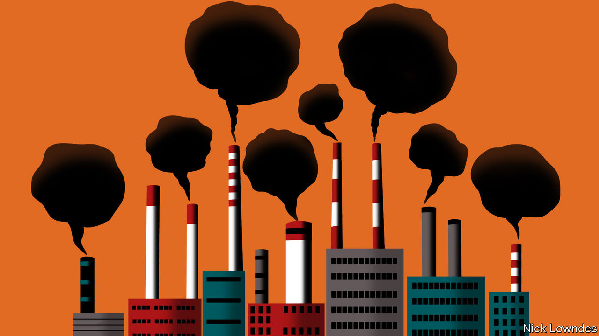

## Johnson

# Of train-boasts, plane-shame and electric automobiles

> The words of 2019 reflect the rise of climate-change activism

> Jan 4th 2020

IDENTIFYING SHIFTS in the Earth’s climate requires decades of data, not just the observations of 2019 or any other single year. Climate change moves slowly, which is part of its calamitous power. Huge fires in California and Australia are probably worsened by the phenomenon—but no blaze can unequivocally be pinned on it, a fact seized on by those who would rather avoid the subject. Yet in the growing strength and coherence of climate protests, something did change discernibly in 2019.

Extinction Rebellion, a new movement, disrupted major cities. Greta Thunberg, a teenage activist, was Time’s Person of the Year; she travelled by boat to a climate summit in New York to avoid flying (and the associated carbon emissions). Another summit, in Madrid, ended in acrimony. Policy may not have evolved much, but wider attitudes did—and with them, the language in which the issue is discussed.

Some climate-related vocabulary was already in circulation. After a boiling summer in Germany in 2018, the Society for the German Language chose Heisszeit, “Heat Age”, as its word of that year. (It rhymes nicely with Eiszeit, “ice age”.) In the Netherlands, meanwhile, the Society for Our Language plumped for laadpaalklever, or “charging-post sticker”: someone who uses the electric-car charging space for too long, treating it like a free parking place.

Van Dale, a dictionary publisher, lets the Dutch-speaking public vote on its word of the year (in separate contests in Belgium and the Netherlands). For 2019 Belgians chose winkelhieren, or “buying local”. The Dutch went with an imported word that has a good case for being the winner in English, too: “boomer”. As Chloe Swarbrick, a 25-year-old member of New Zealand’s parliament, was giving an impassioned speech on the impact of climate change on her generation, she coolly dismissed a heckling older MP with a curt “OK, boomer”. The phrase was already an internet meme; Ms Swarbrick made it the talk of the offline world as well.

Babbel, which makes a popular language-learning app, has collected a host of climate-related neologisms from European languages. Flygskam is perhaps the most likely to be permanently adopted into English: “flight-shame”, from Swedish, was popularised by Ms Thunberg’s rise. It also has a nifty corollary: tagskryt, or “train-boasting”, from those who advertise their flygskam by taking ground transport and letting the world know. (Dutch has an equivalent: treintrots.)

The march of the climate-protest movement has led to the coining of disparaging terms by its critics. Italian, for example, has gretini: allegedly mindless followers of Ms Thunberg (-ini is a diminutive suffix, and the word echoes cretini, or “idiots”). The Danish Language Council and Denmark’s national broadcaster jointly chose a similar term as their Word of the Year for 2019: klimatosse, or “climate fool”, used dismissively by Pia Kjaersgaard, a right-wing Danish politician, to explain her party’s poor election performance. Being Danish, she hastened to add that her party is itself concerned about the climate, but that the klimatosser who voted for other parties apparently care about nothing else.

Compared with its European cousins, English has not been creative. Oxford Dictionaries declared its word of the year to be “climate emergency”. Collins, another dictionary-publisher, nominated the slightly more imaginative “climate strike”, originally coined to denote the schooldays that climate activists such as Ms Thunberg began skipping as a protest. (Klimaatspijbelaar, “climate-school-skipper”, was number three in Van Dale’s Dutch vote.)

Words of the year are a way for lexicographical types to grab a rare slice of the spotlight, boost interest in language and have a bit of fun. All the same, the pessimistic trajectory of the outcomes suggests a darkening global mood. The American Dialect Society will vote for its word of 2019 at its annual meeting in New Orleans in January. Its previous three choices were “tender-age shelter” (a euphemism for places where America’s border forces keep children separated from their parents), “fake news” (often, these days, meaning real news that powerful people would like to dismiss) and “dumpster fire”. Whether or not it picks a climatic word as an emblem of the bygone year, it is hard to see the society choosing anything upbeat.

Perhaps Dictionary.com captured the feeling best with its word of the year for 2019. Neither new nor fancy, it was foreboding nonetheless: “existential”.

Sign up to our new fortnightly climate-change newsletter [here](https://www.economist.com//theclimateissue/)

## URL

https://www.economist.com/books-and-arts/2020/01/04/of-train-boasts-plane-shame-and-electric-automobiles
