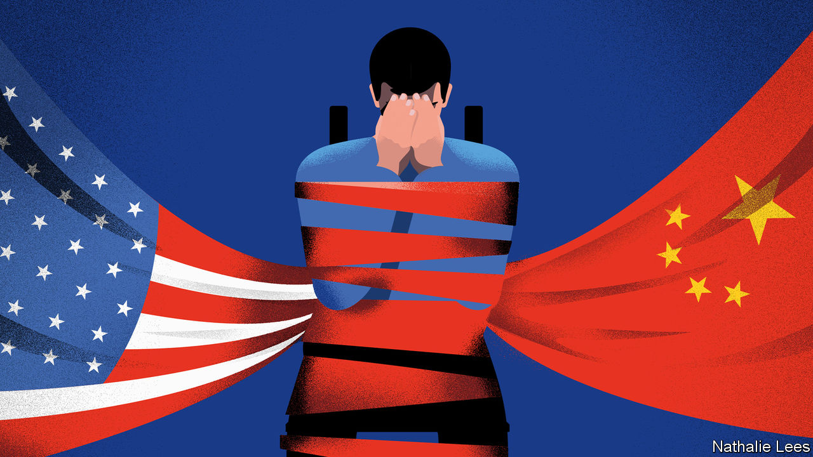
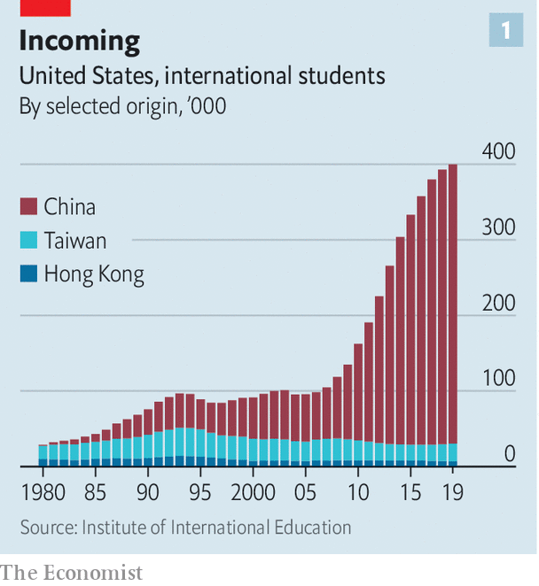
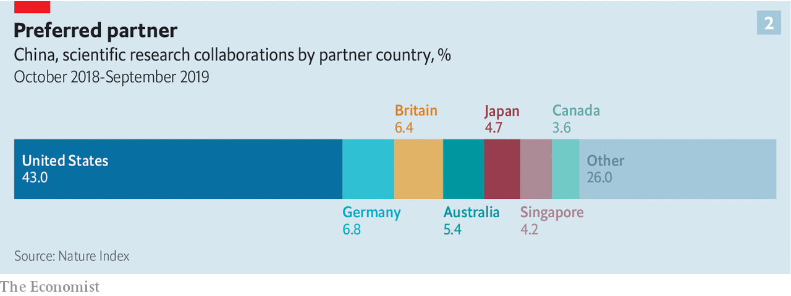
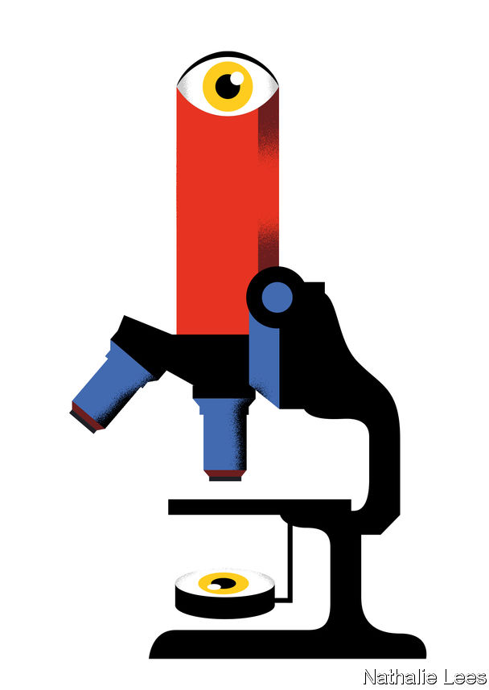

## Chinese students

# The new red scare on American campuses

> Both their host government and their home government increasingly view Chinese students with suspicion

> Jan 2nd 2020NEW YORK

EARLY LAST autumn Alex and Victor, two students from mainland China, sat in the back row of a packed auditorium at Columbia Law School, in New York. They were there for a talk by Joshua Wong, thrice-jailed young hero of the Hong Kong democracy movement, which the two students support. They applauded enthusiastically; they also wore blue face masks.

The masks were in part symbols of solidarity with Mr Wong’s fellow protesters half a world away. But they were also a way of hiding their identities from face-recognition systems in China that might be scanning pictures of the audience, and from Chinese students in the hall less in tune with Mr Wong’s message—such as the ones who sang the national anthem of the People’s Republic in response to the talk. Their names are not, in fact, Alex and Victor; they asked The Economist to give them pseudonyms and not to say where in China they came from. As they talked, other Chinese students quietly observed them, national flags in hand.

There are 19.8m university students in America, of whom just over a million come from other countries. A bit less than a fifth of these foreigners come from India, and 6% from the European Union. Fully a third are Chinese—a much larger fraction than from anywhere else, and more students than China sends to all the other countries in the world put together. At Columbia, half of the nearly 12,000 international students are from China. This is all very good for the students’ future prospects and the universities’ coffers. But it worries the American government, the Chinese Communist Party (CCP) and some champions of academic freedom.

The American government thinks some Chinese students and researchers are responsible for a great deal of intellectual-property theft. The CCP fears that people like Alex and Victor are contracting dangerous levels of democratic idealism. And China’s efforts to curtail the room such dissidence has to flourish in worries people who care about free expression on American campuses and beyond.

The number of mainland Chinese students in America grew by 276% over the past decade (see chart 1) as China’s elite sought to buy excellent educations for their children and American researchers sought talent. In 2018, the most recent year for which figures are available, Chinese graduate students received 13% of all science and engineering doctorates awarded by American universities.

The rate at which researchers at the Massachusetts Institute of Technology (MIT) co-author papers with colleagues at leading Chinese universities has risen tenfold over the past decade—part of a trend which has seen collaborations between American and Chinese researchers become more numerous than collaborations with any other country (see chart 2). Many Chinese researchers have significant resources as well as sharp minds; some sorts of lab work are easier and cheaper in China than in America. It is hardly surprising that American researchers—especially the growing number who have former pupils back in China—want to work with them.

Not all of this collaboration is peer-to-peer. Chinese companies fund an increasing amount of research at American universities, including into areas prioritised in the “Made in China 2025” industrial-policy initiative—a policy America’s Department of Justice has referred to as a “roadmap to [intellectual-property] theft”. MIT, for example, has research partnerships with SenseTime, a Hong Kong company that provides facial-recognition technology to Chinese police, and iFlytek, a Chinese firm that works on voice recognition and which has paid for research at Princeton and Rutgers.

The administration of President Donald Trump worries about all this. In the past two years, scrutiny of mainland Chinese on American campuses has intensified, and with it scrutiny of other students and researchers who are ethnically Chinese, including Chinese-Americans. Some see this new scrutiny as testing American academia’s reputation for openness, international co-operation and the free exchange of ideas. Christopher Wray, the director of the FBI, believes it provides a valuable counterweight to academic “naivety”.

In 2018 Mr Wray testified to the Senate intelligence committee that China poses a “whole-of-society threat” to America, one which demands a “whole-of-society response”. In Mr Wray’s analysis the fact that American researchers collaborate so much with Chinese researchers is a cause for concern; such scientists and students are among the “non-traditional collectors” of an intelligence operation he has described as “deep and diverse and wide and vexing”.

In 2018 and 2019 agents from the FBI’s 56 national field offices contacted hundreds, perhaps thousands, of students, researchers and professors with ties to China—many of them from China or ethnically Chinese, including Chinese-Americans—to determine whether they might be working on behalf of the Communist Party. The National Institutes of Health (NIH), Department of Energy and other providers of federal grants have urged universities to monitor researchers for connections to Chinese institutions or “talent” programmes which seek to attract scientists, often Americans of Chinese ethnicity, who have gained expertise deemed of value in China. China’s “Thousand Talents” programme, which in part offers scientists incentives to set up labs in China, was used to recruit at least 6,000 experts from overseas between 2008 to 2017.

The NIH says that it has identified 180 researchers to whom it has provided grants who may not have disclosed payments from, or other affiliations with, Chinese institutions—including some who appear to have established “shadow labs” in China mirroring their NIH-funded ones in America. In 2019 two research institutions—MD Anderson, a cancer-research centre in Houston, and Emory University in Atlanta—cut ties with five researchers, all of them ethnically Chinese, who had taken money from China. In December federal authorities arrested a Chinese cancer researcher at Logan Airport in Boston after he allegedly tried to smuggle to China vials of biological material taken from a Harvard teaching hospital. (His Harvard-sponsored visa has also been revoked.)

But officials at some universities say that private briefings from the FBI have left them both unconvinced of the scope of the problem and unclear what actions need to be pursued. “What exactly Mr Wray has in mind, where precisely he sees the threat—this is all left frustratingly vague,” says an international-research administrator at an elite university that has been briefed by the FBI (and where the FBI has also interviewed visiting Chinese scholars). “Some of the guidance has been, ‘Be careful about anything to do with biotech.’ Well biotech is huge…I don’t even know which faculty to talk to if you don’t tell me more.”

Faced with such scepticism, last summer the National Security Council, the State Department, the Department of Justice (though not the FBI) and experts on Chinese influence operations briefed some 15 university presidents, provosts and other senior administrators in a two-day session at St Michaels, Maryland. One of those giving the briefings noted that the idea of technology developed on their campuses aiding China’s repression of Uighurs in the western province of Xinjiang seemed particularly salient to the administrators: such links could damage their institutions’ reputations. This is not a purely theoretical issue. In October SenseTime and iFlytek, the artificial-intelligence firms with research partnerships at MIT, were blacklisted by the American government for allegedly abetting the abuses in Xinjiang.

As well as investigating Chinese students and researchers already in America, the administration has also looked at ways to make it harder for them to arrive and easier for them to be expelled. In 2018 some of Mr Trump’s aides argued for severe restrictions on student visas for Chinese nationals. Instead the administration curtailed five-year visas for foreign graduate students in certain fields of science and technology such as aviation and robotics; these students now get renewable one-year visas. The Department of Homeland Security has also made it easier to declare that foreign students are overstaying their visas. Educators report anecdotally that invited Chinese scholars are finding it much harder to get visas, including short-term visas for academic conferences that in the past were routinely issued.

Concerns about what Chinese students get up to are not unique to the executive branch. Marco Rubio, a Republican senator from Florida, and Mark Warner, a Democratic senator from Virginia, have been among the most prominent figures on Capitol Hill warning not just of Chinese intelligence operations at American universities, but also of those universities’ worrying dependence on Chinese money via tuition fees and research partnerships. Pressure from senators and congressmen is one of the reasons why, since 2018, at least 15 universities have closed the Confucius Institutes, paid for by China, that offer Chinese language instruction and arrange cultural events. A new federal restriction that bars universities with Confucius Institutes from Defence Department funding for Chinese-language study has also been a factor.

Some university administrators, scientists and civil libertarians worry that the administration’s conception of the “China threat” is so broad and vague that anyone with the slightest connection to China can become a target for questioning by the FBI—a new Red Scare. Lee Bollinger, president of Columbia, published an op-ed in the Washington Post titled “No, I won’t start spying on my foreign-born students”. Rafael Reif, the president of MIT, wrote in an open letter that students and staff of Chinese ethnicity “tell me that, in their dealings with government agencies, they now feel unfairly scrutinised, stigmatised and on edge.” Several groups of Chinese and Chinese-American scientists published a letter in Science, America’s leading scientific journal, expressing fears of “scapegoating, stereotyping and racial profiling”.

Communist Party figures have been happy to see the Trump administration’s spy-hunt portrayed as a xenophobic exercise. In December Hua Chunying, a foreign ministry spokeswoman, praised the “courage” of Fareed Zakaria, an American commentator who belittled the administration’s concerns in an article headlined “The New China Scare”.

The Trump administration, for its part, has tried to have things both ways. While happy to be seen as tough by those to whom toughness appeals, in public officials say that Chinese students and scholars are as welcome as ever. White House officials claim only to be concerned about a tiny fraction of people on student visas who may be operating as spies. Though Mr Trump is reported to have said, at a dinner with American corporate bosses, that “almost every student that comes over to this country [from China] is a spy”, he said at the G-20 summit last June that “we want to have Chinese students come” and that they are “tremendous assets” who should be treated “just like anybody else”.

Fears of China’s espionage are not new. Since 2011 more than 90% of all American prosecutions for economic espionage have been linked to China. But that does not mean their increased prominence can be simply chalked down to a hawkish change under Mr Trump. China has changed, too. Both its ambitions and its authoritarianism have become more marked, especially since President Xi Jinping abolished the term limit on his presidency in 2018. The internment of more than 1m Uighurs in detention centres, a severe crackdown on lawyers and activists and a hardline response to protests in Hong Kong have fatally undermined the old argument that Western engagement with China would see it liberalise. In the past it was possible to argue that Chinese students in the West would return home with new ideas about freedom of expression and individual dignity and political agendas to match. Now it is clear that, in some cases at least, their presence is an overseas redoubt for the CCP’s ideas about conformity and loyalty. 

Some China-watchers point to Australia as a worrying exemplar. Australian officials have warned for years of China’s influence operations in the country, including at universities. In July students from mainland China threw punches at other students demonstrating in solidarity with the Hong Kong protesters at the University of Queensland. The consul-general in Brisbane, Xu Jie—who is, unusually for a senior Chinese diplomat, an adjunct lecturer at the university—praised them for their “patriotic behaviour”.

Talks by Chinese dissidents are a particularly touchy subject. In 2015 Teng Biao, who is now an adjunct lecturer at Hunter College in New York, was a visiting scholar at Harvard Law School. In a report on Chinese influence at American universities produced by the Wilson Centre, a think-tank, in 2018, Mr Teng described how he planned to invite Chen Guangcheng, a blind lawyer who in 2012 made a daring solo escape from house arrest to the American Embassy in Beijing, to give a talk there. An “influential person” at the university persuaded him that hosting Mr Chen would “reflect poorly on Harvard”: the university’s then-president, Drew Faust, was in Beijing meeting Mr Xi.

Mr Teng is still unwilling to identify the “powerful professor” who warned him off. He thinks it could further damage his prospects in the job market, where his position as a dissident is already a black mark: “The pressure from the Chinese government is real and is strong.” The Wilson Centre report also documented instances of what appeared to be blatant efforts by China to influence free expression, including freezing Chinese participation in lucrative programmes for such offences as inviting the Dalai Lama to speak on campus.

Beijing’s wishes in such matters are often communicated through the Chinese Students and Scholars Associations (CSSAS), that are to be found on more than 150 American campuses. In 2019 the CSSA at Purdue University in Indiana asked administrators to cancel a talk by Mr Chen. When the talk went ahead (with police protection) the organisation circulated an announcement that such speaking events provoke “fierce controversy and dissatisfaction among Chinese students.” 

Other manifestations of Chinese influence are more subtle. Columbia shows off a bust of Vaclav Havel, the dissident playwright who, after the fall of communism, became president of the Czech Republic; he was a guest of the university for some weeks in 2006. But they will not find a bust of Liu Xiaobo, a Chinese writer who won the Nobel peace prize for his human rights activism, despite the fact that he too had been a guest at the university, back in 1989. (A request to place such a bust, made on behalf of his widow, was rejected.)

In the curricula and cultural activities of Confucius Institutes language students will find no more mention of human-rights activists like Liu than they will of the Tiananmen Square protests in 1989 or the repression in Xinjiang.

Students from China often refrain from discussing sensitive subjects in front of other Chinese students. A professor at one Ivy League university says that after some students asked to submit written work touching on human rights under a pseudonym he now offers that option to all. Alex and Victor avoid sensitive topics when with their peers and keep their distance from Columbia’s CSSA. “In China too I heard so many stories about students reporting on their professors because their professors mentioned Tiananmen in class,” Victor says. “These fellow students would do this in mainland China and they would do the same abroad.”

The number of Chinese students in America is not yet dropping in response to any of this. The fact that it has ceased growing may have something to do with the tensions, or with worries about visas. But some of those worries are not specific to China; numbers of students from elsewhere are down, too. And other factors are at play. Foreign-exchange controls have tightened; China’s economy has slowed. More Chinese families now sending children abroad may opt for cheaper destinations. Though America is still preferred, enthusiasm for it is waning while enthusiasm for Britain waxes.

But the boom is over—and so are the hopes that it might in and of itself bring new amity. Both the greater number of Chinese students and the greater power of information technology mean that it is ever easier for them to remain isolated on campus, mixing little with their American peers. They use WeChat, a social-media app, both to stay in touch with friends and family back home and as their sole source of news, much of which reflects their government’s view of their host country. In 2018 a Purdue University survey of a large midwestern university found that 42% of Chinese students had a less favourable perception of America than they had when they arrived; just 16% said their impression had improved. Their study abroad has not exactly built a bridge between the two countries. The intense scrutiny they face from both Beijing and Washington threatens to widen the divide. ■

See also: “[What Chinese students found when they moved to America’s Midwest](https://www.economist.com//1843/features/alienation-101)” (1843 magazine, April/May 2017)

## URL

https://www.economist.com/briefing/2020/01/02/the-new-red-scare-on-american-campuses
