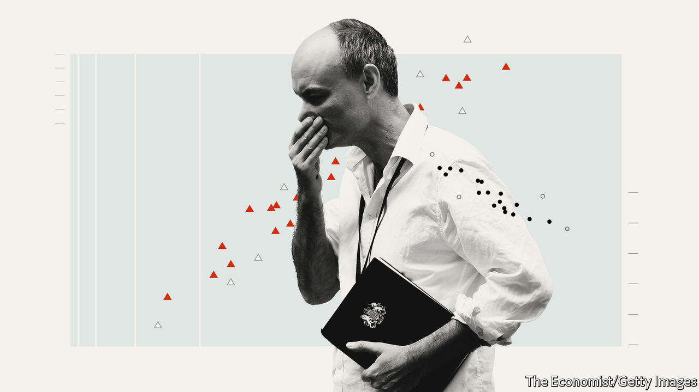

## Britain after Brexit

# Dominic Cummings’s plan to reshape the state

> Why Downing Street thinks that to get anything done it must first fix the machinery of government

> Jan 2nd 2020

THE SUSPICION with which many Brexiteers have long regarded Brussels has come to be matched by an equal mistrust of Whitehall. After repeated delays to Britain’s exit from the European Union, many Leavers became convinced that bien-pensant officials were out to subvert the will of the people. Yet for Dominic Cummings, the prime minister’s chief adviser and brains behind the Leave campaign, the frustration with the civil service goes back much further. The subtitle of an entry on his personal blog, written in 2014, sums up his outlook: “The failures of Westminster & Whitehall: Wrong people, bad education and training, dysfunctional institutions with no architecture for fixing errors.” Some Eurosceptics want to put a bomb under Whitehall in order to get Brexit done. Mr Cummings wants to get Brexit done so that he can put a bomb under Whitehall.

Following Boris Johnson’s triumph in the December election, the government has an opportunity to reshape the country. Labour is in chaos, the Remainers are defeated and the British system gives huge power to governments with a large parliamentary majority. Mr Cummings’s thinking—set out over hundreds of thousands of words in a blog that ranges from Sun Tzu and Bismarck to education policy and space exploration—helps explain why many in Downing Street think that to get anything done in government they will first have to fix the civil service.

Mr Cummings has lambasted cabinet government as an outdated, oversized decision-making mechanism. Once Britain has left the EU, the number of departments is reportedly due to be cut, with Business absorbing Trade, the Foreign Office taking International Development, and the Department for Exiting the EU scrapped. A “super-department”, including education, research and innovation, is rumoured, and the Home Office may even be broken up. If Mr Cummings gets his way these changes will be just the start.

Civil service reform is not usually a priority for a new administration. Most turn their attention to it only after finding their initial vim frustrated. At the start of her second term, Margaret Thatcher tried to make officials more accountable and to focus them on outcomes. At the start of his, Tony Blair brought in Michael Barber, who had worked on school reform, to split the government’s aims into measurable targets and pursue them relentlessly. Or, in the words of Mr Cummings, establish “what should be minimal competence for people who do not know how to prioritise and are managerially incompetent”.

In his view, this incompetence reflects a system that incentivises the wrong things. Mr Cummings has called for greater use of redundancy to get rid of people not up to it. He wants training to emphasise quantitative skills and for those who are effective to stay in place for longer (some departments lose more than a fifth of their workers each year, through rotations or exits). Job specifications may also change. According to Mr Cummings, permanent secretaries, who run departments, face an impossible job (as “chief policy adviser, department CEO and a fixer”) and are promoted on their ability to play the game. Almost none of them, and indeed almost no minister or adviser, is “+3 standard deviations…on even one relevant dimension (IQ, willpower/toughness, management ability, metacognition, etc)”. As an ally notes, Mr Cummings “doesn’t care if he hires socialists, he just wants people to be competent.”

Another part of the answer, Mr Cummings believes, lies in hiring brilliant people to work on specific problems outside of bureaucratic constraints. He points to the success of America’s work on intercontinental ballistic missiles and some aspects of the Apollo programme in the 1950s and 1960s, which brought the world’s best scientists and engineers into government projects. More broadly, he argues that such examples illustrate the importance of clearly defined goals, the use of long-term budgets to save money and the need for “an extreme focus on errors”. He has called for “red teams”, as used by the CIA and defence firms, to argue the opposite view in meetings, to counter groupthink.

All of this is likely to involve tackling what Nick Pearce, head of the Downing Street policy unit under Gordon Brown, calls the “key tension” at the heart of Britain’s bureaucracy: that ministers are held responsible for what their department does but do not have much control over it. Britain is unusual in that ministers have little sway over who runs their department and limited ability to make appointments, compared with similar political systems like Australia and Canada. Mr Cummings recounts a litany of errors by officials during his previous stint at the Department for Education: “With all of them, regardless of how incompetently they had been handled—nobody was ever fired.”

He writes that part of the reason he and his then-boss, Michael Gove, “got much more done than ANY insider thought was possible—including [David] Cameron and the Perm Sec—was because we bent or broke the rules.” A devil-may-care approach could spread in a government eager to get things done. Mr Cummings thinks politicians are cowed by government legal advice, often by lawyers citing European directives. A recent report by Policy Exchange, a sympathetic think-tank, suggests making it easier for ministers to take advice from external lawyers.

Rearranging government departments “is a very sizeable task in and of itself,” with a mixed record of success, notes Catherine Haddon of the Institute for Government, a think-tank. Writing about how to transform the state is one thing; doing so is quite another. So old hands suspect gradual evolution is more likely than a big bang. To Mr Cummings, that may sound like the usual complacency: “There is a widespread befuddled defeatism that nothing much in Westminster can really change,” he blogged. Now he has another chance to prove the establishment wrong. ■

## URL

https://www.economist.com/britain/2020/01/02/dominic-cummingss-plan-to-reshape-the-state
