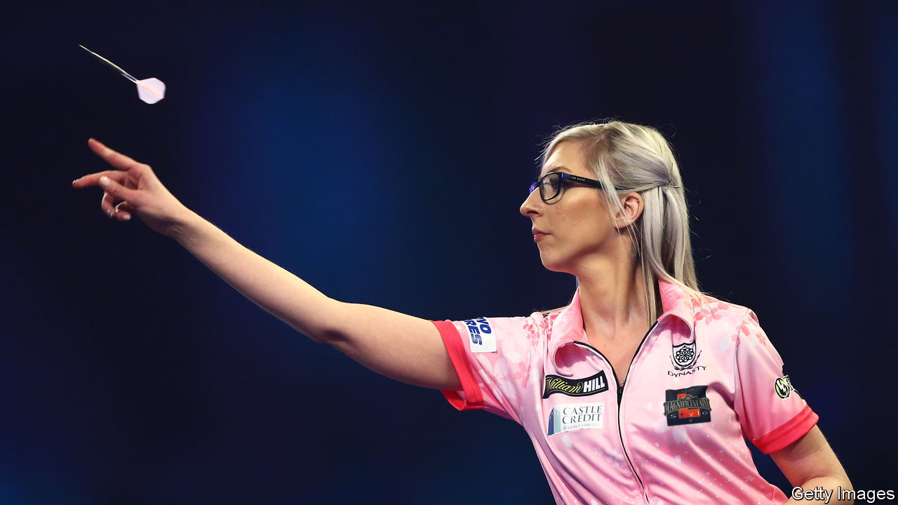

## Bull market

# How darts flew from pastime to prime time

> The sport has staggered out of the pub and onto television. Next stop, America

> Jan 2nd 2020ALEXANDRA PALACE

BRITISH SPORT has a new star. On December 17th Fallon Sherrock, a 25-year-old from Milton Keynes, became the first woman to win a match at the PDC World Darts Championship, the sport’s most prestigious event. She then went one better by knocking out the tournament’s 11th seed with a magical shot at the bullseye, eventually taking home £25,000 ($33,000) in prize money. Ms Sherrock, a far cry from the beer-bellied blokes who used to typify the game, symbolises how in recent years darts has gone from a peculiar British pastime to an entertainment juggernaut with transatlantic ambitions.

Darts staggered out of the pub and onto television in the 1970s, but low viewing-figures and a loutish reputation eventually led broadcasters and sponsors to pull the plug. In the early 1990s a group of disgruntled players broke from the stuffy British Darts Organisation and struck a deal with Sky, Rupert Murdoch’s fledgling broadcaster. Their new outfit, which became the Professional Darts Corporation (PDC), attracted the attention of Barry Hearn, a promoter with a knack for turning pub games into money-spinners (snooker gave him his big break). In 2001 Mr Hearn took over the PDC and set about revitalising the sport.

The corporation has turned darts into Britain’s biggest pantomime, with heroes and villains, outrageous costumes and jeering from the crowd. Fans “want to see 180s [the maximum a player can score with three darts], big finishes and players giving it large on stage,” according to Matthew Porter, the PDC’s chief executive. At the World Championship, one pint-swilling fan wearing an ill-fitting nun’s habit confirms as much: “It’s such a good night out, we come to have a laugh basically.” The results of the matches hardly seem to matter.

The PDC’s efforts have paid off. Some 85,000 fans flocked to Alexandra Palace, in north London, to watch Ms Sherrock and 95 other players compete for £2.5m in prize money. According to Dave Clark, who presents Sky’s coverage, in recent years darts has been the second-most-watched sport on the network over Christmas, beaten only by football.

This British pursuit has found devotees farther afield. German and Dutch fans bought a third of the tickets to the World Championship, and broadcasters from both countries covered the event live. Players such as Michael van Gerwen boost its continental appeal. The “doyen of Dutch darts” was beaten in the tournament’s final on New Year’s Day by Peter “Snakebite” Wright, a flamboyant Scot sporting a purple mohawk.

In 2020 Madison Square Garden in New York will host a PDC event for the first time, as part of an effort to introduce the sport to even bigger markets. Although it is played in bars, darts has never been enjoyed as a spectator sport in the United States, according to Patrick Chaplin, a historian of the game. If Americans want to see big characters playing up to raucous crowds they can watch WWE wrestling. There is a knottier problem, too: much of the sponsorship for PDC events comes from bookmakers, but in most states gambling on sport is illegal. In New York punters can bet on sports only in a handful of casinos, not online or at events. Without bookies’ money, the PDC’s glitzy tournaments and bulging prize pots become less feasible.

There may seem something indelibly British about darts; the heavy-drinking fans suggest that the game has never really escaped the pub. But the PDC is convinced that its boisterous, made-for-TV repackaging of the sport can find an even bigger audience abroad, and that players such as Ms Sherrock can shake off its blokey image. If the bet comes off, expect to see the arrows flying around the world.