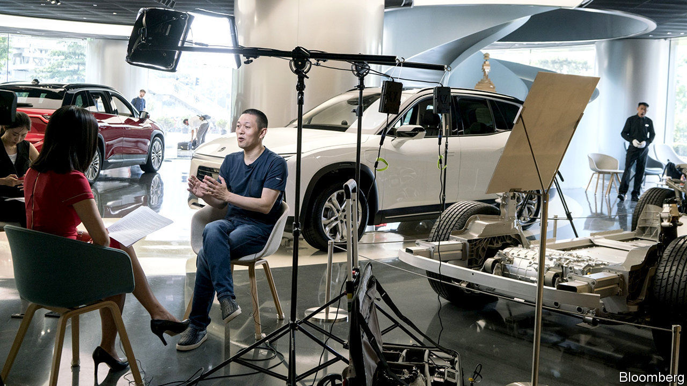
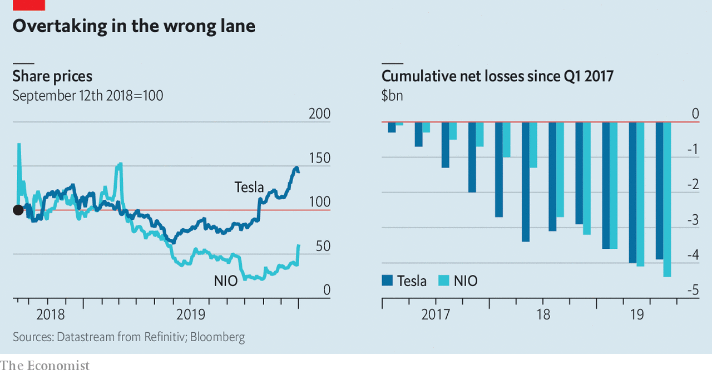

## Schumpeter

# Cloning Tesla: electric-vehicle wars in China

> Why Elon Musk has learned to love China

> Jan 4th 2020

WILLIAM BIN LI is as close as China may have come to cloning Elon Musk. The founder of NIO, a swanky electric-vehicle (EV) company, is in his 40s, a tech nerd, and though not as meme-able as the founder of Tesla, is treated like a rock star by his adoring customers. NIO, worth $4bn, is a fraction of the size of Mr Musk’s Tesla, valued at $75bn, but of all China’s 30-odd EV startups, it is the best known. It also raises and dashes investors’ hopes with Tesla-like frequency. On December 30th NIO’s shares soared 54% when Mr Li said output had probably reached 8,000 vehicles in the fourth quarter from almost 4,800 in the third. But over the whole of 2019 they lost almost 40% (see chart).

In truth, Mr Musk is in a league of his own. But Mr Li has long had the edge on him in one respect. As our Technology Quarterly in this issue reports, NIO is emblematic of China’s ambition to be a hub of global EV production, dominating electric vehicles in the 21st century as squarely as America did the internal-combustion engine in the 20th. As such, China would be a natural place to produce a “Tesla killer”, as NIO was dubbed during a CBS interview with Mr Li aired in 2019.

Yet if NIO is trying to topple Tesla, it is going about it in an odd way. It is copying some of the very aspects of Tesla’s business model that have made the American firm’s survival a matter of constant concern, such as lavish spending on sophisticated technology, resulting in correspondingly large holes in its cashflow statements. If anything can kill Tesla, it is more likely to be its perennial difficulty in generating cash than competition from a Chinese upstart with the same problem. Ironically, it could be China that ultimately secures Tesla a bright future. If only NIO could be so lucky.

Not long ago NIO was considered the more promising of the two. In the world’s largest car market, where sales of luxury vehicles are booming, it got its start in 2014 when state and local governments were throwing subsidies at both buyers and manufacturers of EVs. Venture-capital backing was abundant. NIO delivered its first commercial car, the ES8 SUV priced at above $70,000, in 2018. Shortly afterwards it issued shares on the New York Stock Exchange, both to raise money and to heighten its international profile so that it could sell cars around the world. Its shareholders include Baillie Gifford, an Edinburgh-based fund manager that is the largest institutional investor in Tesla.

Tu Le of Sino Auto Insights, an advisory firm, says NIO’s Tesla-killing aspirations got the better of it, though. It was rash to think it could quickly take on a firm 11 years older with huge global brand recognition and several models. NIO’s revenues, estimated at around $1.2bn for 2019, are dwarfed by the $24bn projected for Tesla. Yet since the start of 2017 its cumulative losses have overtaken those of Tesla (see chart). NIO has splashed out on spacious stores with libraries, coffee shops and crèches, sometimes directly across the street from Tesla showrooms. But unlike Tesla it has not invested much in factories, contracting manufacturing to JAC Motors, a state-owned carmaker, instead.

Furthermore, a cut in state subsidies for EV purchases since June has hurt investor sentiment, prompting fears of a funding crunch. NIO raised $100m from Tencent, the tech giant that is also one of its leading shareholders, in the third quarter, and Mr Li is expected to pitch in as much himself. But NIO burned through even more than that in the third quarter and has net debt of $1.3bn, according to Bernstein, an investment firm. Though NIO’s sales rose 22.5% in the third quarter compared with the previous three months, and it launched a third SUV on December 28th, it admits it needs funding if it is to survive for another year.

Given the precarious circumstances, the Chinese government might be expected to throw NIO a lifeline. Instead, it is Tesla that is getting the breaks. On December 30th, the day of NIO’s relief rally, the first Model 3s rolled out from Tesla’s Gigafactory in Shanghai, costing a mere $50,000 each. Though work started on the plant less than a year ago, production is already running at about 1,000 cars a week. Days before, the American firm received $1.3bn-worth of funding from Chinese lenders to complete the Shanghai-based factory. Production in China spares Tesla from import tariffs on finished vehicles, and its locally made cars also qualify for subsidies. Its shares have soared to record highs in recent days, though there are still nagging doubts about its ability to increase volumes, margins and cash generation. Perversely, Tesla may even have benefited from China’s trade war with America. The government hopes to portray Tesla’s investment, the first fully foreign-owned car plant in China, as a symbol of its openness.

NIO, despite being Chinese, does not offer the same geopolitical advantages, and without its own factories it has less leverage when asking state governments to support it. As Michael Dunne, the Tesla-driving boss of ZoZo Go, a car advisory firm, puts it, “NIO doesn’t have a clear-cut godfather in the Chinese government.” It is competing with a host of EV startups, such as Byton, WM and Xpeng, for funding. There is no guarantee all of them will survive.

In this fraught market, fortunes could quickly reverse again. NIO says it may soon announce new funding arrangements. A state-backed carmaker could take a big stake in it. Some analysts say it is unlikely the government will let NIO go bust, because it is such a symbol of China’s technological ambitions.

For now, though, Tesla is in pole position. In fact, says Mr Dunne, China must already feel like home to Mr Musk. The government’s EV ambitions give Tesla a tailwind that it lacks in America; on January 1st its customers there stopped benefiting from a tax credit. Consumers love luxury-car brands; Tesla’s main competition will be with Germany’s premium carmakers, not Chinese ones. China’s manufacturing prowess will help Tesla overcome the “production hell” it suffered back home. And China may be quicker to encourage autonomous driving than America. For Mr Musk, the main drawback could be that Twitter, his favoured megaphone, is blocked behind the great firewall. But for Tesla that too must be a blessed relief. ■

## URL

https://www.economist.com/business/2020/01/04/cloning-tesla-electric-vehicle-wars-in-china
