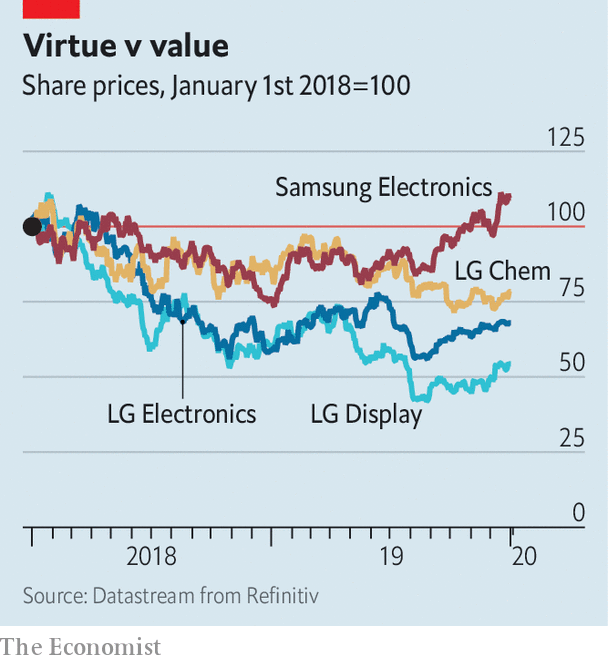

## Life’s not good enough

# LG, South Korea’s cuddliest chaebol, wants a sharper edge

> Can a newfound appetite for risk help it take on Samsung?

> Jan 2nd 2020SEOUL

BEFORE LG EXECUTIVES mull a new product, corporate types in South Korea like to joke, they first ask themselves: “Has Samsung already done this?” Only if the answer is “yes” does the country’s fourth-biggest conglomerate, which makes everything from consumer electronics and cosmetics to chemicals and health-care goods, move ahead with the plan.

The gibe says a lot about how LG is perceived on its home turf. Unlike Samsung, South Korea’s largest chaebol, which has been mired in scandal, LG oozes reliability and law abidance. When the government urged large groups to unwind their convoluted cross-shareholding structures, LG was one of the first to do so. But cuddliness may have blunted LG’s innovative edge. After years of profit growth the group’s performance has started to show cracks. LG Electronics, its flagship affiliate, has been struggling with plunging earnings in its mobile-phone division, where it faces fierce competition from Samsung, as well as Apple and China’s Huawei. Many are wondering if the “follower” strategy that has served LG well is still fit for purpose.

Koo Kwang-mo, the group’s chairman, may be among them. The 41-year-old took the reins in 2018 after the sudden death of his adoptive father, himself a descendant of the conglomerate’s founder. Although he keeps a similarly low profile to his predecessor, Mr Koo is testing out a more aggressive approach.

In November he appointed Brian Kwon, who had previously run LG Electronics’ mobile-phone and home-entertainment businesses, as boss of the whole affiliate. Mr Kwon’s battle with Samsung in flat-screen televisions involved taking out advertising explicitly mocking Samsung’s QLED technology as a has-been. Such brashness would have been unthinkable under the old guard, says Park Ju-Gun of CEOScore, a corporate watchdog in Seoul. LG Display, which makes the rival OLED technology used in LG’s televisions, is also being overhauled. In September its boss unexpectedly resigned and the company has since sacked dozens of executives and offered redundancy packages to many workers. In order to maintain its lead in large OLED panels it has ramped up capacity at its factories in South Korea and China. It has also sacrificed margins by pouring cash into research and development, hoping to catch up with Samsung in smaller, more profitable screens used in mobiles.

The newish head of LG Chem, Shin Hak-cheol, likewise has a reputation as a risk-taker. Last month the chemicals arm (which, like most parts of LG, is listed but ultimately controlled by the holding company Mr Koo heads) announced a joint venture with General Motors to produce batteries for its electric vehicles in a new factory in Ohio. Although demand for batteries is expected to grow, LG will be exposed to the fortunes of a single carmaker. These developments may be trial balloons for a plan to adopt a less risk-averse strategy for the group as a whole. So far, investors appear unimpressed. Shares of LG’s biggest companies have tumbled in the past two years; for all its scandals and deserved criticism of its governance, Samsung has done better (see chart). LG’s efforts to distinguish itself from Samsung’s vices are laudable. Mr Koo may need to do more to emulate its innovative virtues. ■

## URL

https://www.economist.com/business/2020/01/02/lg-south-koreas-cuddliest-chaebol-wants-a-sharper-edge
