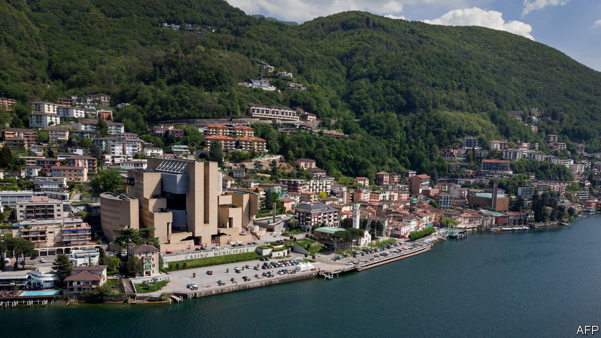

## Goodbye casino, hello smugglers

# A tiny Italian exclave unwillingly joins the EU’s customs union

> Campione d’Italia, a little piece of Italy inside Switzerland

> Jan 2nd 2020CAMPIONE

“WE FEEL COMPLETELY abandoned,” says Giancarlo Bortoli, as a cormorant skims behind him to land on Lake Lugano. A retired croupier, Mr Bortoli is a citizen of one of Europe’s least-known micro-territories: Campione d’Italia, an exclave of Italy within Switzerland. With fewer than 2,000 residents, the exclave results from a territorial adjustment in the 16th century. Like similar geopolitical oddities, Campione has a colourful past. Its casino, owned by the local government, was founded in 1917, reputedly to help tease intelligence out of off-duty diplomats in the first world war. Among those who later found it convenient to establish themselves in Campione was Howard Marks, one of the world’s biggest cannabis-smugglers.

Visitors coming from Switzerland encounter a grandiose arch marking the frontier. Yet “until now, it was as if Campione were part of Switzerland,” says Alessandro Alfieri, a senator for Lombardy, the Italian region to which the exclave belongs. Campione’s inhabitants have their rubbish collected, their water purified and their telephones supplied by Swiss utilities. They drive on Swiss number-plates. And until this week they were, in effect, part of the Swiss customs area, an arrangement with which they were perfectly happy.

At the start of 2020 Campione was brought into the EU customs area, meaning all sorts of new checks and duties will now be required. The exclave was already reeling from the closure of its (heavily indebted) casino in July 2018, Europe’s largest, and the main source of revenue for the local authority. With many of Campione’s residents living on unemployment benefit of less than €900 a month, having lost their jobs either at the casino or the council, the once buoyantly prosperous exclave is a glum place these days. Still, by placing it under a customs regime different from that of the country surrounding it, the EU may have opened a potential new source of income for some—smuggling.