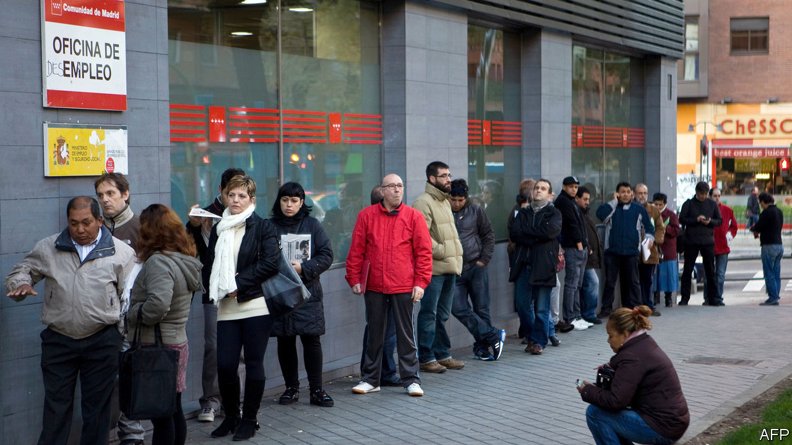
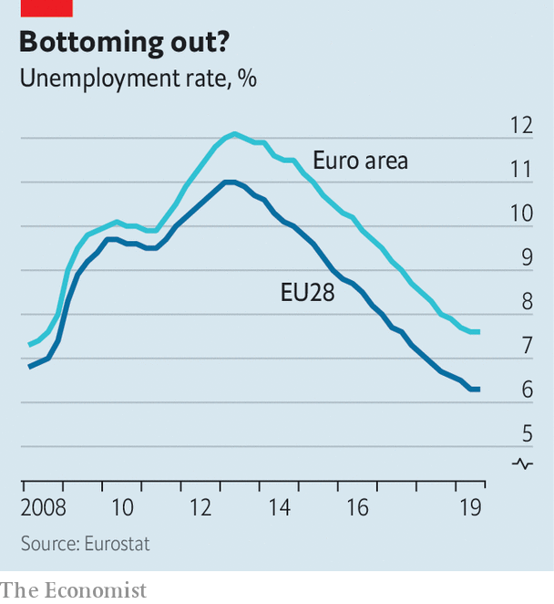

## Steady state

# Europe’s employment recovery seems to be nearing an end

> The EU’s unemployment rate has not changed since the spring

> Jan 2nd 2020

A DECADE AGO, as the sovereign-debt crisis engulfed the euro zone, long queues of the unemployed snaked outside job centres in Athens and Madrid. Unemployment, which had already been rising after the global financial crisis of 2007-08, took another jump up. By the summer of 2013 over a quarter of the workforce—and half of young people—were out of work in Greece and Spain. Then the crisis waned and the picture drastically improved. Unemployment has fallen by 40%, from more than 26m in the EU to just shy of 16m. Remarkably, the recovery has taken place even as more women and older people entered the workforce. Around 14m new jobs have been added, or around 6% of total employment.

In 2019, though, that recovery seemed to draw to a close. The EU unemployment rate has been stuck at 6.3% since May; the euro-area average has hovered around 7.5%. Job creation, too, has lost momentum. In the first nine months of the year employment grew at an average quarterly pace of only 0.2%, half the rate seen in 2017, when the economy was motoring along. What has driven the deceleration?

One explanation is that the labour market has returned to normal as the economy has recovered from the depths of the crisis. Companies may have soaked up the spare capacity that was generated by the recession, meaning that unemployment cannot fall much further without stoking wage inflation. But as this spare capacity cannot be measured directly, economists must search for clues about its extent.

Across the EU as a whole, the unemployment rate is now slightly below where it was in 2008, and the employment rate is actually at a record peak. Wage growth, meanwhile, is at its highest for a decade. All this is consistent with diminishing spare capacity. But in America and in Britain, where the recovery started earlier than in the rest of the EU, economists have been surprised by how low unemployment has fallen. That suggests that unemployment in the EU could fall even further.

The explanation fits some countries better than others. It seems apt for central and eastern Europe, where economies are growing rapidly as they catch up with those in the west, but the workforce is shrinking. In the Czech Republic the unemployment rate is an eye-poppingly low 2.2%—on par with that of Japan—and wages are rising at an annual rate of 7%. In Germany and the Netherlands, jobless rates are just over 3%, the lowest for decades.

By contrast, unemployment rates in France, Italy and Spain are still high compared with before the crisis, suggesting there is still some slack left. Yet these rates too have stabilised as employment growth has moderated. (One exception is Greece, which has the highest unemployment rate in the EU, of 17%, where joblessness is continuing to fall sharply.) This suggests another culprit for flatlining unemployment might be a shortfall in demand. Overall, the EU’s economy has been slowing since 2018, and bosses may want to take on fewer staff as a result.

The labour-market effects of the slowdown are, unsurprisingly, most evident in Germany’s manufacturing sector, which has been in recession for over a year. There, employment actually fell in the third quarter of 2019 for the first time in four years. Bosses have also been squeezing workers’ hours: a survey by the IFO Institute for Economic Research found that 8.4% of German manufacturing firms were operating short-time working schemes in December 2019, the highest share since 2010. More than 15% are expected to bring in shorter hours over the next three months.

What happens next will depend on how the economy fares, and whether the slowdown spreads beyond manufacturing, which employs only around 15% of the EU workforce. Forecasters expect the unemployment rate barely to budge: the European Commission, for instance, expects the EU rate to drop no further than to 6.2% by 2021. That assumes the European economy does not slow further; but the bad news keeps coming. A survey of purchasing managers, released on January 2nd, suggested that manufacturing activity in Germany was still shrinking in December, and that it decelerated in France. The longer these troubles continue, the more likely it is that bosses will become reluctant to hire more workers, and may lay some off. ■

## URL

https://www.economist.com/europe/2020/01/02/europes-employment-recovery-seems-to-be-nearing-an-end
