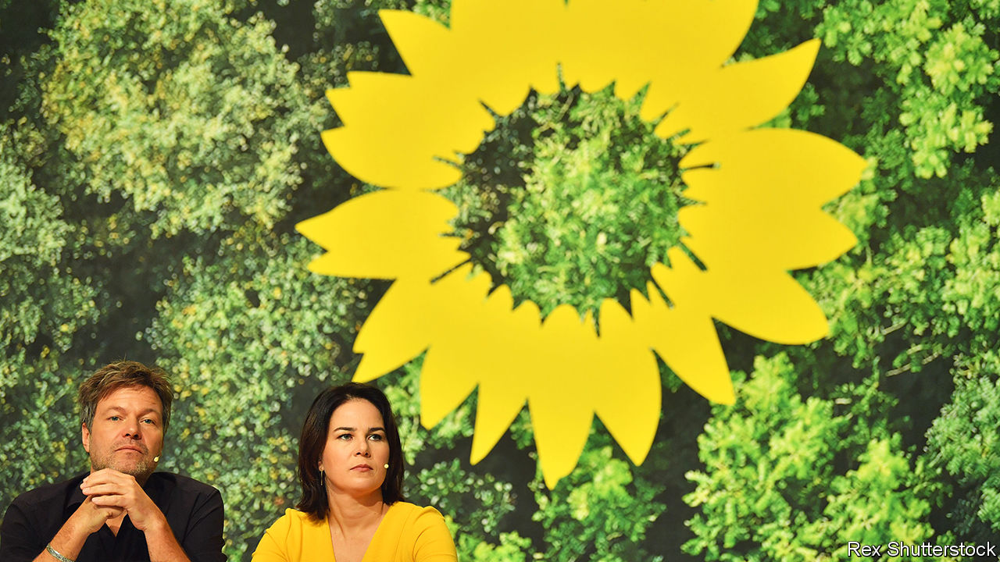
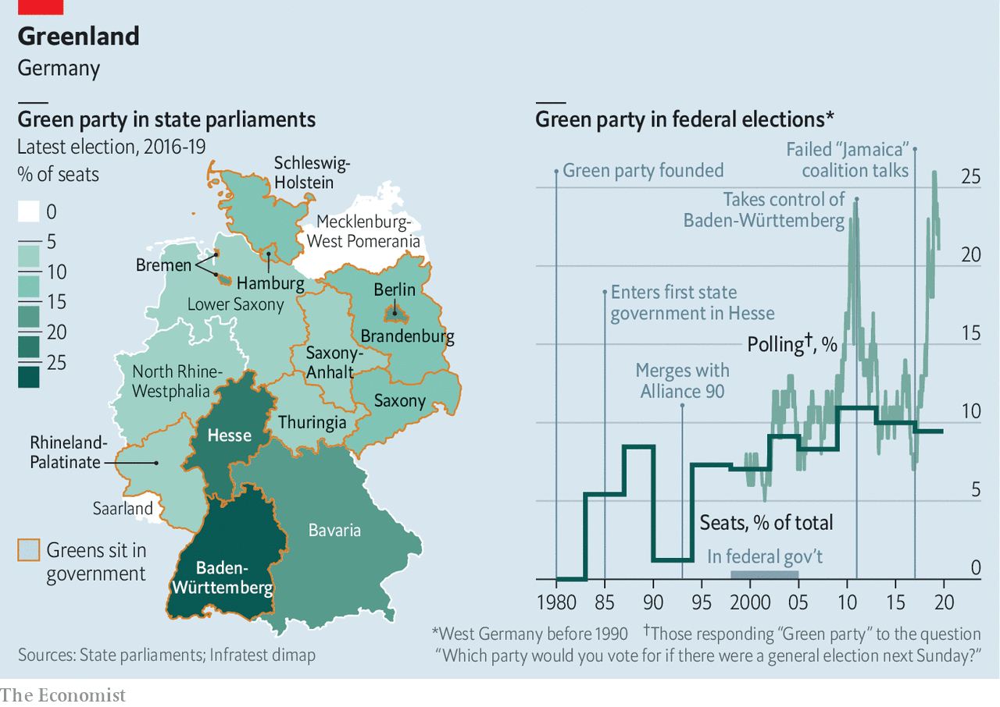

## From protest to power

# The stars have aligned for Germany’s Greens

> The next election may put them in government

> Jan 2nd 2020BERLIN

THE STORY of Germany’s Greens is a series of once-per-decade eruptions. Forty years ago an eccentric band of environmentalists, peaceniks and anti-nuclear activists gathered in Karlsruhe to set up a political party. In the early 1990s, after the party stumbled by failing to back German reunification, it merged with civil-society groups in the former east, yielding a clunky name that survives today: Alliance 90/The Greens. In 1998 the party joined Germany’s federal government serving for seven years as junior partner to Gerhard Schröder’s Social Democrats (SPD). In 2011, surging in polls after the Fukushima nuclear disaster, they took control of their first German state: Baden-Württemberg, in the rich south-west, where Winfried Kretschmann, a communist-turned-centrist, remains the Green premier today. Now a fifth eruption is looming.

As the Greens prepare to mark their 40th birthday on January 13th, they are squarely ensconced as Germany’s second most popular party (behind Angela Merkel’s conservative Christian Democratic Union, the CDU), and have a hunger for power that would have scandalised their hippie forebears. Germany’s next election is due in autumn 2021, if the ailing “grand coalition” of the CDU (and its Bavarian sister party, the CSU) and the SPD survives that long. Whenever it comes, it will almost certainly restore the Greens to government, probably alongside the CDU/CSU. It is even conceivable that Germany will provide the world with its first Green leader (bar a short-lived Latvian premiership in 2004).

A confluence of factors explains the Greens’ success. Germany’s federal structure offers smaller parties a chance to earn experience, and respect, in the Länder (states). Political fragmentation, and Green flexibility—a coalition with conservatives here, ex-communists there—sees them in office in 11 of the 16 states, as many as the SPD. This has trained a cadre of Green professionals in the art of government, rooted the party across Germany and stoked an appetite for power. It has also given the party an effective veto in the Bundesrat (Germany’s upper house, which comprises representatives of state governments), where it has tightened energy and climate laws.

The party itself has shaped up, too. For the past two years the Greens have been led by Robert Habeck and Annalena Baerbock, a telegenic, cheerful pairing who personify the triumph of the party’s “Realo” (pragmatic) wing over its hard-core “Fundis”. Mr Habeck, 50, a perma-stubbled former minister in the northern state of Schleswig-Holstein with a relaxed manner, has quickly become one of Germany’s most popular politicians; Ms Baerbock, 39, is a sharp-witted MP who knows her party inside-out. Where previous co-leaders (one from each wing) ran separate party fiefs to keep the peace, the current pair share personnel, philosophy and even an office. The Greens are mostly united, and the leaders’ hunger for power widely shared: a recent party congress re-elected them with North Korea-sized majorities. This leaves them well placed to gain from German voters’ new obsession with tackling climate change.

Above all, the Greens’ policies have broadened. “We are working hard not to be perceived as a single-issue party,” says Mr Habeck. Take public investment, where the Green plan is a refreshing contrast to the pro-austerity dogma of the CDU and others. The party wants to make up for years of underinvestment by borrowing €35bn ($39bn) per year to upgrade transport, digital, energy and other infrastructure, loosening the constitutional “debt brake”, which limits deficits, to exploit more generous EU rules. (That would be hard but possible, insists Mr Habeck.) A second strand is a social policy targeted at disaffected SPD voters. The Greens want a higher minimum wage, rent caps and to make Germany’s welfare system more generous again by softening earlier reforms.

Foreign policy is trickier. Most Greens shed their instinctive pacifism long ago. They take a tough line on China (the party opposes inviting Huawei to build Germany’s 5G networks) and Russia (it is against the Kremlin-backed Nord Stream 2 gas pipeline). Yet such impulses do not make up a broader strategy. And since 1999, when the party split over whether to back intervention in Kosovo, it has grown only more sceptical of military adventures abroad. The party resists what Mr Habeck calls the “symbolic” NATO target of devoting 2% of GDP to defence, instead vaguely urging a focus on capabilities and co-operation with European allies. Yet France, Germany’s most important partner, wants it to step up its military help in places such as the Sahel. “European soldiers, including Germans, must be prepared to deploy under certain circumstances,” says Mr Habeck, while acknowledging that the issue is “extremely challenging” for his party.

Difficult compromises are being forged on climate, the party’s signature issue, too. Despite having battled to shake off their image as humourless eco-moralists tossing off prohibitions against motorists and carnivores, the Greens are again talking about bans, which Mr Habeck has called “the condition for freedom”. The Greens want to phase out coal power and the combustion engine (in new cars) by 2030. They also want cheaper trains, dearer flights, EU tariffs on climate-unfriendly imports and a higher price on carbon emissions—plus compensation for those affected by it. Yet overall the party seeks to harness the power of markets and innovation, not to scare voters with radical proposals implying privation. The party assiduously courts business; Mr Kretschmann, its most successful politician, hugs closely the car firms that employ hundreds of thousands in his state. Still, there are limits. The Greens will not shake off their founding opposition to zero-carbon nuclear energy.

The common thread is a little bit of everything: climate-friendly growth that hurts neither companies nor the poor; investment plus fiscal responsibility; a foreign policy combining ethics with realism, all wrapped in an EU flag. Underpinning this is the closest the party gets to a political philosophy, as outlined by Mr Habeck. “Society has changed, and the idea of one-size-fits-all parties isn’t working,” he says. “If you think Greens have the answer, you can vote for us whether you’re an old lady or a punk in Berlin.”

To an extent, data back the party’s claim to transcend left-right divisions. At the European election in May, where the Greens came second with 20.5%, they took almost as many votes from the CDU as from the SPD. (They won among all voters aged under 60.) And as Germans adopt greener lifestyles the party returns the compliment, embracing local customs and traditions. “I like beer-tents, I like my Dirndl,” chuckles Katharina Schulze, who led the Greens to their best-ever result in Bavaria in 2018 after campaigning accordingly.

A recent poll found voters favouring a CDU/CSU-Green coalition after the next election. Once unthinkable, such “black” (conservative)-green tie-ups are spreading: Mr Kretschmann has led one since 2016, and Hesse, another rich state, has a conservative-led one. (In Austria the Greens agreed this week to join Sebastian Kurz’s People’s Party in coalition.) There was a dry run after Germany’s 2017 election, when the CDU/CSU, Greens and the liberal Free Democrats tried (and failed) to assemble a “Jamaica” coalition. But next time finding agreement on euro-zone, social, asylum and climate policy could prove tricky, and the CDU/CSU would seek Green concessions on security policy that the party base might struggle to swallow.

Still, the Greens are likely to ensure that Germany’s next election is the first in post-war history in which the CDU and SPD fail to occupy the top two spots. Could they lead a green-black government? It is not impossible: they briefly topped polls last spring. A Green-led coalition with the SPD and hard-left Die Linke is another option, though the numbers are not yet there. But the chance of a Green chancellor means Ms Baerbock and Mr Habeck must confront the awkward question of which of them it would be. Many insiders quietly admit to preferring Ms Baerbock, but Mr Habeck’s charisma and profile make him the favourite.

Such thoughts belie a concern among some Greens that the party’s current polling high may prove to be as fleeting as previous ones, especially if an economic slowdown displaces the climate among voters’ concerns and the party wilts under the scrutiny of an approaching election. That could happen, but neither governing party looks set to stage a recovery, and the Greens’ newly diversified policy portfolio is a hedge against voter caprice. For now, the party appears to be on a steady course towards government. ■

## URL

https://www.economist.com/europe/2020/01/02/the-stars-have-aligned-for-germanys-greens
