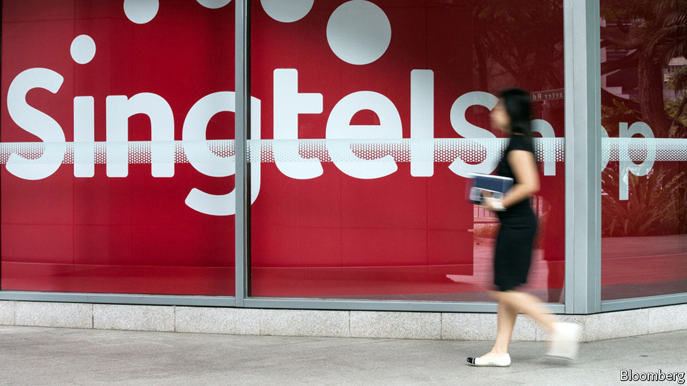

## Up for Grab

# Grab and Singtel will bid for a digital-banking licence in Singapore

> A ride-hailing firm and a telecoms group take on South-East Asia’s banks

> Jan 2nd 2020

IN 2014 SINGTEL, a Singaporean telecoms group, teamed up with Standard Chartered, an Asia-focused bank, to create Dash, a mobile-money unit it claimed would “revolutionise mobile commerce and banking”. But red tape meant it went nowhere fast. It refocused on mobile payments, but still struggled. Insiders liked to quip, says one, that “the only place that accepted Dash was Singtel’s canteen”.

Singtel’s banking ambitions are no longer a joke. On December 30th it said it was tying up with Grab, a car-hailing firm, to bid for a digital-banking licence from the Monetary Authority of Singapore (MAS). Together, the two firms are well-placed to benefit from one of the city state’s biggest financial reforms in two decades—and perhaps, to shake up banking across South-East Asia, a market of 655m.

Singapore hopes the new licences will deepen banking penetration and boost competition. According to Arthur Lang of Singtel, though the city state is one of the world’s main financial centres, 40% of the population is either underbanked—lacking access to credit cards or long-term savings products—or unbanked—lacking even a basic account. The three biggest incumbents, DBS, OCBC and UOB, hold 61% of domestic deposits. A spokeswoman for MAS says the entry of non-banks will “add diversity and choice”. Tech firms should have access to better credit-assessment tools and data, allowing them to lend to underserved small firms and the young.

Singapore also wants to improve its reputation for financial innovation. Investors poured a record $735m into local fintechs in the first nine months of 2019. DBS, the most valuable local bank, is well-known for its digital savvy. But Singapore lacks thriving neobanks. Europe has many, including Monzo, Starling and N26. South Korea’s Kakao Bank already has over 10m customers. Singapore is set to announce winning bids by mid-2020—over a year after Hong Kong, a notorious digital laggard, completed a similar tender.

MAS has set a high bar for bidders. Hong Kong handed out eight licences; Singapore will award just five, only two of them for full-service banking. Each of the pair will require S$1.5bn ($1.1bn) in entry capital; Hong Kong set a threshold of just HK$300m ($38m) per licence. Virtual banks will be subject to the same capital-adequacy rules as high-street peers and must show they can turn a profit within five years. Singapore wants innovation, says Florian Hoppe of Bain, a consultancy, but fears its profitable incumbents will be destabilised if tech newcomers burn cash to grab market share.

Much of the interest initially came from early-stage startups, says Eric Dadoun, an angel investor. But MAS’s stiff demands seem to have put off all but household names. Razer, a maker of gaming gear, is leading a consortium that includes investment funds, an insurance firm and an internet company. Gojek (an Indonesian unicorn), Standard Chartered, local banks and OneConnect (a subsidiary of Ping An, a Chinese insurance titan) are thought to be interested. A mooted tie-up between Keppel, a conglomerate, Validus, a peer-to-peer lending platform, and OCBC collapsed hours before the December 31st deadline.

The Grab-Singtel tie-up has two major strengths. First, the firms have clout and a broad geographic spread. Singtel is South-East Asia’s largest telecoms firm. It owns or backs subsidiaries in Australia, Indonesia, the Philippines, Thailand and 14 African countries. Grab has been downloaded onto 166m phones in South-East Asia. A funding round in March valued it at $14bn.

Second, they fit together neatly. In much of the region, more people have smartphones than have bank accounts, and Singtel’s brand is strong. But it is not known for innovation—which is where Grab can help. Founded in 2011, it sees itself as a “super-app”. On top of ride-sharing and food delivery, it already offers payments, working-capital loans and microinsurance, notably to its drivers and suppliers.

The duo’s ambitions clearly stretch well beyond Singapore. Tellingly, Singtel’s efforts are being led by Mr Lang, who heads its international operations, rather than Yuen Kuan Moon, its digital guru. A recent report by Bain, Google and Temasek, one of Singapore’s two sovereign-wealth funds, found that over 70% of adults in South-East Asia are underbanked. It says revenues from digital finance could grow from $11bn today to $60bn in 2025. Moreover, where Singapore goes other regulators in the region usually follow, says Frank Troise of SoHo Capital, which advises firms looking to enter Asian markets. “Malaysia, Indonesia, Vietnam, Thailand and the Philippines are all watching this and they’re just going to copy-paste.” A local banker reckons that Asia’s incumbent lenders are in for “the fight of their life”.

Perhaps not just Asia’s. Uber, an American ride-hailing champion, owns 27.5% of Grab. Perhaps it will pick up some tips and data. In October it launched a money division, the latest attempt by a Silicon Valley stalwart to enter financial services. “If I was J.P. Morgan or Verizon right now,” says Mr Troise, “I’d be terrified.” ■