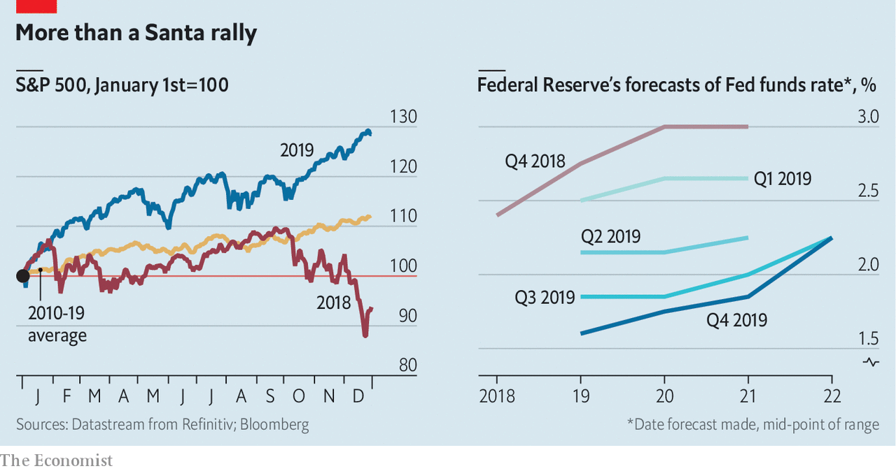

## Christmas bonus

# The causes of a booming stockmarket are unlikely to last through 2020

> Global growth, a trade deal and lower rates have added oomph to shares

> Jan 2nd 2020NEW YORK

THE CHRISTMAS of 2018 was a dismal one for American stockmarket investors. Meagre gains eked out through a volatile year were reversed at its end, on fears of slowing global growth and all-out trade war between America and China. The S&P index of large companies tumbled by 15% between November 30th and December 24th that year. Many thought a recession was imminent.

The fears proved overblown. The S&P 500 rose by 28.9% during 2019, close to the 2013 record increase and well above the average annual gain for the past decade (see chart). December is often good for markets—a phenomenon traders call the “Santa rally”. This one was particularly strong, with the index rising by 2.9%. Markets beyond America also did well. The FTSE All-World, a global index, rose by 24% in dollar terms, its best showing since 2009. 

Share prices often rise when expectations of future profits do. But earnings have stagnated recently, so that does little to explain this year’s boom. Falling interest rates played a bigger part. These boost share prices by increasing the comparative value of claims to future income streams, such as profits. The Federal Reserve, which had finished 2018 signalling that it would tighten monetary policy, changed course early in 2019 and indicated that it would ease if necessary to offset any shocks caused by the trade war. Market predictions for policy rates tumbled. During the year the Fed cut three times, undoing nearly all the previous year’s tightening.

After turbulence in the repo market, the Fed also started to expand its balance-sheet by buying short-dated Treasuries. The move was billed as a technical solution to problems in an essential part of the financial system, not as an economic stimulus. But it may have acted as one, all the same. After the financial crisis a decade ago, the Fed’s swelling balance-sheet was credited with driving a stockmarket rally.

December’s market oomph seems to have come from a mini trade deal between America and China. America cancelled planned new tariffs on Chinese goods and cut some already in force. China agreed to buy more American goods.

It was a good year not just for stocks, but for most financial assets, including corporate debt, government bonds, commodities and gold. That is unusual. When risky assets such as stocks and high-yield corporate debt are rising, safer ones such as government bonds and gold generally fall. Investors flock from risk to safety in times of crisis, and back again when the outlook improves. But when policy interest rates fall, bond yields generally do too; and thus bond prices rise. Loose monetary policy also tends to boost commodity prices. Broad indices of American bond prices rose by 9% in 2019. The price of gold rose by 19%.

A bumper year, then. But what of 2020? The potent combination of monetary easing and evaporating risks to growth seems largely played out. Shifting from trade hostilities to a ceasefire had a big impact; any further rapprochement is unlikely to do so much. Meanwhile neither the Fed nor independent economists are forecasting interest-rate moves during 2020.

Economic growth is also less likely to provide a tailwind. In America and globally, growth slowed a little during 2019. According to the Conference Board, a think-tank, economists expect that slowdown to continue. Profit upgrades are therefore unlikely. And investors are already paying through the nose for stocks. The “earnings multiple”—share prices as a multiple of profits—is steep, at 21.6 for the S&P 500, far above the long-run average of around 16.

Election years tend to be turbulent for stockmarkets. Over the past century, America’s has been more buoyant in the first two years of a presidential term than in the final one. And investors are worried that the Democrats will pick a nominee from the party’s radical left. When Elizabeth Warren was rising in opinion polls in October, hedge-fund managers warned that markets would fare poorly under her.

In October Paul Tudor Jones of Tudor Investment, a hedge fund run from Palm Beach, claimed the stockmarket would fall by 25% if Ms Warren were to be elected president. The Wall Street Journal has reported that Bridgewater Associates, the world’s largest hedge fund, has spent $1.5bn on derivatives that will pay out if the S&P 500 falls by March. It is hard to tell much about a fund’s portfolio from a single trade (and Ray Dalio, its founder, denied that the trade is representative)—but that is around when it will become clear who the Democratic nominee is likely to be.

Fears in 2018 for the year ahead proved misplaced. Those for 2020 may be, too. But investors should not bank on it. Only 12 times since 1928 has the S&P 500 posted a better return than it did in 2019. Each time, the following year turned out weaker than the one that came before. More ominously, in four returns were negative. ■