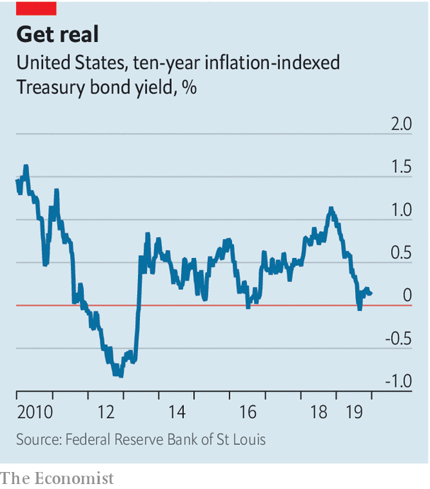

## Buttonwood

# Why the most important hedge is against unexpected inflation

> High asset prices stem from low inflation and interest rates

> Jan 2nd 2020

IT IS HARD to say precisely when a cherished theory of inflation lost its sway. But if you had to pick a moment, it might be during an exchange last July between Alexandria Ocasio-Cortez, a first-time congresswoman who had risen quickly to prominence, and Jerome Powell of the Federal Reserve.

The occasion was the twice-yearly testimony by the Fed’s chairman to Congress. The unemployment rate, noted Ms Ocasio-Cortez, had fallen by three percentage points since 2014, yet inflation was no higher. Might the Fed’s estimates of the lowest sustainable jobless rate have been too high in recent years? “Absolutely,” replied Mr Powell. The once-strong link between unemployment and inflation, known as the Phillips Curve, was a “faint heartbeat”, he said.

Inflation now seems no more pressing a worry than other diseases of the distant past—smallpox, say, or scurvy. Even central bankers, who are paid to be anxious, tend to fret that inflation in rich countries might stay too low, not that it might suddenly surge. Investors may see it differently. The whole edifice of asset prices is founded on the expectation that inflation—and thus interest rates—will stay low. An unexpected rise in inflation ought to be the thing investors are most determined to guard against.

Inflation clearly does not behave as it used to. It no longer goes up automatically when unemployment goes down. Perhaps this is because people have come to expect low inflation. Wages and prices are marked up less often and so are less responsive to slackness or tightness in the jobs market. Global supply chains mean local bottlenecks have less influence on prices.

For much of the decade that has just ended, central banks kept interest rates unusually low. This has had as little effect on inflation as low unemployment has. One explanation is the desire of ageing workers to set aside more of their income for retirement. This in turn has pushed down the equilibrium interest rate that balances the supply and demand for savings—with knock-on effects for asset prices. Rock-bottom bond yields reflect a belief that central banks will keep interest rates low indefinitely. And if bond yields stay low, expected returns on other assets (the earnings yield on equities, the rental yield on property and so on) will also stay low—and their prices will remain high.

A serious burst of inflation would change all that. It would be a sign that the low-interest-rate equilibrium had shifted. That would upset the constellation of high asset prices. For investors with portfolios stuffed with richly priced stocks, there is a strong reason to seek hedges against unexpected inflation. High-quality government bonds are the traditional diversifier for equity risk. But when inflation strikes, long-term nominal bonds are the worst assets to own. One way for the cautious to protect themselves is simply to hold more cash. Central banks would surely respond to a surge in inflation by raising short-term interest rates, thus boosting the returns on cash (with a delay).

But in many places cash rates are below current inflation. A superior way to hedge is to hold Treasury Inflation-Protected Securities, or TIPS. The coupon—effectively a real rate of interest—is a fixed fraction of the principal. The principal is not fixed, however. It is adjusted over time to reflect increases in the consumer-price index, or CPI. Ten-year TIPS currently have a small but positive real yield of 0.1% or so (see chart). The yield on a nominal ten-year Treasury is around 1.9%. The difference between the two reflects expectations of inflation (that is, 1.8%).

By holding TIPS to maturity, an investor can receive inflation insurance and also be paid a real return of 0.1% a year. True, were there to be an inflation shock, the Fed would react and real interest rates would go up, which would have a downward effect on the price of TIPS. But that would be more than offset by the upward effect of a surge in demand for insurance against higher expected inflation, say John Roe and Chris Jeffery of Legal and General Investment Management.

Reasonable people might ask: “Why bother?” Inflation has been slain. The fear that it is just around the corner led to investment mistakes and policy errors during the 2010s. Fair enough. But the reasons for quiescent inflation in the face of low unemployment and the secular decline in interest rates are not fully understood. A decade from now, a successor to Mr Powell may be explaining to Congress how the Fed had undercooked its inflation forecasts.