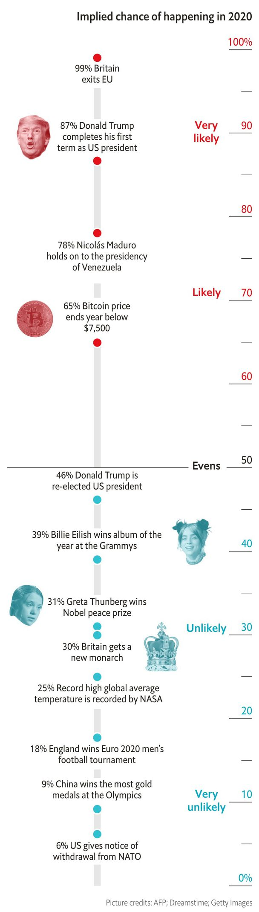

## The year in probabilities

# What markets and models expect in 2020

> Brexit is a near-certainty; American withdrawal from NATO a long shot

> Jan 4th 2020

“PREDICTION IS DIFFICULT,” they say, “especially about the future.” Statistical models can yield tolerably accurate projections for events that occur often, but not for one-offs, for which there are no historical data. One way to estimate the odds of such events is the “wisdom of crowds”. Just as stockmarkets aggregate beliefs about risk and firms’ future profits, betting markets reveal a consensus view about future political and news events.

Our graphic shows forecasts for the year ahead based on markets and models, from Donald Trump’s chances of re-election (46%) to whether Sweden will win the Eurovision Song Contest (9%). Nothing about the future is certain, but some outcomes are more likely than others. ■

Sources: Betfair; Federal Reserve Bank of Minneapolis; Ladbrokes; Paddy Power; PredictIt; Unibet; William Hill; The Economist

## URL

https://www.economist.com/graphic-detail/2020/01/04/what-markets-and-models-expect-in-2020
