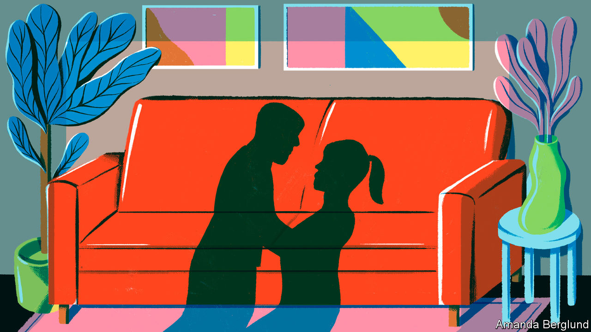
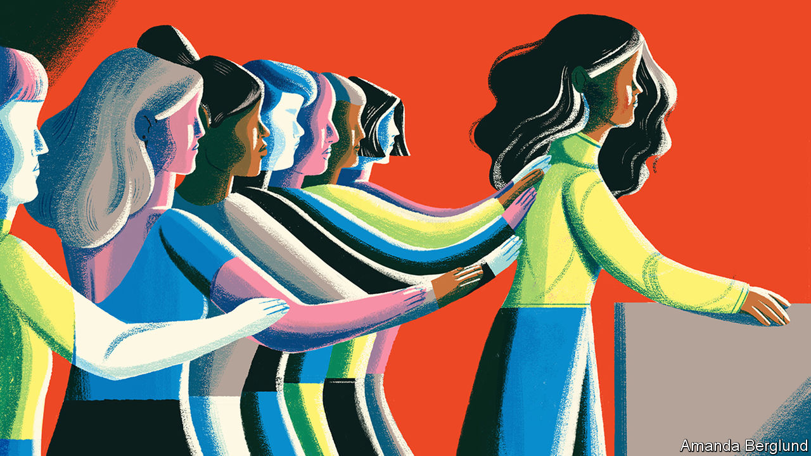

## Her word against his

# Why so few rapists are convicted

> The justice system is still stacked against women

> Jan 4th 2020

ON JANUARY 6TH a rape trial will begin and the world will hear all about it. Harvey Weinstein, a Hollywood mogul, will face five charges of sex crimes. Dozens of women have accused him of using his position to prey on them. In 2017 their testimony helped set off the #MeToo movement. If found guilty, Mr Weinstein, who denies all allegations of non-consensual sex, could spend decades in prison.

The accusations against Mr Weinstein set off such a storm because so many women had experienced something similar. But in other ways, the case is wildly unrepresentative. Most rape trials do not involve a famous defendant or multiple movie stars. More importantly, most rapes are not reported and most that are reported never come to trial. In England and Wales only 1.5% of rapes reported in the year ending March 2019 led to charges being filed, compared with 7.8% for all crimes and 8.3% for all violent crimes.

Rape is one of the hardest crimes to prosecute. After a murder, there is a corpse. After a rape, by contrast, there may be no physical evidence at all. Often, the only evidence that a crime has even occurred is the word of the victim, flatly contradicted by the defendant. When it is essentially her word against his, it can be extremely difficult to prove beyond reasonable doubt that the accuser is telling the truth and the defendant is lying. It is doubly so when the general public—and therefore jurors—have deep misconceptions about what a typical rape looks like, and what a credible allegation sounds like.

As well as drawing on the latest research, this article will use a fictional case study to illustrate the difficulty of weighing “he-said-she-said” evidence. Although our reporters interviewed numerous real-life victims of sexual assault, we found it hard to present their cases fully and even-handedly without harming the individuals involved. The story of “Jane” and “Joe” is not true, but we have tried to make it typical of the vast majority of cases that never get near a courtroom.

Jane is 24 and an office assistant. She says that two years ago Joe, a colleague, raped her. They went for drinks after work and she missed her train home. They went back to his flat. Once they were there, she says, he held her down and raped her despite her saying “no” repeatedly. She did not fight or scream. They had kissed a year prior to the incident, at the office Christmas party.

Joe is a 40-year-old banker. He says that on the night in question, they kissed and then had consensual sex. The next morning she left before he woke. But he says they have stayed on friendly terms. He says it was a classic one-night stand: “she was totally into it.” She is now “clearly lying”.

Many people faced with these two accounts will find Joe’s more credible. People often think of rape as involving things conspicuously missing from Jane’s account: a predatory stranger, a weapon used to threaten or hurt, a secluded location and a victim anxious to report the crime straight away. They are mistaken. “Most common knowledge about sexual assault is wrong,” said Barbara Ziv, a forensic psychiatrist who testified as an expert witness in the trial of Bill Cosby, an American comedian convicted of three counts of aggravated indecent assault in 2018.

In America over 127,000 rapes were reported to police in 2018; in England and Wales 58,947 were reported in the year ending June 2019. A huge majority of the victims were women. Many reports are made long after the event; more than a quarter of attacks reported in England and Wales in 2017 took place over a year before. Some 80% of rapes reported are committed by a person known to the victim.

Sexual assault typically involves neither weapons nor visible injuries. The 2017 Crime Survey for England and Wales found the most common location to be the victim’s home (39%) and the second most common the offender’s home (24%). Just 10% happen in a public place such as a park or the street. Nearly a third of people claiming to be the victims of rape said they told no one; over half told an acquaintance; fewer than one in five told the police. When Christine Blasey Ford claimed, in testimony before the United States Senate, to have been assaulted decades ago by Brett Kavanaugh, then a nominee to the Supreme Court, President Donald Trump insisted that anyone who had experienced such an assault would go straight to the police. In fact sexual assault and rape are the most underreported violent crimes.

Victims may not report their ordeal for a number of reasons, such as embarrassment or thinking it will not help. They may remain in contact with their assailant for work reasons. They may flirt with him or have sex with him again as a way to regain, or establish, a sense of control over their relationship.

Jurors can find this hard to fathom. Defence lawyers exploit their confusion. Soon after allegations against Mr Weinstein surfaced two New York Times reporters revealed how Mr Weinstein’s then lawyer, Lisa Bloom, had tried to reassure board members of his company by saying photographs would soon be published of “several of the accusers in very friendly poses with Harvey after his alleged misconduct”. When such evidence reveals a continued relationship that the accuser has sought to hide, it can be relevant. The mere fact of a continued relationship, though, says little.

The absence of a weapon; missing, imprecise or mistaken memories; delayed reporting; prior acquaintance; claims of consent—they all make a rape complaint more likely to be dismissed by investigators, even though they are extremely common.

In the past in the West, and to this day in such places as Saudi Arabia, a woman’s word was explicitly given less weight than a man’s. The law required a victim’s “prompt outcry” and corroboration of her account “because ladies lie”, as Morris Ploscowe, a mid-20th-century American legal scholar, put it. Deborah Tuerkheimer, a law professor at Northwestern University in Illinois, argues that the American judicial process still systematically discounts the credibility of accusers. The prior conduct and character of the accuser routinely come under scrutiny.

People who know Jane, or think they know her, are likely to find her story more credible. “The Weinstein case is greatly helped by those accusing him being well-known actresses [whom] the public trusts,” says Elaine Herskowitz, an investigator and consultant. And by the fact that Mr Weinstein doesn’t look like George Clooney, adds Bennett Capers, a professor at Brooklyn Law School. If Joe is good-looking both men and women are more likely to believe him than if he is not.

The greater the power differential between rapist and victim, the likelier he is to get away with it, reckon criminal-justice scholars. Jurors are especially likely to disbelieve victims if they are sex workers, drug addicts or teenagers. When a boss harasses a cleaner who cannot afford to lose her job, she is unlikely to report him. And if she does, his high social status may, in jurors’ minds, lend credibility to his denial of wrongdoing. Jeffrey Epstein, a wealthy sex offender who died in custody in New York, selected teenage girls from broken homes to prey on. When Epstein was first accused this probably made it easier for his lawyers to persuade investigators that his accusers could not be trusted.

Jane goes to the police. Asked why she didn’t report the next day, she says she was embarrassed and thought there was no point. She told her friend Sally, but nobody else. The only reason why she is reporting the rape now, she says, is that she has felt emboldened by the #MeToo movement.

If victims think reporting assaults is pointless, it is not without reason. In a study recently released by America’s National Criminal Justice Reference Service, researchers followed the flow of reports of rape and attempted rape in six American jurisdictions between 2008 and 2012. Of 2,887 reports by women just a fifth led to an arrest. Only 1.6% of incidents reported led to a trial. “Police and prosecutors selected cases based on what they thought a jury would believe,” says Linda Williams, one of the study’s authors.#

Drop-off rates seem to be increasing. In 2018-19 Britain had its lowest number of rape prosecutions in a decade, despite the number of police reports nearly tripling since 2014. According to FBI data, in America police successfully closed just 33% of rape investigations in 2018 (including dismissals), the lowest “clearance rate” since the 1960s. Rape was second only to robbery as the least-solved violent crime. Lower clearance rates might be a sign that police are keeping complex cases open for longer. But it could equally indicate that more rapes are going unsolved.

The police decide to question Joe. He accuses Jane of lying. He says she is jealous because he has started a new relationship. She is now “crying rape” for attention, he suggests.

Again, Joe’s story fits with a public preconception: the idea that a large proportion of women who accuse men of abuse are lying. According to Ipsos Mori, a pollster, 57% of American men and 48% of women believe that “false accusations of sexual harassment against men are very common.” In a survey of nearly 900 police officers in America, over half stated that 10-50% of sexual-assault complainants lie about being attacked. One in ten said it was more like 50-100%. A poll by The Economist shows that in the aftermath of #MeToo people are more worried than before about false allegations of harassment and rape.

It is impossible to know the true rate of false reports. However, in a review of credible research, David Lisak, at the time at the University of Massachusetts, narrowed the estimate to between 2% and 8%. For those who are falsely accused, the process can be a nightmare with irreparable consequences. But if police presume accusers are lying, rape victims will not come forward, and rapists will rape with impunity. “What you want is a system that treats both testimonies seriously, which is not the same as automatically believing all of it,” says John Spencer of Cambridge University.

False accusations are much more likely than real ones to look like the stereotype of rape (violence, strangers and dark alleys). A study in 2014 of cases in Los Angeles found that of the 4.5% of rape allegations deemed to be false by the researchers, over three-quarters were for aggravated rape, which involves the use of a weapon, multiple suspects or collateral injury.

The investigators start to dig into Jane’s accusation. There are several gaps in her story. She cannot remember for sure how they got to Joe’s flat nor how and when exactly she got home afterwards. But she describes Joe’s sofa in great detail, including the squeaky sound it made. Joe’s sofa does squeak.

Neighbours say they heard no sounds of a struggle; but Jane does not say she struggled. She says she froze.

There is no physical evidence. Jane does not claim to have been physically injured. She did not go to hospital. In any case, Joe does not deny that they had sex.

Phone records show that Jane texted her friend Sally the morning after:

“need to talk asap :( call? x”.

Sally’s diary confirms that Jane told her she had been raped.

Jane also sent two messages to Joe in the weeks after the encounter:

“I’m bored. wassup with you? x”.

 “you goin to the summer party? Hope so”

 Joe did not reply to either. On the day that Jane texted Sally, he texted a friend about “banging the babe senseless”.

Beyond testimonial evidence, he-said-she-said inquiries typically focus on three things: the victim’s memory, her body and her digital footprints.

The ways in which the mind remembers, and forgets, assault can work to the accuser’s disadvantage. Memory of trauma can record some particulars in excruciating detail while leaving other details hazy or forgotten. “From a survival point of view this makes perfect sense,” says Jim Hopper of Harvard Medical School. “Our brain has evolved to remember what to avoid in the future, but not what was happening on the other side of the room.” Alcohol adds to the difficulties. In England and Wales over a third of self-reported rape victims said they had drunk alcohol when they were attacked. Heavy drinking can cause blackouts as well as removing the capacity for consent. Even moderate drinking can blur the memory of peripheral details.

The body, too, does not necessarily record the evidence people might expect. Non-consensual sex does not always lead to injury or physical trauma. One reason is “tonic immobility”, a reflexive response in which the body is paralysed. Two thirds of rape of victims questioned in a Swedish study reported symptoms of tonic immobility. “Victims are still suspected of lying if their vulvas aren’t visibly shredded after a rape,” writes Kate Harding, a feminist author, in “Asking for It”.

Digital records are a new source of potential evidence. When witness statements and other evidence are inconclusive, jurors will struggle to choose between the accuser’s story and that of the accused. To increase their doubts, defence lawyers often try to demolish the accuser’s credibility. Trawling for any dodgy-looking detail of prior conduct is no longer acceptable in most jurisdictions. But material relevant to the relationship in which an assault is alleged to have happened is still allowed.

In Britain failures by police and prosecutors to investigate properly accusers’ phone records and disclose them to the defence have led to a number of rape cases collapsing. Victim advocates worry that in response the level of intrusion into phone, email and chat records will come to amount to a “digital strip search”. If an accuser signs an instrument called a Stafford statement a wide array of digital records related to her can be perused, including those from doctors and therapists. Such intrusion is another reason victims stop cooperating with investigations.

After investigation, the prosecutor decides there is not enough evidence to proceed to trial. But Jane’s story appears on social media. Having seen it, another woman comes forward claiming Joe did the same thing to her. An anonymous blog post alleges that when he and the author were interns 20 years ago he was “super creepy” and would “constantly talk about his penis”.

The human resources department at the bank where Jane and Joe work faces a meltdown; many women, and some men, say they feel uncomfortable around Joe. Joe’s local football club asks him to step down as coach of its girls’ team. His girlfriend leaves him.

Three months later, Jane resigns from her job; Joe’s friends at work make her feel uncomfortable. Jane continues to suffer from anxiety. Joe has a new girlfriend and is working in a different part of the same bank.

“I don’t care if 30 more women come forward and allege this kind of stuff, Les is our leader and it wouldn’t change my opinion of him,” Arnold Kopelson allegedly told fellow members of the board of CBS , a broadcaster, in July 2018. A single accusation of sexual misconduct against the company’s CEO, Les Moonves, had become a spate. But their sheer volume meant that unlike Mr Kopelson the public did care, and in time the shareholders came to care, too. Mr Moonves was forced out of his job; he might have been prosecuted had the statute of limitations relevant to the allegations not expired. Mr Moonves denies all of the allegations.

The retrial of Mr Cosby also demonstrated the power of numbers. The first case against him, which went to court in June 2017, ended in mistrial. But at retrial the judge allowed five additional victims to testify. Even though there was only one formal complainant, the volume of supportive testimony helped the jury to convict him. Some rapists do indeed, over time, rape more than one woman—a rare example of a commonplace about rape that has some truth. Multiple accusers make each other more credible, especially if they come out independently. But the number of allegations does not necessarily make any one easier to prove in legal terms.

When legal systems fail, people look elsewhere. Anonymous early-warning networks have existed for as long as women have scrawled the names of dangerous men on toilet doors or described colleagues as “not safe in taxis”. Shared spreadsheets such as the Shitty Media Men list which circulated in New York and the Westminster Sex list used in British political circles are digital equivalents.

Online tools built for the job now exist. Callisto, a system now used in many universities, gives those reluctant to report assaults two options: create but don’t file a report (in case they want to file it in the future) or enter their perpetrator into “Matching” (college authorities are only notified if several people enter the same name). The non-profit that runs it claims users are six times more likely to report abuse and that they do so much sooner than people without access to the tool.

After decades of institutional failure to take allegations seriously, #MeToo showed the power of social media to disseminate accounts of predation and to give accusers a new sense of solidarity. The sheer volume of allegations has caused some criminal cases to be opened or reopened. But it has also shown how hard it is to achieve justice for rape victims, or deter their attackers. ■

## URL

https://www.economist.com/international/2020/01/04/why-so-few-rapists-are-convicted
