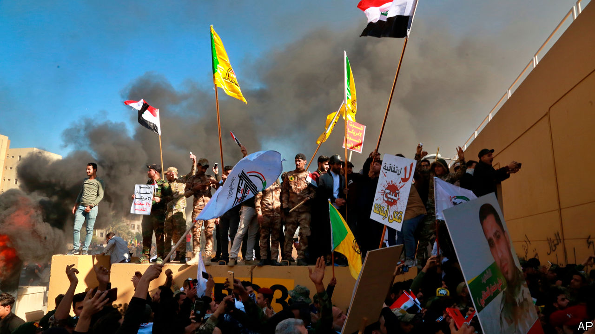

## Undeterred

# America shows how not to tame Iran

> By bombing Iraqi territory, America has helped Iran

> Jan 2nd 2020

AFTER NEARLY coming to blows in 2019, America and Iran celebrated the new year in fitting style: with prophecies of war. The escalation began on December 27th, when dozens of missiles, allegedly fired by an Iranian-backed militia in Iraq called Kataib Hizbullah, struck an Iraqi military base in Kirkuk, killing an American contractor and wounding American and Iraqi soldiers. Two days later America responded, over objections from the Iraqi government, with air strikes on Iraqi soil that killed at least 25 militia members and wounded over 50. After thousands of militiamen and protesters then attacked the American embassy in Baghdad, President Donald Trump said Iran would be held responsible. “They will pay a very BIG PRICE!” tweeted Mr Trump. “This is not a Warning, it is a Threat. Happy New Year!”

Iran is responsible for stoking the conflict. Its interference in Iraq has spurred tens of thousands of Iraqis to march against it in the streets since October. The protesters are fed up with their own politicians, many of whom seem to want only to please Iran’s leaders, their fellow-Shia patrons. Tehran has even helped its Iraqi clients quell the unrest. Hundreds of protesters have been killed by pro-Iran militias. At the same time, says America, Iranian-backed groups have carried out nearly a dozen attacks on Iraqi bases and facilities housing American contractors and soldiers, who are there at the invitation of the Iraqi government to train local forces. With the Iraqis neglecting their security, America understandably hit back to deter future attacks.

But officials in Washington appeared taken by surprise when the killing of Iraqi citizens on Iraqi soil against the wishes of the Iraqi government ended up causing a savage backlash (see [article](https://www.economist.com//middle-east-and-africa/2020/01/02/the-conflict-between-america-and-iran-intensifies-in-iraq)). Iraqi officials accused America, accurately, of violating Iraqi sovereignty. The crowds that stormed the embassy, in the heavily guarded Green Zone of Baghdad, seemed to have been waved through by local security forces. Iran, no doubt, also had a hand in stirring up the unrest. As Mr Trump dispatched hundreds of extra troops to the region, a coalition of pro-Iran parties in Iraq called for the withdrawal of all American soldiers. Parliament may be receptive.

The episode has underlined the contradictions in the president’s approach. His chief aim in the Middle East is to curb Iran. In 2018 he pulled out of a deal that froze Iran’s nuclear programme. Since then he has heaped sanctions on Iran as part of a campaign of “maximum pressure”. At the same time, however, he has done little to hit back when Iran and its proxies attacked commercial shipping, Saudi oil facilities and American targets. Now Mr Trump has at last returned fire—but he has chiefly harmed himself. The air strikes have stoked anti-Americanism. On the streets of Baghdad, chants of “out, out Iran” gave way to “death to America”. A strike designed to punish Iran has ended up rewarding it.

Sixteen years after overthrowing Saddam Hussein, that smacks of poor intelligence and of a depressingly weak influence over the government in Baghdad. It is an ominous sign for the durability of America’s continuing presence in Iraq.

But America’s contradictions are dwarfed by those of the Iraqi state, which shoots one lot of protesters while encouraging another to run riot. Prominent politicians, such as Hadi al-Amiri, who heads a large bloc in parliament and controls a powerful militia, even joined the group outside the American embassy. He and other militia leaders, to say nothing of Iran, would like to see America go. And yet the Iraqi army depends on the Americans for guns, training and money (some $5.8bn since 2014) even as their bitter enemies, the jihadists of Islamic State, are regrouping. That points to a bigger problem: Iraq’s militias are nominally under the government’s control, but act at best independently and at worst for Iran. If Kataib Hizbullah did indeed fire missiles at an Iraqi military base, one arm of the state attacked another.

Iran’s baleful influence is making Iraq even more dysfunctional. The government is dominated by people like Mr Amiri, who are in thrall to Tehran. They have used its backing to accumulate power, while entrenching ethnic and sectarian divisions and milking the state. Rather than curb Iranian meddling, as the people want, they invite it, ignoring the dreadful example Iran has set lording over crisis-ridden Lebanon and war-torn Syria.

The Iraqi people know their country can do better. Its politicians should heed them, not the mullahs next door. Until that happens, however, Iraq will be caught in a miserable tug-of-war between America and Iran, a global superpower and a regional one. It is a struggle that, going by the evidence of this week, America will lose—and that Iraq will thus lose, too. ■