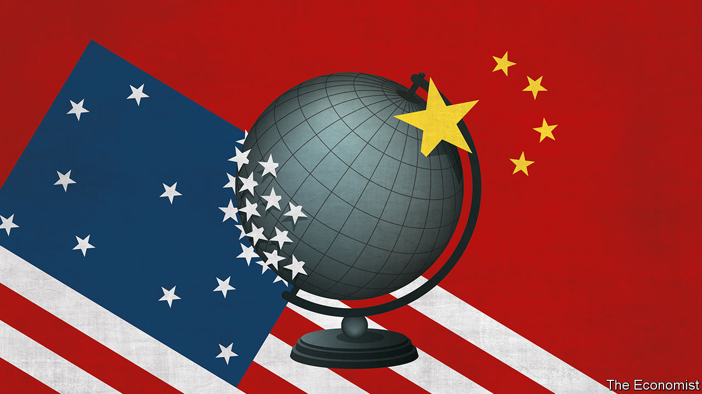

## The superpower split

# Don’t be fooled by the trade deal between America and China

> The planet’s biggest break-up is under way

> Jan 2nd 2020

ON JANUARY 15TH, after three years of a bitter trade war, America and China are due to sign a “phase one” deal that trims tariffs and obliges China to buy more from American farmers. Don’t be fooled. This modest accord cannot disguise how the world’s most important relationship is at its most perilous juncture since before Richard Nixon and Mao Zedong re-established links five decades ago. The threat to the West from China’s high-tech authoritarianism has become all too clear. Everything from its pioneering artificial-intelligence firms to its gulags in Xinjiang spread alarm across the world.

Just as visible is America’s incoherent response, which veers between demanding that the Chinese government buy Iowan soyabeans and insisting it must abandon its state-led economic model. The two sides used to think they could both thrive; today each has vision of success in which the other lot falls behind. A partial dismantling of their bonds is under way. In the 2020s the world will discover just how far this decoupling will go, how much it will cost and whether, as it confronts China, America will be tempted to compromise its own values.

The roots of the superpower split go back 20 years. When China joined the World Trade Organisation in 2001 reformers at home and friends abroad dreamed that it would liberalise its economy and, perhaps, its politics too, smoothing its integration into an American-led world order.

That vision has died. The West has faced a financial crisis and turned inward. China’s behaviour has improved in some ways: its giant trade surplus has fallen back to 3% of GDP. But it has an even bleaker form of dictatorship under President Xi Jinping and has taken to viewing America with distrust and scorn (see [article](https://www.economist.com//china/2020/01/02/china-views-donald-trumps-america-with-growing-distrust-and-scorn)). As with every emerging great power, China’s hankering to exert its influence is growing along with its stature. It wants to be a rule-setter in global commerce, with sway over information flows, commercial standards and finance. It has built bases in the South China Sea, is meddling with the 45m-strong Chinese diaspora and bullying its critics abroad.

President Donald Trump has responded with a policy of confrontation that has won bipartisan support in America. Yet the China hawks thronging Washington agencies and corporate boardrooms share no consensus over whether America’s goal should be the mercantilist pursuit of a lower bilateral trade deficit, the shareholder-driven search for profits in American-owned subsidiaries in China or a geopolitical campaign to thwart China’s expansion. Meanwhile, Mr Xi oscillates between grim calls for national self-reliance one day and paeans to globalisation the next, while the European Union is unsure if it is an estranged American ally, a Chinese partner or an awakening liberal superpower in its own right.

Muddled thinking brings muddled results. Huawei, a Chinese tech giant, faces such a disjointed campaign of American pressure that its sales rose by 18% in 2019 to a record $122bn. The EU has restricted Chinese investment even as Italy has joined China’s belt-and-road trade scheme. China spent 2019 promising to open its big, primitive capital markets to Wall Street even as it undermined the rule of law in Hong Kong, its global financial hub. The phase-one trade deal fits this pattern. It mixes mercantilist and capitalist goals, leaves most tariffs intact and puts aside deeper disagreements for later. Mr Trump’s tactical aim is to help the economy in an election year; China is happy to buy time.

Geopolitical incoherence is neither safe nor stable. True, it has not yet inflicted a big economic cost—since 2017 bilateral trade and direct investment flows between the superpowers have dropped by 9% and 60% respectively, but the world economy still grew by about 3% in 2019. Some businesses, such as Starbucks’s 4,125 cafés in China, need never be affected. But confrontation is constantly spreading into new arenas. America’s campuses are convulsed by a red scare about Chinese spying and intimidation (see [Briefing](https://www.economist.com//briefing/2020/01/02/the-new-red-scare-on-american-campuses)). Rows blaze over athletes kowtowing to China, naval docking rights and alleged censorship on TikTok, a Chinese app used by teenagers worldwide. In the background is the risk of a confrontation between the superpowers over Taiwan, which holds elections in January (see [article](https://www.economist.com//asia/2020/01/02/taiwans-china-sceptic-president-tsai-ing-wen-may-win-again)).

Each side is planning for a disengagement that limits the other superpower’s day-to-day influence, reduces its long-term threat and mitigates the risk of economic sabotage. This involves an exceptionally complex set of calculations, because the two superpowers are so intertwined. In technology, most electronic devices in America are assembled in China, and, reciprocally, Chinese tech firms rely on foreign suppliers for over 55% of their high-end inputs into robotics, 65% of those into cloud computing and 90% of those into semiconductors. It would take 10-15 years for China to become self-sufficient in computer chips and for America to shift suppliers (see [Technology Quarterly](https://www.economist.com//technology-quarterly/2020/01/02/technological-progress-in-china-could-still-lead-to-fireworks)). Likewise in high finance, which could serve as a vehicle for sanctions. The yuan accounts for just 2% of international payments and Chinese banks hold over $1trn in dollar assets. Again, shifting trade partners to the yuan and winding down the banks’ dollar exposure will take at least a decade, probably longer. And when it comes to research, China still trains its best talent and finds its best ideas in America’s world-beating universities—at the moment there are 370,000 mainland students on campuses in the United States.

Were the superpower rivalry to spiral out of control, the costs would be vast. To build a duplicate tech hardware supply-chain would take $2trn or so, 6% of the superpowers’ combined GDP. Climate change, a great challenge which could provide a common purpose, would be even harder to cope with. Also at stake is the system of alliances that is a pillar of America’s strength. Some 65 countries and territories rely on China as their largest supplier of imports and, asked to choose between the superpowers, not all of them would opt for Uncle Sam—especially if it continues to pursue today’s policy of America First. Most precious of all are the principles that really made America great: global rules, open markets, free speech, respect for allies and due process. In the 2000s people used to ask how much China might become like America. In the 2020s the bigger question is whether a full superpower split might make America more like China. ■

## URL

https://www.economist.com/leaders/2020/01/02/dont-be-fooled-by-the-trade-deal-between-america-and-china
