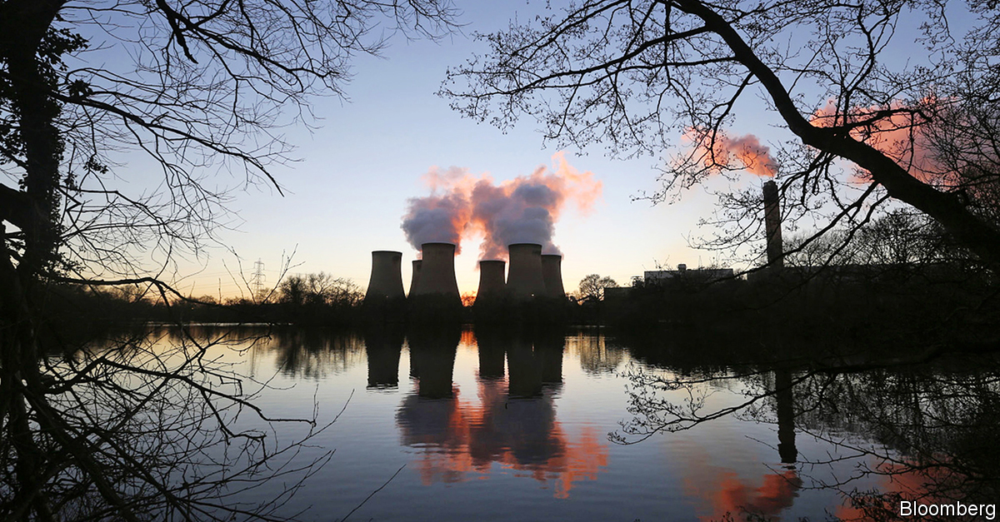
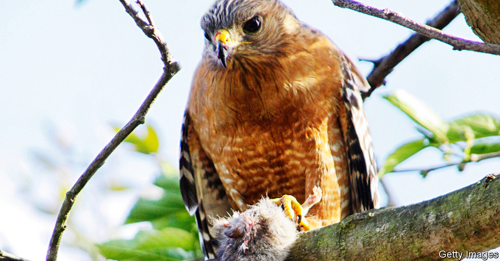
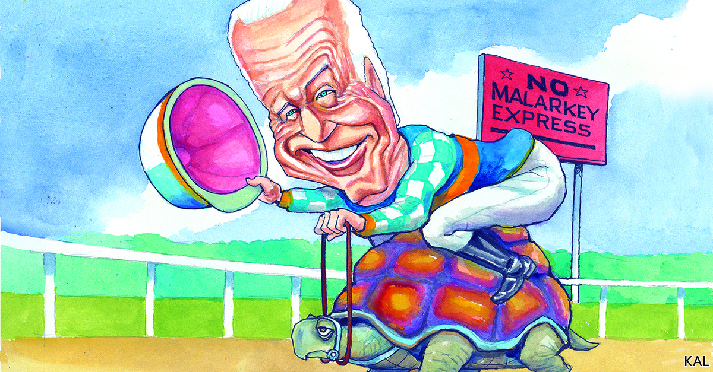

## On carbon capture, health care, rats, conservation, Joe Biden

# Letters to the editor

> A selection of correspondence

> Jan 2nd 2020

Regarding the idea of pulling carbon dioxide out of the atmosphere, you favour artificial systems over natural ones (“The chronic complexity of carbon capture”, [December 7th](https://www.economist.com//briefing/2019/12/05/climate-policy-needs-negative-carbon-dioxide-emissions)). Yet profitable carbon removal through natural-systems farming, grazing and forest and marine management is already proven, scalable and rich in side benefits. It can robustly achieve a 1.5oC climate trajectory with no overshoot, strongly support the UN’s Sustainable Development Goals and avoid between $1trn and $3trn of supply-side investments a year by 2050, if coupled with lucrative and conservatively assessed energy efficiency and modern renewables. However, inertia and policy perversity block this in both energy and carbon removal, the former making the latter problematic.

Systems that grow and sustain themselves will outperform machinery that must be built, maintained, protected and powered. This incurs opportunity cost: needlessly costly methods worsen climate change by saving less carbon per dollar. Emphasising carbon removal through unnatural systems can incur moral hazard, waste money and time, and distract from the profitable solutions that are available.

A recent paper, “Recalibrating climate prospects”, shows how “integrative assessment models” that translate climate science into choices and consequences generally understate mitigation opportunities. Offsetting these biases, what Jeremy Grantham calls “the race of our lives” is very much on. Neither despair nor complacency is warranted.

AMORY LOVINSCo-founderRocky Mountain InstituteBasalt, Colorado

Although trees and other plants need significant land area for carbon capture and storage, nature’s process is far more efficient than industry’s. Carbon has a molecular weight of 12 and oxygen 16, so carbon dioxide has a molecular weight of 44. Carbon capture stores the whole amount, whereas plants elegantly store only 27% of that weight as carbon biomass, releasing the oxygen to the atmosphere for our benefit. Let’s give carbon credit where it’s due.

MICHAEL RAMAGEReader in architecture and engineeringUniversity of Cambridge

Your analysis of carbon capture and storage was welcome, if somewhat pessimistic. We recently analysed ten recognised carbon-utilisation pathways and found that, at the top end, around 10bn tonnes of carbon dioxide a year could be used by 2050, a sizeable chunk of current emissions. Some of these pathways, notably the production of urea and polymers, could already be profitable. Others would require a carbon price of less than $100 per tonne.

As you implied, a carbon tax could speed their deployment. A simpler alternative is mandatory sequestration: requiring fossil-fuel companies to capture and safely dispose of a fraction of the carbon dioxide that they extract or import. Indeed, Britain had such a bill on the table in 2015. Perhaps it is time to bring it back.

CAMERON HEPBURNSmith School of Enterprise and EnvironmentUniversity of Oxford

Price transparency in health care can be helpful to patients (“Diagnosis: opaque”, [November 23rd](https://www.economist.com//business/2019/11/21/donald-trump-wants-hospitals-to-be-more-upfront-about-prices)), though it has limitations in the American market. The price mechanism works best when the buyer has the luxury of choice and time, which patients often do not because of market consolidation and clinical urgency. Around 40% of the insured population are already in public programmes with fixed prices that are largely transparent and often set below the cost of providing care.

Crucially, without transparency of quality and therefore value of care, it is hard for patients to know what they are getting for the price. A surgeon who performs a procedure few others can, and none better, typically receives the same payment as someone with worse outcomes. Isolated price transparency is as helpful as washing only one side of a window.

LYELL JONESProfessor of neurologyMayo Clinic College of Medicine and ScienceRochester, Minnesota

I was disappointed to see your take on rat control in California, siding with the pest-control industry and their toxic products (“Something rodent in the state”, [November 23rd](https://www.economist.com//united-states/2019/11/23/a-bill-would-make-it-harder-to-control-californias-thriving-rats)). Those of us who support this bill are not pro-rat, we just want to stop the indiscriminate killing of non-rat species. There are many other means of controlling pests such as snap traps and electrical traps that do not take nearly the same toll on wildlife. Poisons allow the pest-control companies to kill off their competition, literally.

SIOBHAN RUCKSan Francisco

The Royal Horticultural Society says you should grow mint around your composters as rats do not like the smell. It has certainly worked around my composter. On that evidence, a friend from Lagos says she plans to set up a farm there to produce the herb, and reckons she will make a mint out of it.

DUNCAN STEPHENSONLeeds

Your article about the benefits of newly created fake rhino horn did not address the challenges and risks (“Fooled you”, [November 16th](https://www.economist.com//science-and-technology/2019/11/14/how-to-forge-rhinoceros-horn)). Might this new material end up legitimising trade in rhino horn, for example? Furthermore, rhino horn is not just being used for traditional Chinese medicine, but also for conspicuous consumption. Fake horn will not work for that market, just as fake diamonds have not supplanted the real thing on wedding rings. That is not to say this new horn will definitely do harm, but that the risks need to be considered.

The fake-horn approach fundamentally misses the underlying weakness in the economics of conservation: poaching is cheap and quick and can generate good financial return; conservation is long-term and expensive and struggles to generate revenue. We need more businesses selling products that help protect wildlife by creating local jobs, generating revenue for conservation organisations, and paying taxes in countries with wildlife to create an economic justification for conservation and the resources to support it.

If the 12m people who watched “Planet Earth II” in Britain bought just one cup of £2 wildlife-friendly coffee on average each week for a year, it would generate more than £1bn for conservation. Legitimate purpose-driven businesses, not forgers, are the key to saving wildlife.

RICHARD MILBURNMarjan Centre for the Study of Conflict and ConservationKing’s College London

Lexington’s column on Joe Biden provided a noteworthy example of Winston Churchill’s observation that America and Britain are divided by a common language ([December 7th](https://www.economist.com//united-states/2019/12/07/the-stickiness-of-joe-biden)). With all of Mr Biden’s problems with the #MeToo movement, he would surely be unhappy to be reported as “planting peckers” on one elderly cheek. One hesitates to visualise it.

RICHARD WAUGAMANClinical professor of psychiatryGeorgetown UniversityWashington, DC

## URL

https://www.economist.com/letters/2020/01/02/letters-to-the-editor
