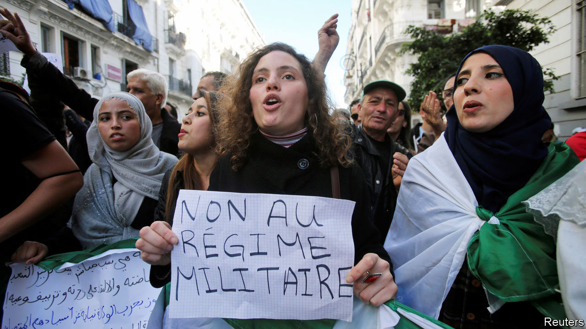

## Hoping for a cheerier Algeria

# An Algerian general takes over from another general

> As a new government struggles with empty coffers and angry streets

> Jan 4th 2020ALGIERS

IT WAS AS if the old general running the country behind the scenes for the past eight months had not died after all. A bare week after a heart attack felled General Gaid Salah on December 23rd, another septuagenarian in a green uniform under a brocaded peaked hat harangued a hall full of generals (all similarly attired). The army, said General Said Chanegriha, the country’s new top military man, must confront a “serious conspiracy against stability”. No one doubted he was referring to the protest movement known as Hirak that has convulsed Algeria since last February. In April it brought down the country’s despot, Abdelaziz Bouteflika, after 20 years in office. Though a new civilian president, Abdelmajid Tebboune, had been elected in early December, the new general in charge said the risk of chaos was too great for the army to return to the barracks.

Algeria had a few months of civilian rule after independence in 1962. But the generals have dominated ever since. Keeping their grip is getting harder. What began as a protest against corrupt politicians has turned on the generals. The hundreds of thousands who cheered when the army removed an ailing Mr Bouteflika in April now march every Friday against those who ousted him. They hiss at the phalanx of anti-riot forces facing them and call for the isaba, or gang of top brass, to go. “You can’t recycle this rubbish,” they cry. “Civilian not military rule.”

The generals have tried to mollify the protesters by imprisoning two former prime ministers, several security chiefs and a slew of top businessmen. But leading lights in Hirak have denounced those hasty proceedings as show-trials. They also accuse the generals of replacing one set of cronies with another.

On December 12th the army oversaw a presidential election to fill Mr Bouteflika’s shoes. But the five candidates were all handpicked ageing former apparatchiks. Turnout was the lowest ever. On December 28th President Tebboune, 74, named a university professor and former diplomat, Abdelaziz Djerad, as prime minister. The opposition so far has been unusually united, with Berbers, Islamists and secular types all marching together.

Economic woe fuels their anger. Mr Bouteflika’s men, led by his brother, Said, squandered the country’s huge oil wealth. In the past five years foreign-exchange reserves of some $200bn have fallen to $30bn. Oil and gas exports generate 95% of foreign-currency receipts, but are falling. Gas exports are 20% lower than last year. The government has curbed imports and slashed spending on public works, including housing, a subsidised sector that has been crucial to keeping people quiet.

The army’s recent anti-corruption drive has upset many business people. Posh restaurants in Algiers such as Le Tantra, where ministers munched with magnates, are empty. To slow capital flight, the authorities have stepped up checks on people leaving by the main airport. “I foresee very violent demonstrations if they move on subsidies,” says a diplomat in Algiers. European governments fear another surge of illegal immigrants crossing the Mediterranean.

If he is to survive without the army propping him up, Mr Tebboune needs popular support. He could free the jailed leaders of Hirak and ask them to help him pave the way towards a genuine democracy. He could turn a presidential system into a parliamentary one, hold early parliamentary elections and devolve power to the regions, particularly the Kabyle, where Berbers predominate. Mr Tebboune might find many protesters amenable. After marching for so many weeks, they are tired and fearful of endless acrimonious division.

Would the army let him? Ever since independence it has thwarted moves towards democracy. In 1991 it cancelled free elections after Islamists won the first round, unleashing a civil war in which perhaps 200,000 people died. The army, Africa’s biggest buyer of arms, is still very strong. But it needs enemies. It accuses Hirak of threatening national unity. And it rails against the build-up of foreign forces, especially Egyptian, in Libya to the east. In the provinces it deploys hired thugs known as beltajiya, armed with sticks and stones, to clear protesters from the squares.

The top brass are the late General Salah’s protégés. But younger officers may be less keen to play politics. So far the generals have resisted the temptation to have the protesters shot. General Chanegriha is Algeria’s first commander not to have been a mujahid (a fighter) in the anti-colonial war of liberation. Returning the army to the barracks would be a victory of a new kind—one that Algerians sorely need. ■

Correction (January 10th 2020): This article originally suggested that Algerian officials were in talks with the IMF over a possible loan. The IMF says that no such discussions have taken place.