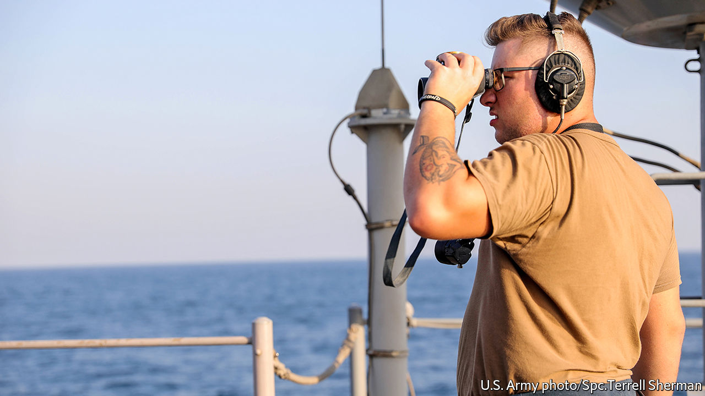

## Neighbourhood watch

# How America and its allies are keeping tabs on Iran at sea

> Many eyes aim to deter Iran from making mischief

> Jan 2nd 2020MANAMA

FOR ALMOST two decades America’s navy and its allies in the Middle East spent most of their time chasing pirates, drug smugglers and terrorists in the region’s busy waters. But a string of attacks on oil tankers in 2019—blamed on Iran—has shifted their focus.

In July America launched Operation Sentinel to improve its ability to spot and respond to threats to shipping in and around the Persian Gulf. In November it formally placed the operation under a coalition with the ungainly name of the International Maritime Security Construct (IMSC). This now consists of seven countries: America, Australia, Bahrain, Britain, Saudi Arabia, the UAE—and plucky Albania (which can squeeze most of its sailors onto one aeroplane).

The concept is straightforward. Iran wants to force America to ease sanctions that are crippling its economy. Interfering with international shipping is one way of exerting pressure. The IMSC is intended to deter Iran from making mischief by increasing the likelihood that it would be caught in the act.

To do so the IMSC stations two warships, which it calls sentinels, in the Strait of Hormuz, the choke-point that carries one-fifth of the world’s oil. Smaller, mostly Arab vessels, called sentries, patrol inside the Persian Gulf. Drones and planes keep watch from above. “We are monitoring much more of the Arabian Gulf and the Arabian Sea than we were a year ago, and we’re monitoring it much more frequently,” says Vice-Admiral James Malloy, the commander of America’s Fifth Fleet.

Intelligence is gathered at a headquarters in Manama, the capital of Bahrain, where 65% of the personnel are non-American. The IMSC’S Arab members may lack firepower, but they are “essential” to the mission because of their knowledge of local shipping patterns, says Admiral Malloy. Command will rotate between members such that a Saudi admiral may control British ships.

Iran has not struck at sea since the mission began. Yet it has not all been plain sailing for the IMSC. When America began gathering allies, France, Germany and other European countries refused to join an effort that risked association with President Donald Trump’s policy of “maximum pressure” against Iran. Even Britain initially balked, proposing a European-led force instead.

France went ahead with a competing initiative that has since welcomed the Netherlands and Denmark. America takes a dim view of it. The French mission “does not exist” at sea, says Admiral Malloy. “We are not co-ordinating or sharing information, and there are no immediate plans to do so.” Both outfits want new members, but others are keeping their distance. Japan will soon send a destroyer and surveillance plane to the region. It will share intelligence with the IMSC but remain apart from it.

Iran will be less than pleased with all the new visitors. Its threats to shipping, far from strengthening its hand against America, have led to it being hemmed in even more tightly.