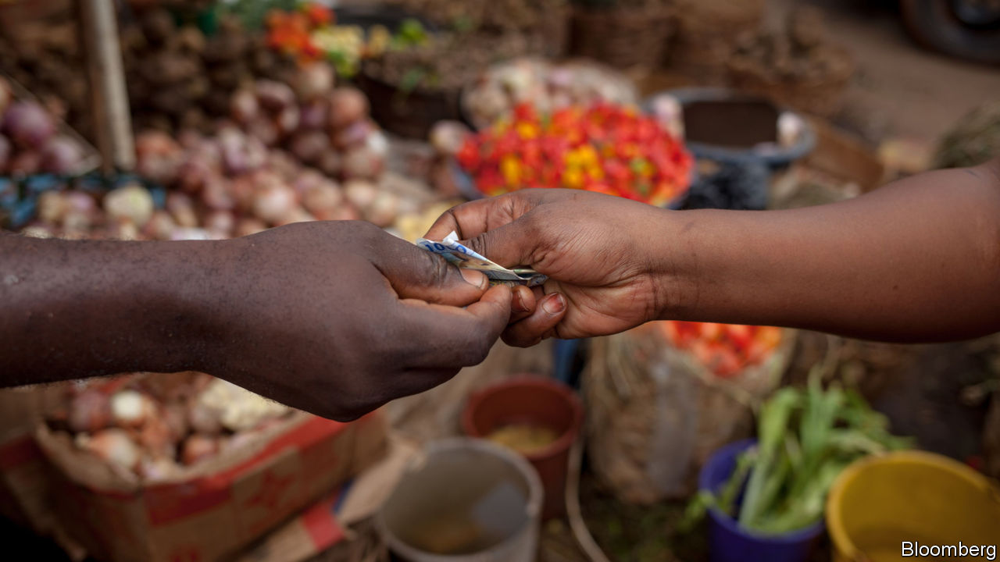
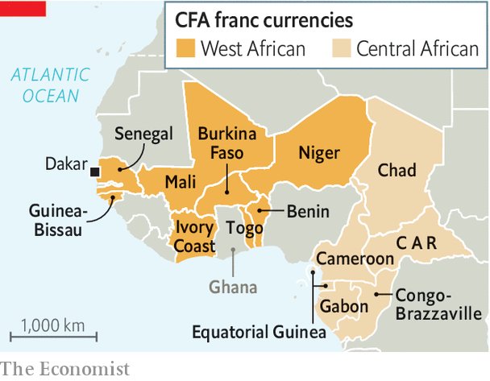

## Francly speaking

# Making sense of west Africa’s new currency

> The French-backed CFA franc is going. Will the new eco be as stable?

> Jan 4th 2020DAKAR AND KAMPALA

MONETARY POLICY, done well, is meant to put everyone but economists to sleep. Yet in west Africa it has pulled thousands of protesters onto the streets. Many locals have long objected to the west African and central African CFA francs, two monetary unions pegged to the euro and backed by France. This arrangement has delivered low inflation and currency stability to the 14 African countries that use one or other of the CFA francs. But critics call the CFA a relic of past subjugation and absurdly portray it as a “colonial tax” imposed by France, the former power.

On December 21st those calling for an end to the CFA franc mostly got their way. Emmanuel Macron and Alassane Ouattara, the presidents of France and Ivory Coast, announced the most far-reaching changes to the currency area since its formation in 1945. The west African CFA franc, which is used by eight countries, will be ditched in 2020 and replaced by the eco, which will have far looser ties to France. The central African CFA franc is unchanged, but many expect the six countries using it to implement similar reforms.

The symbolism is powerful. The currency’s acronym originally stood for “French Colonies of Africa” and the CFA has become a lightning rod for anti-French sentiment across west Africa—in early December Mr Macron threatened to withdraw the 4,500 French troops battling jihadists in the Sahel unless governments in the region ended their “ambiguity” towards “anti-French movements”. Mr Macron seems to hope that he will quell some of the anger against France by backing away from the currency it once championed.

Yet the economic implications will be large. France says it will continue to support the currency’s peg to the euro. But this guarantee—in effect a promise to make unlimited transfers from the French treasury if the eco comes under speculative attack—is one that markets may doubt, especially in a crisis. “How can we short this thing?” asked one hedge fund trader, on hearing news of the new currency.

Confidence in the eco is waning even before it has been formed because the old safeguards are being dismantled. Today, countries using the CFA deposit half their foreign-exchange reserves into an account at the French treasury. When the eco is formed this obligation will end, presumably allowing them to go to the Central Bank of West African States in Dakar (BCEAO). The French representative on the currency union’s board will also be shown the door. With less oversight of the union and no control over its reserves, France may hesitate to write a blank cheque.

Maintaining the eco’s peg to the euro may also impose uncomfortable limits on the monetary sovereignty of its members. Any country that maintains a fixed exchange rate while letting capital flow freely across borders—as west African ones will continue to do—forfeits a measure of monetary autonomy. For instance if the BCEAO were to slash interest rates from their benchmark of 2.5%, capital would probably flee to the relative safety of Europe. The central bank could burn through reserves, but eventually it would either have to raise interest rates or let the exchange rate slide.

By choosing to retain the peg, west African governments are deliberately binding their own hands. A problem for central banks everywhere is convincing people that they will not give in to political pressure to stoke booms or print money. The peg is, in effect, a commitment to track the anti-inflationary stance of the European Central Bank. This has produced benefits: inflation has been much lower in Ivory Coast, which uses the CFA franc, than in neighbouring Ghana, which does not.

Yet critics worry that monetary policies aimed at keeping inflation low in Europe are not necessarily right for Africa. The rigidity of the currency’s peg, which has only been devalued once in its history, is also a worry. If wage growth in the eco zone exceeds that of the euro-zone (adjusting for productivity) then the eco’s fixed exchange rate would become overvalued. That would retard exports and encourage imports.

For all the uncertainty, the change has already produced one positive outcome. A passionate argument about neocolonialism is being transformed into a drier one about inflation. That should calm tempers in the streets, even as it sets economists’ pulses racing. ■

## URL

https://www.economist.com/middle-east-and-africa/2020/01/04/making-sense-of-west-africas-new-currency
