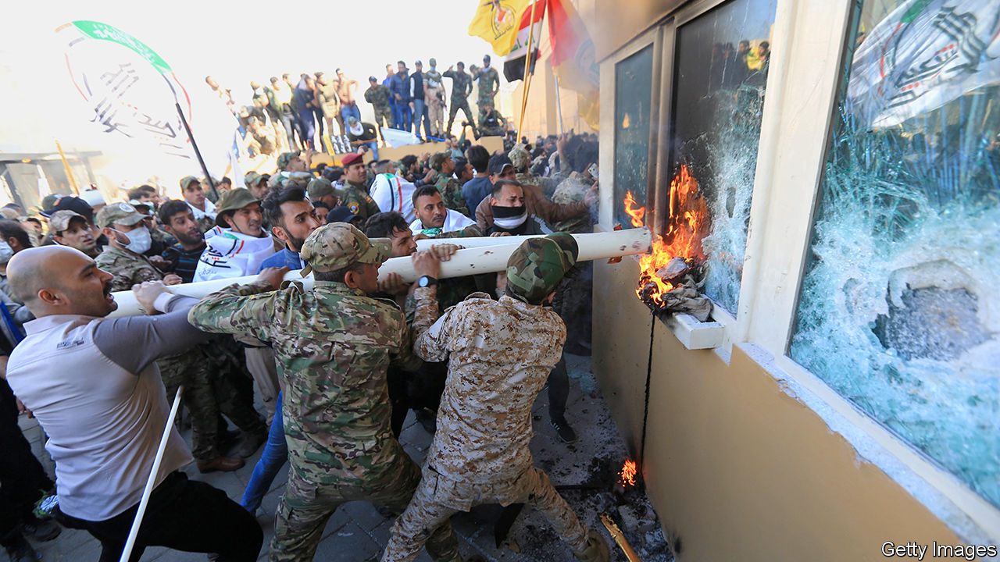

## Combustible

# The conflict between America and Iran intensifies in Iraq

> Missiles, air strikes and an embassy under attack

> Jan 2nd 2020

FOR MONTHS young Iraqi protesters trying to reach the Green Zone, the government enclave in Baghdad, were met with bullets and tear-gas canisters, the latter often fired at their heads. But on December 31st hundreds of militiamen were allowed to enter unmolested. The men, affiliated to Kataib Hizbullah, an Iranian-backed Shia paramilitary group, tried to storm the American embassy. They threw petrol bombs over the walls and broke into a reception area where security personnel would normally screen visitors. Iraqi police largely stood by for hours; it was not until nightfall that the Counter Terrorism Service (CTS), an elite unit, sent men to secure the embassy. They did not have orders to evict the rioters, who made plans to camp outside. As night fell, American Apache helicopters could be seen flying overhead, dropping flares.

The riot was another escalation in a crisis between America, Iran and Iraq. On December 27th more than 30 rockets hit an Iraqi military base near Kirkuk. That attack, the 11th of its kind in two months, killed an American contractor and wounded four American soldiers. The American response, two days later, was a series of air strikes on five bases run by Kataib Hizbullah. At least 25 of its members were killed.

This was an “unacceptable vicious assault”, fumed Adel Abdul-Mahdi, Iraq’s outgoing prime minister. He was referring not to the initial rocket attack but to the retaliatory air strikes that followed. Those strikes had violated Iraqi sovereignty and “would force Iraq to review its relations and its security, political and legal framework” with America, said the government.

Mr Abdul-Mahdi had a point. America killed Iraqi nationals on Iraqi soil, in an attack carried out without the blessing of the Iraqi government. But America was not the only actor to make a mockery of Iraqi sovereignty. Though Kataib Hizbullah is backed by Iran, it is nominally under the control of Iraq’s government, like other paramilitary groups created to fight the jihadists of Islamic State (IS). If it fired rockets at an Iraqi military base, one branch of the Iraqi state bombed another. At the American embassy days later, at least one photograph showed a uniformed member of the Iraqi security forces helping rioters smash windows.

American officials are quietly seething at the Iraqi government’s willingness to rebuke them while giving a free hand to Iranian-backed groups. Iraq failed in its “responsibility to protect us as their invited guests”, complained a State Department official. In December American officials accused Iran of stashing short-range missiles in the country, and there are suspicions that Iraq may have been the launching point for a drone and missile attack on Saudi oil facilities in September. The raid on Kataib Hizbullah is a major blow in that contest. “We haven’t killed this many tier-one Iranian proxies in one go, ever,” says Michael Knights of the Washington Institute for Near East Policy, a think-tank.

But this is at best a tactical achievement. America is 19 months into Donald Trump’s “maximum pressure” campaign against Iran, which began with his decision to withdraw from a deal that curbed Iran’s nuclear programme in return for economic relief. His sanctions have cut Iran off from the world economy. Oil exports crashed from around 2.5m barrels a day in 2017 to less than half a million now. The Iranian rial has collapsed and many citizens struggle to afford necessities like medicine.

But economic pain has not compelled Iran to negotiate a new agreement, let alone moderate its regional policies. Quite the opposite. America blames it for the sabotage of oil tankers in the Persian Gulf last summer and the attack on two oil facilities in Saudi Arabia in September. In a conference call on December 30th, hours before the embassy riot, American officials tried to portray such belligerence as a sign of progress. “Iran is currently in a state of panicked aggression,” said Brian Hook, the special envoy for Iran. “They are lashing out. They’re not used to being told no.”

Far from panicked, though, Iran’s aggression looks calculated. Since October it has faced a wave of popular anger across the region. Protesters in Iraq want an end to Iran’s meddling. Those in Lebanon have turned some of their ire on Hizbullah, a Shia militia and political party that is separate from Kataib Hizbullah but similarly backed by Iran. Meanwhile, Iran itself was convulsed by unrest in late November after the government raised fuel prices.

So the American strike was a welcome distraction. On December 30th a coalition of pro-Iran parties in Iraq demanded the expulsion of all 6,000 American troops. They proposed similar legislation earlier in the year but lacked support in parliament. MPs may be more receptive this time. American officials argue they had no choice but to hit Kataib Hizbullah. The Pentagon, understandably, is worried about protecting troops and contractors in Iraq. But the Trump administration seems to have thought little about the political consequences—in part, because there is almost no one in Baghdad to consider them. The embassy there, which once housed 2,000 diplomats, now has just ten political officers and six working on military affairs. The secretary of state, Mike Pompeo, wants to cut those numbers further.

Iran would be happy to see America go, but Iraq has plenty to lose. Its army remains weak, demoralised and corrupt. Shia militias and Kurdish peshmerga are motivated and capable but have their own agenda. What is left—army commando units and the CTS, which played a pivotal role in rolling back IS—relies on close co-operation with American special forces and spies. Since 2014 America has spent $5.8bn on military aid for Iraq. That would matter less had the crisis not come at an especially delicate time. IS is regrouping in Iraq. In December a Kurdish intelligence chief told the BBC that the group had become “like al-Qaeda on steroids”, nestled in Iraq’s Hamrin mountains and flush with cash.

For the time being America is sending more troops. Mr Trump dispatched 100 marines to reinforce the embassy. As The Economist went to press, hundreds more soldiers were preparing for deployment to Kuwait, and perhaps onward to Iraq. Meanwhile, militia leaders eventually told their men to withdraw from the embassy, out of “respect for the Iraqi government”. But they had made their point. Sixteen years after America invaded Iraq with the hope of installing a friendly government, it can barely keep its own embassy safe. ■