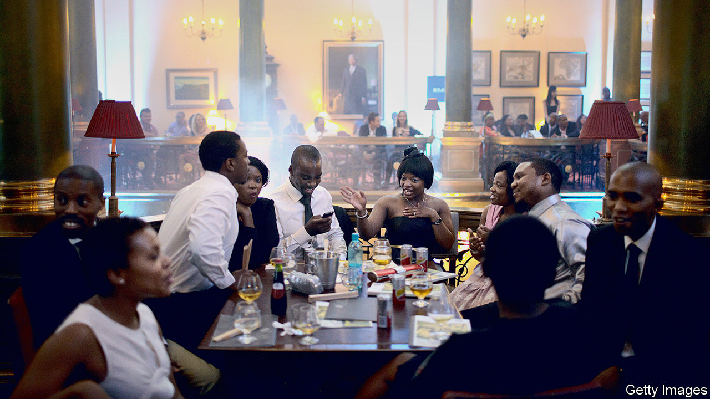

## Reviving Johannesburg’s Rand Club

# The new generation trying to overhaul a once racist and sexist club

> A bastion of a reactionary era reinvents itself

> Jan 2nd 2020JOHANNESBURG

WHEN ALICIA THOMPSON was a student in Johannesburg before the end of apartheid, she would often walk past the beautiful cars parked outside a club she was not allowed to join. It was not by chance that the Rand Club, the oldest private-members’ club in the city, was filled with old white men. It was by design. Women and blacks were not admitted as members until the early 1990s. “It was not my space,” says Ms Thompson. “That was the power of apartheid: you never questioned where you couldn’t go.”

The Rand Club was once a centre of power in Johannesburg, the haunt of financiers and mining magnates, including Cecil Rhodes and Lionel Phillips, who in 1913 was inconveniently shot by a trade unionist on the way to lunch (he survived, but missed his meal). Its official history calls it “a civilised refuge for good fellows”. Rules imposed decorum; no ice in drinks in the billiards room, for example, lest clinking distract players. At the same time the longest bar in Africa (31.2 metres) encouraged inebriation.

But for most South Africans the club was seen as the reactionary lair of a racist business elite. Legend has it that decor depicting the signs of the zodiac does not include Virgo, a female sign. Any member who dared to sponsor a black friend would most likely have been ostracised, or “blackballed”.

The Rand Club’s traditions are squarely at odds with today’s multiracial South Africa. Only a few years ago protests led to the removal of statues of Rhodes at institutions such as the University of Cape Town. (Rhodes was a co-founder of the club, where there is still a room named after him.) But a group of younger members, including Ms Thompson, who is black and female, believes that it is better to transform the club than close it.

In 2016 a crisis presented the new group with their opportunity. The club was nearly bankrupt. Many businesses had migrated from the inner city and membership had fallen to a few hundred from thousands in the club’s heyday.

Rick Currie, a fourth-generation member, and two other members lent it 6.5m rand ($450,000). Part of the deal was to revamp the club, which now hosts weddings, parties, opera recitals and jazz nights. Rooms are rented out on Booking.com, a travel site. Artists from across Africa have been invited to display their works. It houses a bookshop and tailor. All of these activities have helped the bottom line—the club is profitable for the first time in decades—and loosened up the straitened atmosphere.

For some the Rand will always be a relic of a backward era. But for Ms Thompson it is transcending its history. Ascending the main staircase, she points to where a portrait of Queen Elizabeth used to be. In Her Majesty’s stead is a painting of Nelson Mandela. His steady gaze is a reminder that change can happen, even in the most unexpected places.

## URL

https://www.economist.com/middle-east-and-africa/2020/01/02/the-new-generation-trying-to-overhaul-a-once-racist-and-sexist-club
