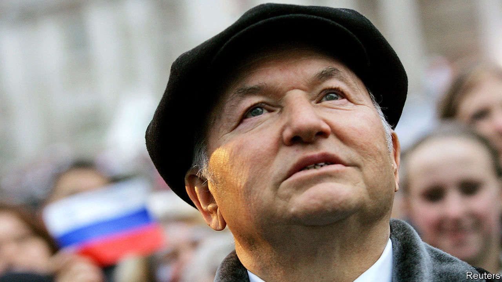

## Tearing down the past

# Obituary: Yuri Luzhkov died on December 10th

> The long-time mayor of Moscow and transformer of the city was 83

> Jan 2nd 2020

IN SEPTEMBER 1997 Yuri Luzhkov, proud mayor of Russia’s capital, threw a three-day birthday party. It had been three years in the planning, down to the last almost Godlike detail, seeding the clouds to keep the rain away. A huge pageant, with 1,200 performers and a fire-breathing dragon, filled the streets. A son-et-lumière show was beamed onto the hilltop façade of Moscow State University. The Bolshoi ballet danced outside, Luciano Pavarotti sang in Red Square, and in the cathedral of Christ the Saviour, which Mr Luzhkov had raised again from Stalin’s dynamiting with its gold cupolas gleaming, three orchestras boomed out Tchaikovsky’s “1812”. There was nothing like that shout of victory over Napoleon to make the mayor’s stout Russian heart beat stronger in his breast.

Of course it was not his birthday. It was Moscow’s, which 850 years before—more or less, since no one really knew—had first appeared as a wooden stockade beside the Moscow river. But it might as well have been his party, because in his energy, his get-on-with-it attitude, his chutzpah and exuberance, he summed up the city. As a Muscovite born and bred, he also shared its love of circus, even appearing in the ring to celebrate his friend, the clown Yuri Nikulin, by driving a toy car and tumbling down a ladder.

His instinct for holding on to his immense baronial power was somewhat surer than that. He built a new ring road, increased pensions, made the hot water work. And he rebuilt the place. Over the 18 years of his rule, from 1992 to 2010, he turned a drab grey Soviet city into a modern European metropolis, glittering with steel and glass towers and forested with cranes. He built a new financial district, Moskva-City, home to nine skyscrapers more than 60 storeys high. He ordered the tearing down of 1,722 Soviet apartment blocks in favour of something glassier. Elegant Manezh Square became an underground mall and an overground amusement park. Spires, turrets, baroque gilding, classical pediments, neo-imperial this and that, appeared all over town, sometimes all on the same building. On an artificial island in the river he placed a statue of Peter the Great, steering a frigate, which was taller than the Statue of Liberty. The same favourite sculptor, Zurab Tsereteli, also dotted sculptures of the mayor about. One showed him sweeping away all the rubbish from Moscow’s streets.

And so he did: scrap what he disliked, put up what he liked. Since Catherine the Great had left half-built her palace at Tsaritsyno, he finished it with an entrance pavilion, new decor inside and a whole new park of bridges and follies. And if, amid the symphony of wrecking balls, he demolished buildings people really cared about, such as the Art Nouveau Voentorg department store or streets of 18th-century houses, he could always put up facsimiles that were bigger and better. Talk of history and authenticity annoyed him; as at the birthday party, he preferred to mix it all up and dwell on mythology instead. At weekends he would rush from one dust-filled site to the next in his flat black leather cap, every inch the boss-man, the khozyain, gleefully replacing the past.

He sought official permission for some of these projects, but did not really need to. Two years after Boris Yeltsin appointed him, definitively elevating him from his humdrum past as a chemicals-industry researcher and commissioner for distributing vegetables, he asked for, and got, full control of all state holdings in Moscow. His doubts about capitalism were soon put to rest. From the rowdy beanfeast that was privatisation he ended up owning 1,500 businesses in the city and a stake in 300 more. By 1996 these brought in $1bn a year. As Russia stumbled out of Soviet torpor into a brave freewheeling age, he was running a city that accounted for a quarter of the country’s GDP and was soaking up most of its foreign direct investment. When, only a year after the birthday party, Russia defaulted on its domestic debt and the foreign money flowed out again, he never stopped believing it would soon come back.

Critics moaned about corruption, but he called that slanders and lies, and beat them hollow in court. He was doing a roaring trade with backroom quid pro quos, which to him was simply normal behaviour. If a bank advanced him credit, obviously he gave them a share of city business. If benefactors helped him, he got them Kremlin offices. Mafiosi hung around him, but he was shrewder than to use them directly. And the fact that many of his building contracts went to the company owned by his wife Elena Baturina, the richest woman in Russia, was nothing, they both said, to remark on. She made her own deals.

The first focus of his own energy was to bring back Moscow’s greatness. If the capital flourished, then Russia would, too. A fair chunk of the city’s revenues went to good Russian causes, such as supporting the dependants of the Black Sea fleet in Sebastopol, which was, he insisted, a Russian city. At home, to keep Moscow pure from alien Western influences, he banned gay-pride marches and opposition rallies and set up, as a rival to Macdonald’s, Russian Bistro, serving among the glitzy boutiques of Tverskaya Street kvas and stuffed pirozhki, cabbage and potatoes. The logo, his choice, showed a Cossack of the sort who had smashed Napoleon.

With such patriotism burning in him he was bound to be drawn to Russian politics. In 1998 he set up the Fatherland party, which aligned the next year with the All Russia party of Evgeny Primakov, recently prime minister. They could have been a governing duo, but were both destroyed by media attacks in Vladimir Putin’s favour. He never minded Mr Putin, and they were fairly close. It was Dmitri Medvedev, made president in 2008, who roused his ire and who at last fired him, since he clearly would never resign.

Surprisingly for a city man, he promptly turned to farming, improving (in every way) a historic estate at Veedern, and keeping bees. Bees had long fascinated him, and he had drawn much criticism for spending more to rescue them from the peat-bog fires that choked Moscow in 2010 than he spent on helping Muscovites. But he found them a philosophy in themselves, so patiently building their city while he, the khozyain, almost Godlike, drew off the honey and perpetually watched over them. It was like the old days. ■