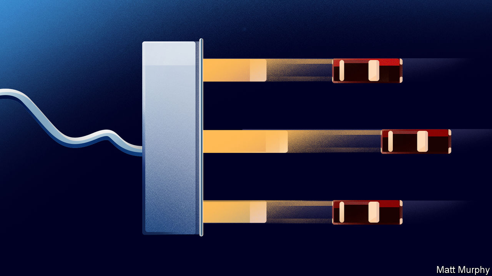
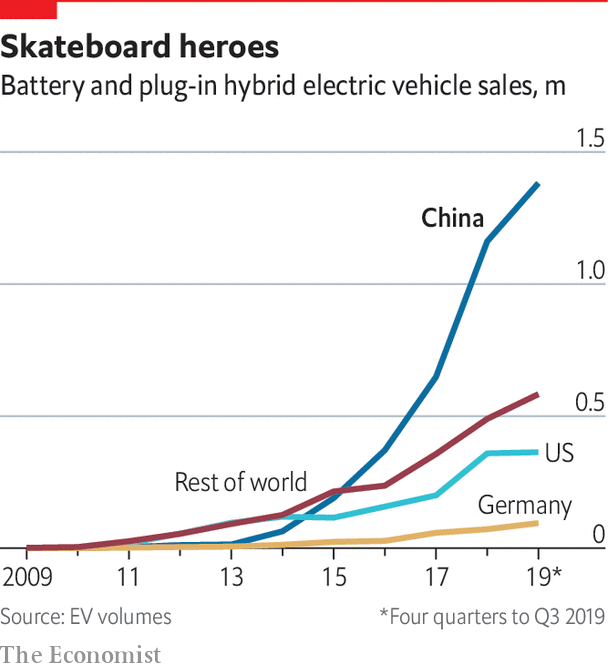

## Cars

# China has never mastered internal-combustion engines

> Electric cars will be different

> Jan 2nd 2020

AT A SHINY new factory in the suburbs of the port city of Wenzhou in south-eastern China, a sturdy robot arm picks up a curved sheet of glass. As a vehicle crawls past it on a conveyor belt, the arm gently nestles the windscreen into its housing, then swivels back to get its greedy suction cups on the next one. Bleepy electronic versions of “Greensleeves” and “Baa Baa Black Sheep” blare out over the factory floor every so often, signalling break time for one of the various groups of human workers.

This is the first factory of a newish Chinese firm called WM Motor. At the end of the production line, brand new electric SUVs roll out into the world at a rate of about 16 every hour, two-thirds of the factory’s maximum rate. Though it currently makes only the one model, the company’s global ambitions are clear. The car’s Chinese name is Weima, which means “powerful horse”. Its Western name is a German word, Weltmeister, which means “world champion”. The German name is the one to focus on. Executives in China’s electric-vehicle industry believe it has a chance to do something that its older internal-combustion-engine carmakers never managed—become a global force.

That is quite an ambition for a Chinese car company. Though China may now make nuclear-power plants able to dominate the world market, its domestic internal-combustion-engine cars cannot dominate even the Chinese market. The best-selling manufacturers are VW and Honda, whose vehicles are built by local joint ventures. This is because nuclear reactors, although they need extremely strong and carefully engineered components, are basically souped-up kettles. A car, and especially its engine, is something much finer, its pistons and valves continuously dancing, the string of explosions in each cylinder perfectly timed, the amount of torque transferred through the crankshaft to the wheels just what the driver expects, all of it owned by someone who wants to devote as little time to maintaining this mechanical miracle as possible—ideally, none.

No amount of technology transfer, legitimate or otherwise, can boost a country to pole position in such an industry. As Japan and South Korea have shown, it takes decades of intense investment, hard graft and astute leadership to develop the engineering know-how and the intricate supply chains that make such things possible. China does not have the patience for that. “You would have to invest billions of dollars for another 20 years, and maybe then we would be getting close to the Germans,” says Freeman Shen, WM’s founder. “It’s hopeless.”

Tapping into existing supply chains might make things easier; but although China has the access this takes in electronics, in cars it does not. And the car industry’s supply chains are lines of co-operation as well as commerce. To make affordable, high-quality cars you do not just need the likes of Bosch to sell you off-the-shelf components. You need their active co-operation in creating just the right parts. If providing that co-operation means risking established business with bigger, better incumbents, it is unlikely to be completely forthcoming.

Chinese EV firms like WM think that the fact that they depend on a completely different—and more electronic—set of components means they can do an end-run around the internal-combustion incumbents, taking the lead in a new industry rather than catching up in an old one. And they are the only ray of light in a very gloomy Chinese carmaking outlook. The rest of the car market has been shrinking for 16 straight months. Sales of EVs have been set back by cuts to the government subsidy programme in 2019, but nonetheless the government still wants a quarter of all cars sold by 2025 to be electric. Today they account for only 7% of the market. But China being China, that still works out as 1.5m vehicles a year, making it the largest EV market in the world.

The market is dominated by Chinese incumbents moving from internal-combustion vehicles to EVs. But there is also a pack of startups. Nio may be the most famous, but WM is perhaps the most ambitious. It owns and operates all of its factories, and although it said it had delivered only 12,600 cars in 2019 when your correspondent visited in October, it says it will soon have the capacity to produce 200,000 a year in Wenzhou, and that a slightly bigger plant in Huanggang, 630km inland in Hubei province, will make another 300,000 cars a year when it is completed.

These facilities come with the compliments of the provincial governments in Zhejiang and Hubei. Officials see the factories as bringing their provinces jobs, prestige and VAT receipts, which in China are collected when the car leaves the factory. And if WM succeeds, the officials associated with it will earn the sort of kudos that can elevate them a long way in the party hierarchy. Nio and Xpeng, WM’s venture-capital-backed competitors, have not yet benefited from quite this level of largesse. They are having their cars made by contract manufacturers, which is less capital-intensive but also yields less control over the process.

Getting high-tech factories built for nothing gives WM a chance to achieve something that China’s combustion-engine car companies never managed: develop core technology that is globally competitive. Mr Shen, a car-industry veteran, says he has had 1,000 engineers dedicated to working on electric vehicles for the past four years. “I guarantee that the largest car company in the world, Volkswagen, does not have 1,000 engineers dedicated to electric vehicles,” he says.

Mr Shen’s focus is on the EV’s battery packs and the power-management systems that distribute electricity around the vehicle. Because the battery pack is the most expensive part of the car, squeezing the same range out of less battery is a competitive advantage; that is what WM’s innovative battery-cell configurations are meant to do. Mr Shen says WM holds 1,200 patents, with the most important ones around the car’s battery, electric motor and control system. That is because such innovations could be reverse-engineered. The software that manages the battery’s thermal properties in a crash, on the other hand, is a complex trade secret.

Mr Shen says he expects the best electric-car companies to start building their own batteries eventually. Those have hitherto been sourced from giant companies like CATL, a Chinese firm which holds a large share of the global electric-vehicle-battery market. Big car companies would never source their engines from third parties; integrating them closely into the design and production process improves overall performance. Mr Shen expects electric cars to be no different.

Beside Nio and Xpeng, WM’s stiffest competition in China will come from two foreign firms, Tesla and VW. Tesla’s boss, Elon Musk, says the company’s Shanghai gigafactory will be making 1,000 cars a week by the end of 2019; they will mostly be its Model 3, which is both its cheapest car and, at 355,800 yuan ($50,000), still very expensive for the Chinese market. The factory, built in just eight months, is designed to make 500,000 cars a year.

Meanwhile, Volkswagen is refitting one existing Chinese factory and building a brand new factory to produce 600,000 EVs a year. It expects to produce 1m electric cars a year in the country by 2022 and to have manufactured 11.6m electric cars in China by 2028. If those ambitions are fulfilled the firm’s EVs will have captured about 5% of the total Chinese car market.

All this ambition suggests that there may be a bust on the way, and that the EV startups may suffer badly from it. WM is hoping to turn those particular lemons, grown through overzealous and incontinent state aid, into lemonade. It expects many of its smaller competitors to go bust over the next few years, especially now that the subsidy programme has been stopped. That will free up talented engineers.

A more rationally delivered advantage that the state is providing for WM and others hoping to sell EVs in China is charging infrastructure. This makes buyers more confident. The state also facilitates the roll-out of advanced technical features for the benefit of the public at large. Mr Shen says that WM is planning a pilot with State Grid, China’s largest utility, in 2020 whereby the batteries in its customers’ cars will be used as grid storage to help balance the flow of electricity in Beijing and Shanghai.

Even if WM fails, China is set to be a large market for EVs long before any other country, and that will benefit the industry as a whole. Because the government demands that all cars sold in China are made with Chinese components, the country will come to host the world’s most important supply chains for electric cars. This opens up the possibility that Chinese supply chains will eventually be used to provide components for the rest of world, as with smartphones.

It also suggests that such a strategy could see Chinese EV makers capture a lot of the value from vehicles made elsewhere. Their simplicity, compared with cars powered by internal combustion, makes EVs easier to manufacture in sections. Because there are no cooling fluids to pump around the vehicle, no drivetrain to run through the floor of the cabin, and no engine block poised to crush occupants in the event of a crash, the top and the bottom of the car can easily be separated out and produced independently. The bottom part, which contains the complexity of battery and power-management electronics, is called the “skateboard”, and embodies the lion’s share of the value of the car.

Mr Shen imagines a scenario in which his firm’s skateboards are shipped around the world to be integrated with bodies and interiors created by other manufacturers that have failed to create their own core EV technology. It would be a complete reversal of the situation today, where Chinese car companies need Western firms to supply the most valuable components. China’s huge market for EVs is creating a supply chain that startups like WM and self-reinventing incumbents like vw will rely on. That may end up being an advantage for the Chinese industry on a global scale.■

## URL

https://www.economist.com/technology-quarterly/2020/01/02/china-has-never-mastered-internal-combustion-engines
