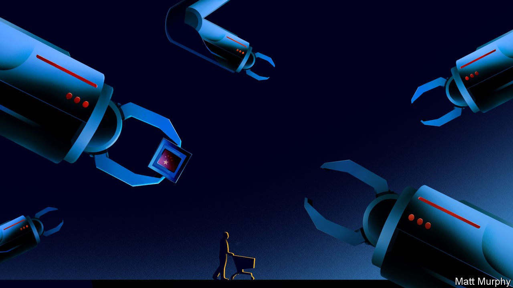
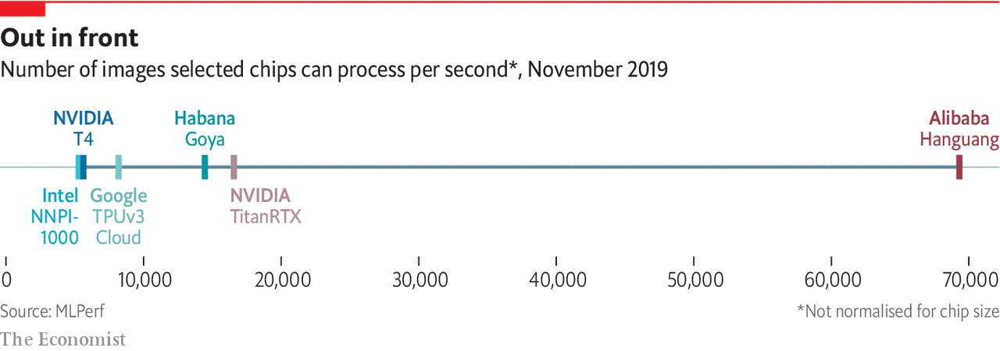

## Microprocessors

# China is slowly moving up the microprocessing value chain

> Getting good at designing is easier than at manufacturing, however

> Jan 2nd 2020

THE FORTUNE PRECISION EQUIPMENT COMPANY makes chunks of metal. Hulking sheets of it are cut with millimetre accuracy using robot arms in room-sized enclosures bearing the brand of their German or Japanese manufacturers. The white spray of cooling lubricant makes the process look like an industrial-strength shower for some post-modern Cleopatra.

Based in Shenyang, five hours north-east of Beijing by train, Fortune is the bottom rung of the most important and complex supply chain on Earth: the one which produces the integrated circuits, or chips, found in smartphones and servers. Fortune’s robots make parts for equipment which will be installed in factories in Taiwan and Oregon, and used to etch circuitry on silicon and make chips. Selling equipment to industry giants like Applied Materials in America makes it a small success for the semiconductor supply chain. Much of the rest of the industry is not doing so well.

Failure to make cutting-edge chips is not exactly China’s fault. It is a difficult industry to kick-start. The factories that produce the chips are phenomenally expensive. The technology itself is even more complex than an internal-combustion engine. The intellectual property behind cutting-edge processes is fiercely guarded. In many ways the manufacturing of chips represents the supreme technological challenge for China, an amalgamation of all the other challenges presented in this report. It will have to call upon everything it has learned from successes and failures like nuclear plants and engines if it is to succeed.

The Chinese government is trying hard (the country’s biggest chip factory, SMIC, a private firm, has settled many suits over IP theft). In October the government raised 204bn yuan ($29bn) from the finance ministry, state-owned firms and local governments for its domestic chipmaking efforts. That followed 139bn yuan raised in 2014. The problem is that the government’s chip programme is optimising for the wrong thing. Instead of trying to stimulate a domestic chip industry to meet China’s huge market needs, the funds are being spent on trying to reach parity with chip companies like Intel.

Chips are a vital product to China because they are fundamental to any technology-led growth that the country desires for its future, as well as for making weapons. PwC, a consultancy, estimates that the global market for chips will grow by 4.6% a year, to be worth $575bn in 2022, driven by the requirements of cars, AI systems and communications networks.

Currently a huge share of that market value moves through China, but is not captured by it. The 418bn chips the country imported in 2018 cost $312bn, a quarter more than it spent importing crude oil. And beyond grabbing a larger part of the value chain for itself, controlling the production of chips would also give China indirect control over myriad other industries, from social networking to personal computing.

Most of the state-led efforts have failed so far. SMIC is on the verge of producing chips at levels of sophistication roughly equivalent to those reached by Intel a decade ago. Its revenues—$3.4bn in 2018—were about a tenth those of TSMC, its Taiwanese rival. SMIC is not yet globally known for its quality and reliability. But Fortune is making progress. It used to ship its metal components off to third parties in Japan and Taiwan to be cleaned up. Today it does not need to do that. The firm has its own clean rooms where it sands down its shiny aluminium components and gives them a smooth grey coating before vacuum packing them in thick plastic. The firm has also started shipping more complex components to its suppliers, simplifying what its customers have to do while capturing more of the value of the final product.

Although Chinese firms are still behind in the manufacture of chips, they have recently achieved some success with designing them for AI applications. In late September the nerdier corners of Silicon Valley were abuzz after Alibaba, a Chinese tech-giant, released Hanguang 800, a chip designed specifically for carrying out machine-learning tasks. Even though Alibaba relied on TSMC in Taiwan to fabricate the chips, AI engineers in the Valley remarked on the Hanguang’s performance, stating that it had beaten all other chips in its class. This was not supposed to happen, as China was thought to be well behind American chip companies.

On November 6th the latest results of MLPerf, an industry-standard benchmark for AI chips, were published. They showed that the Hanguang 800 chip was performing a standardised machine-learning task 13 times faster than the chip that Intel had just released (see chart). The comparison is not totally fair, as the Alibaba chip was made physically larger than the Intel chip, letting it draw more power and perform more calculations per second. But even compared with a bigger chip from Nvidia called the Titan RTX, the Hanguang 800 clocked in four times faster.

There are probably more caveats. Alibaba ran only one out of five tests. Poor performance in the others would betray a chip over-optimised for one task. But even in the most pessimistic scenario it is impressive. That a Chinese company has designed an AI chip which performs as well as, or better than, its Western competitors should alert American politicians and innovators to China’s progress in this area.

Whereas Fortune’s more industrial flavour of success in the manufacturing supply chain took a traditional route for Chinese firms—start at the bottom and work up—Alibaba’s success in designing a chip is more interesting. It is rooted in its wide deployment of machine-learning systems across its business, both in its Taobao online market and its Hema shops on the high street. The firm processes billions of images a day as part of its normal operations, and the machine-learning software it has trained to do that work is now very accurate and powerful.

The Hanguang 800’s designers spent a lot of time sitting next to the coders who built those algorithms. Their job was to work out how to render the algorithms in silicon, so the more time they could spend learning from engineers writing high-performance algorithms, the better. By being close to the market in which AI is used, like Taobao’s and Alibaba’s offline shops, the Hanguang designers were able to tweak the design of the chip to optimise its performance on those tasks. Indeed, in many ways, the data-labelling grunt work that makes Alibaba’s machine-learning algorithms as good as they are translates directly into the high performance of its new chip. China’s strength in data-labelling at the very bottom of the AI supply chain is translating into design strength at the top.

In other parts of the semiconductor supply chain, things are less rosy. Several executives, who asked for their names not to be attached to criticism of government policy, said that the stimulus had been going to the wrong place in trying to catch up with Western giants such as Intel, or TSMC in Taiwan. While Hanguang 800 is remarkable, Alibaba’s design work is a far less capital-intensive, less complex process than the physical manufacture of a chip (which, in Hanguang’s case, was still done in Taiwan).

If catching up on internal-combustion engines was hard, doing so on traditional semiconductor manufacturing will be close to impossible. The market for chips is changing fast. Instead the government would do well to focus on stimulating both design and manufacture of chips aimed at middle-end markets such as the internet of things, and emerging areas like AI.

In one way, China’s challenge with chips is even harder than the problem it faced with combustion-engine cars. There is no completely new technology arriving which will free China from the need to catch up with the rest of the world. But China’s chip companies should still listen to the market, not chase prestige.

Manufacturing and designing chips for the internet of things and AI applications offers an opportunity to leapfrog less agile chip companies, even if it is not the wholesale opportunity that electric vehicles present. If they can focus on these new areas and be patient, it is likely that the scale and depth of the country’s resources could end up winning its companies a permanent spot high on the global supply chain for semiconductors.■