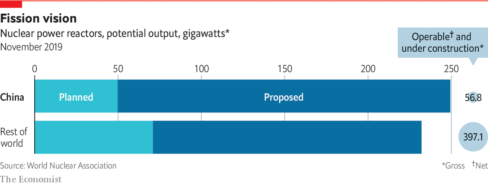

## Success stories

# China’s nuclear industry and high-speed trains are world class

> And the state has been crucial in making them so

> Jan 2nd 2020

WITHIN THE cavernous factory of Dongfang Heavy Machinery Company (DFHM), a state-owned firm based in Guangdong province, lies what looks like a suit of armour built for a mis-shapen giant. In fact, they are parts built to contain something even more fearsome—nuclear reactors and the high-pressure, high-temperature steam that they produce. Some are still being worked on. Some are almost ready to head off, by barge, to sites along the southern coast where China is expanding its nuclear-power industry with greater ambition than any other country in the world.

In 1996, with the help of Framatome, a French firm with a lot of nuclear history, China built a reactor at Ling Ao, 60km (37 miles) from Hong Kong. Part of the deal was that Framatome would share its know-how. It helped a local firm that had previously made boilers learn how to make the hulking metre-thick metal vessels that can safely contain a nuclear reaction. That firm became DFHM. As well as the main reactor vessels, it also now makes the steam generators which turn the nuclear heat into something which can drive turbines and make electricity. Zou Jie, a DFHM executive, says his firm’s products are now competitive with Framatome’s.

One reason for this progress is that China’s nuclear industry has gained experience quickly. In the past 20 years China has built nuclear plants faster than any other country; its nuclear capacity is now 43GW, third only to that of France (63GW) and America (99GW). Unlike in those two countries, though, China’s capacity is growing. And whereas in 1996 just 1% of the value of its first nuclear plants came from domestic firms, that figure is now 85%.

A very similar story can be seen in the country’s high-speed-rail network, though with a telling interlude. China committed to high-speed rail, as to nuclear plants, under Deng Xiaoping in the early 1990s. But it started off down a home-grown technological dead end of trains which, instead of running on wheels, levitate above their track on magnetic fields. Engineers around the world had failed to make such systems work; Chinese engineers proved no exception. So in the 2000s China swallowed its pride and commissioned more traditional trains from overseas providers who promised to let subcontractors indigenise the technology.

As with nuclear, once committed, the country pushed hard. By the end of 2018 China had 29,000km of high-speed track, two-thirds of the global total. Chinese-designed trains do not yet match their Japanese and European counterparts. But one of the four high-speed-train models deployed on the network is now fully Chinese-made, and ready for export.

China’s development of nuclear power and high-speed trains shows that the power of technology does not, as is often assumed, lie primarily in innovation. What matters most about a technology is that it should be both useful and used. And the factors that make it so may be a matter of politics more than ever better widgets.

For any technology that seems to meet a national need but faces right-of-way issues during its deployment, as high-speed rail does, or concerns about public safety, as nuclear does, there is no greater ally than the Chinese Communist Party. When 1m people in Hong Kong signed a petition against the construction of a nuclear plant nearby, a Chinese minister shut down their complaints by stating that “unscientific objections” would not stop the project.

Knowing things can be built quickly makes the commitment to really big engineering projects more feasible in China than elsewhere. It is the same in Russia, the other authoritarian power where nuclear plants are still built for domestic use and export. Even with few political risks and lots of fairly skilled cheap labour the upfront capital costs of building nuclear plants are huge; but China’s governments, national and provincial, and state-owned companies had no worries about their balance-sheets.

Being a one-party state does not blind China to public concerns about safety. When 40 people died in a high-speed-train collision near the city of Wenzhou in 2011, the public was outraged. Passenger numbers fell; work on new lines was paused; safety procedures were scrutinised. There has not been a similar accident since. After the Fukushima nuclear meltdown in Japan that same year, the Chinese government’s position on new plants went from “active” to “conservative”, says Mr Zou of DFHM, and deployment slowed down. That means China will miss the target of 58GW of nuclear-generation capacity it set itself for 2020. But if, as Mr Zou expects, China continues to build up to eight reactors a year, it should meet the lower end of its target of 120GW by 2030.

Some of these reactors are still of foreign design. Versions of both the AP1000, an American design, and the EPR, a French one, have begun operating in China over the past two years. But that underlines China’s edge. It is the only country, including France and America, yet to have successfully built either design. Rather than importing more nuclear technology, Mr Zou and others are looking to export their own.

The reactor of choice—Mr Zou says that Li Keqiang, China’s prime minister, has ordered that it be given pride of place—is China’s brand new Hualong One. It is developed from reactors based on French designs, as those were in turn based on American designs, but can reasonably claim to be completely Chinese. Although none has yet been finished (the first is due to be connected to the grid in Fujian province in 2020), two are being built near Karachi in Pakistan. Another is planned for Argentina, and Britain is evaluating plans to build one at Bradwell in Essex. One advantage of such exports is that the Chinese will get the design scrutinised by independent regulators abroad. That China’s nuclear regulator is part of the same government that is urging the industry’s expansion brings with it some serious concerns about safety.

The reactor-export business development of China’s nuclear industry has gone well. Technology-transfer agreements with foreign companies like Framatome were carried out without controversy. Lower wages for manufacturing workers combined with cheap state-backed loans meant that Chinese nuclear plants are some of the most affordable in the world. There have been no accidents in 20 years of operation.

Though many Western experts believe that nuclear power has a real, if smallish, role in the energy systems of the future, exporting nuclear plants may never be a huge business. In most places, the zero-carbon electricity they offer will not be as cheap as wind or solar. The Chinese are aware of this, too. Their renewables industry has grown even faster than nuclear power and the two sources are providing the country with broadly similar amounts of power. Again, the story is one of taking a foreign technology, indigenising it and scaling it up massively. Whether it be turbines, reactors, trains or satellite launchers, China has mastered this procedure. ■

## URL

https://www.economist.com/technology-quarterly/2020/01/02/chinas-nuclear-industry-and-high-speed-trains-are-world-class
