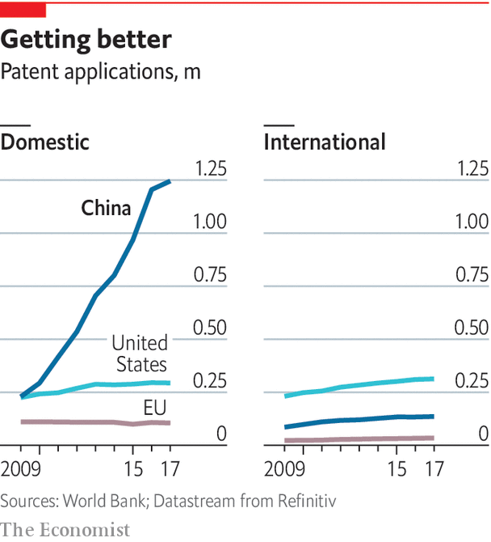

## Intellectual property

# Chinese inventiveness shows the weakness of the law

> Entrepreneurs struggle to retain control of their inventions

> Jan 2nd 2020

AS THE DOTCOM boom was approaching its peak in 1999, Yi Li was working for JDS Uniphase, a Silicon Valley company that made lasers and optical fibres. JDS was a high-flyer, with a market capitalisation fives times the value of Apple at that time. Investors loved the firm for its role in building out the infrastructure of the internet. But when boom turned to crash JDS’s share price plunged by 99.8%. Employees whose stock options had made them paper millionaires lost it all overnight. “I got killed by the bubble,” says Mr Li. “I was too young, too naive. But it was a very good lesson.”

The lesson was one that Mr Li would put to good use back in his native China. But even though he went on to make the fortune that he missed out on with JDS, he discovered first-hand the problems that Chinese entrepreneurs face in protecting their inventions in a nation where protections for intellectual property are nascent at best. His tussles to retain control of his inventions typify a big barrier to China’s technological advancement.

As he picked himself up, Mr Li asked himself where all the money that had poured into JDS had gone. Had it really just evaporated? He decided that, in fact, the apparent financial destruction of the company was what physicists call a phase change—the stuff was still there, but arranged in different forms. The money that had poured into the manufacture of communications equipment had made that equipment cheap, made the construction of a global internet feasible, and the future growth of internet companies a possibility. He developed a thesis for future success: in the wake of any over-investment there would always be a related opportunity to build upon its ashes in the form of newly cheap supply chains. The money that had been in JDS had flowed off towards the next generation of internet companies that its infrastructure had enabled: Google, Amazon and eBay.

Next time he saw a bubble, Mr Li was ready. It was 2004 and money had poured into the manufacture of light-emitting diode (LED) bulbs designed to illuminate rooms much more efficiently than incandescent bulbs. The price of the bulb’s fundamental component, the blue diode, had crashed. Mr Li saw that as an opportunity to develop a new kind of product: a laser projector that relied on the same supply chain that was pumping out cheap blue LEDs. At the time laser projectors were bulky and expensive because they needed three different types of laser, one to project each of the three additive primary colours of red, blue and green. But only the cost of blue laser components had crashed. Red and green lasers were still expensive.

Mr Li started thinking about how to make a laser projector using just blue light. Most cheap LED bulbs work by shining blue light generated by a semiconductor through a phosphorescent filter that absorbs it and re-emits red and green light in its place, thereby producing white light from the mixture. The same works with a laser but, because its light is so intense—1,000 times brighter than an LED—the phosphor filter burns out immediately. Mr Li came up with a ridiculously simple solution. Instead of keeping the filter static in front of the blue laser light, he set it spinning, a disc of phosphor which, if kept moving, could pump out red and green light, as well as blue, while relying on just a blue laser source. The spinning filter did not burn out, because no single spot was ever subjected to enough light intensity for long enough. Mr Li had found a way to tap the cheap blue-LED supply chain and build a laser projector that was ten times cheaper than the competition.

Once he had his design, Mr Li set up Appotronics in Shenzhen, as close to the LED supply chain as he could get. This cemented his first-mover advantage. His system for making a fully fledged laser projector out of a single blue diode was simple and easy to reverse-engineer, so he had to rely on patents for protection. If he had tried to keep it a secret and corner the market, competitors would have torn his devices apart and quickly copied them.

The design was a global hit. If you have recently used a cheap, portable projector that throws a surprisingly good image, it is likely to contain Mr Li’s design. He estimates that Appotronics is the only Chinese firm that holds a patent that has been cited as “prior art” more than 400 times, a sign that large numbers of companies are using the idea. Apple, the beacon of Silicon Valley innovation, has only a few dozen patents cited so often. A suitably bloodthirsty competitor can license the patent, then use it to develop a better product. But Appotronics’ proximity to the Chinese LED supply chains meant it could move much faster than its competitors in building improved new versions of the product.

While China’s supply chains have buoyed up his company, its intellectual-property (IP) system has held Mr Li and his firm back. The American government reels off a long list of problems with the Chinese system, such as trade-secret theft, failure to respect intellectual property and failure to license software (a $6.8bn hole, according to the American government). Mr Li’s problem is the cap on compensation for patent breaches. He says it is too low to disincentivise IP theft. This year the cap was raised from 1m to 5m yuan but that is still not very much. “The average payout in the American system is $2m. In China it’s 80,000 yuan ($11,300),” says Mr Li. “People [in China] are not going to waste money doing patent litigation. You discourage local companies from doing innovation.”

If Chinese companies do take patent disputes to court, the process often takes years—a lifetime for a young startup. But that is still progress. China did not have any patent law until 1985. Specialised courts for hearing IP cases were introduced in 2014. An analysis of those courts’ performance carried out by Renjun Bian of the law school at University of California, Berkeley, shows that, perhaps surprisingly, they have so far favoured non-Chinese patent holders over domestic ones. Ms Bian found that foreign patent holders were winning more cases, receiving injunctions at higher rates, and being awarded larger damages than domestic ones. Those results are probably a reflection of the legitimate nature of foreigners’ grievances—but they are also a sign of the courts’ good faith.

China’s progress on intellectual property (see chart) is not proving enough for America’s trade hawks. But internal pressure from innovators like Mr Li is more likely to create positive change in China’s IP system than a trade war is. This presents a conundrum for American policymakers. The best path to a Chinese system which respects and protects intellectual property is for China itself to become more innovative. And yet that very same Chinese innovation, and the more efficient use of resources as a nation that it makes possible, is unsettling to Americans.

The obsessive focus on the handling of IP in China also misses the bigger picture. Access to intellectual property is just one aspect of successful technology development. Mr Li’s valuable IP is sensitive because his design is simple and does not require a complex supply chain to produce (though being right next to the LED factories of Shenzhen has certainly been an advantage). His patent portfolio is the biggest edge he has.

In the case of more complex technologies like vehicles, nuclear plants or semiconductors, other factors matter more—relationships with suppliers, access to affordable labour, the know-how to use the IP at all. As the West grapples with China’s technological rise, it should remember that it holds great power in these less tangible areas beyond IP, areas from which it is hard to pilfer.■

## URL

https://www.economist.com/technology-quarterly/2020/01/02/chinese-inventiveness-shows-the-weakness-of-the-law
