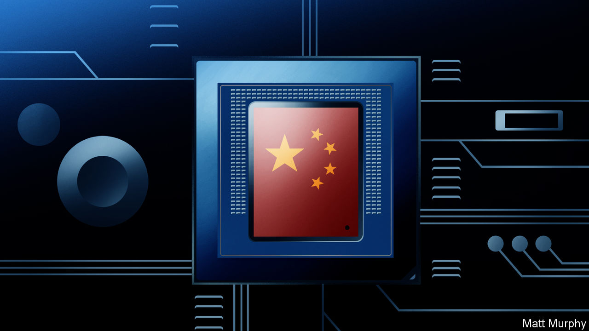

## Chinese technology

# With the state’s help, Chinese technology is booming

> But it will not be a smooth road to global dominance, says Hal Hodson

> Jan 2nd 2020

FOR MOST of human history, China was the world’s most advanced technological power. The blast furnace originated there, and thus so, too, did cast iron. Other breakthroughs included porcelain and paper. Its gunpowder propelled the first military rockets farther than javelin or arrow could fly; its compasses magically revealed magnetic north when the stars were hidden.

Only in the Middle Ages did Europe begin to match Chinese ingenuity and capacity in these fields, doing so largely through imitation. Only with the growth of European mechanical industries and overseas empires in the 18th century did the Westerners become its rivals. In the centuries that followed, hampered by its own stifling education system, China was defeated in the opium wars, then suffered terrible civil unrest and a disastrous revolution that reduced the country to a technological bystander and “Made in China” to a byword for gimcrackery.

Now China is back, trailing clouds of smartphones, high-speed trains, stealthy aircraft, bitcoin mines and other appurtenances of high-tech flair. The parts of the world that overtook it are worried. In 2015 its leaders announced a ten-year, $300bn plan, “Made in China 2025”, designed to make its semiconductor, electric-vehicle and artificial-intelligence industries (and many others) as good as any in the world, if not better. This declaration that China was no longer content with being a factory for American high-tech products created a new tension between the world’s two largest economies. As the plan approaches its halfway point, this conflict seem to be worsening.

America accuses China of stealing and spying its way up the technology supply chain and hobbling American technology by keeping it out of the Chinese market. Its defence department worries about running military operations through networks stuffed with Chinese components. Senators are troubled by how China is using technology to oppress its own people. The American policy establishment fears that the trend for connecting previously unconnected objects like trains and cars to computer networks will offer the Chinese government increased geopolitical leverage at the very least—and at worst, direct control of parts of other countries’ infrastructure. China’s perspective is more straightforward: America is unfairly using its existing power to curtail China’s rightful technological return.

Much thinking about these issues focuses on what technological capabilities China has and what it lacks, where it is ahead of America and where it is lagging behind. But that piecemeal account offers little help in understanding China’s ability to foster new technologies or to dominate the supply chains and standards that underpin them. The vital question is not what technologies China has access to now, but how it built that access and how its capacity for fostering new technologies is evolving.

That is the focus of this report. Obviously, how the correlation of forces between the two powers ends up is important. But to understand that you also need to come to grips with Chinese technology on its own terms. Details of the processes behind the country’s technological development are vital to assessing the long-term challenge posed by a technologically ascendant China. They can get lost in a higher-level geopolitical discussion that is hyperbolic and polarised.

The process of gaining that understanding starts with looking at older technologies, such as high-speed trains and nuclear-power plants. The work of indigenising these technologies is almost complete, and the Chinese firms and state-owned enterprises behind them are poised to export to the world. As such, they represent a model of successful state-led development that has used the state’s repressive power over its citizenry and the sway it holds over the economy to deploy technology on a massive scale.

No government controls more of an economy worth controlling than China’s does. Some 51,000 state-owned firms employ about 20m people and are collectively worth $29trn, according to analysis in 2017 by the OECD, a club of mainly rich countries. Many private Chinese firms claim that they receive no state support, and in strictly monetary terms that is often true, but free land from provincial governments and a side hustle in property management is the norm. The Communist Party’s ability to ensure the successful deployment of a technology is not restricted to funding. The state hedges risk, squashes NIMBYism and pays for infrastructure.

But two other factors are taking over from raw state power as the motor of Chinese technological development. One is the place its companies occupy in many of the most important supply chains in the world, giving them easy access to all sorts of technological know-how. As workshop to the world, China—and particularly the Pearl River Delta region that includes the booming cities of Shenzhen and Guangzhou—makes components for almost everything, understands how to assemble them, and is set up to bring together the right ones as quickly as possible. This geoepistemological advantage explains why the only successful smartphone companies founded since 2010 have been those set up around Shenzhen. (They are all non-state firms.) Their success has spread to new markets based on similar components. The consumer-drone market is dominated by China because drones are basically phones with rotors.

Secondly, the size and particularities of the Chinese market have become spurs to innovation in their own right. WeChat and Alipay, which use QR codes to make payments with phones, emerged and took hold in China because payment cards were not yet established; as a result Chinese cities are becoming cashless. The Communist Party’s need for social control has stimulated an entire industry of machine-learning technologies catering to the security services. The West does not like the applications to which China’s AI companies—mostly, also, non-state firms—turn their algorithms, but there is no denying the scale of their ambition (though their success has some under-appreciated foundations).

Not every peculiarity of the Chinese system is a benefit. State support is frequently doled out to firms or industries based on non-commercial factors. Ignorance and corruption mess things up; so does a thirst for prestige. In the crucial battleground of semiconductors, Beijing’s investment policy is largely based on chasing after the highest-value sections of the supply chain by pumping money into Chinese versions of the foreign companies now commanding those heights. Truly innovative and effective semiconductor businesses sometimes suffer merely because they are less coveted by party officials.

Examining Chinese tech development reveals things not just about China, it illuminates global trends. Some are obvious. A government able to shape and ignore public opinion can do things that governments forced to listen to the people—including vocal minorities—cannot. If China’s technocrats want nuclear power and genetically modified organisms, they will get them.

Some trends are subtler. China’s failure to catch up in technologies like internal-combustion engines, civil aviation and, to date, semiconductors shows how hard it is to make humanity’s most complex mechanisms. The organisations which manage to do so depend on arcane insights and baroque procedures carefully nurtured by corporate hierarchies over decades. That even an economy as mighty as China’s can scarcely catch up should give pause for reflection about the possibilities for innovation elsewhere.

The potential for new technologies to enhance and project Chinese power, and the threat that poses to a global order led by America, hangs over China’s technological development. But these are not its sole inspiration. China is grappling with an ageing population, environmental degradation and a slowing economy. The strengths and weaknesses of its attempts to solve these problems technologically will have lessons for other countries in similar straits, and for those which see China not just as a competitor but as an ever more sophisticated market.

For countries which wish to co-exist with China, its weaknesses reveal good places to invest in developing one’s own capabilities. For those who wish to reduce or curtail Chinese technological power, knowing its strengths and vulnerabilities is vital. ■

## URL

https://www.economist.com/technology-quarterly/2020/01/02/with-the-states-help-chinese-technology-is-booming
