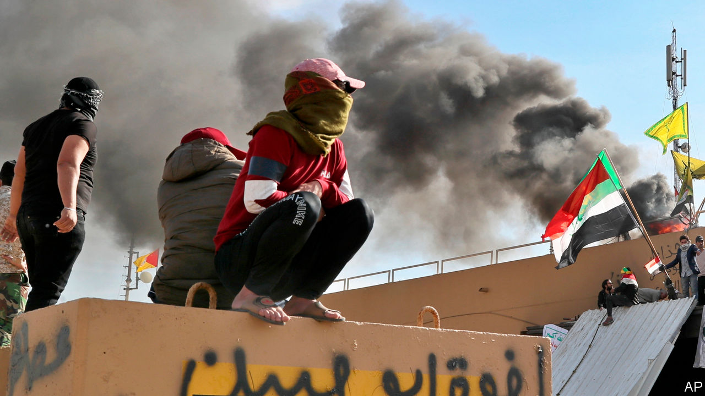

# The world this week

> Jan 4th 2020

After an Iranian-backed militia allegedly attacked an Iraqi army base and killed an American contractor, America bombed the militia’s bases in Iraq and Syria. The militia’s supporters then staged violent protests outside the American embassy in Baghdad. The Iraqi authorities, who had dispersed recent anti-government protests with lethal force, stood by and let the anti-American rioters enter the compound. Donald Trump blamed Iran for organising the mêlée. The Pentagon deployed an extra 750 troops to the region. See [article](https://www.economist.com//leaders/2020/01/02/america-shows-how-not-to-tame-iran).

In Somalia America carried out air strikes against al-Shabaab jihadists suspected of planting a car bomb on the outskirts of Mogadishu that killed at least 80 people.

A court in Saudi Arabia sentenced five men to death for murdering Jamal Khashoggi at the Saudi consulate in Istanbul in 2018. The closed trial concluded that the killing of the Saudi dissident was an impulsive decision taken by the assassins. The CIA believes that Crown Prince Muhammad bin Salman ordered the murder. He denies it.

Binyamin Netanyahu, the prime minister of Israel, said he would ask parliament to grant him immunity from prosecution in three corruption cases. Court proceedings against Mr Netanyahu would be put on hold until the request could be heard, probably after a general election in March. Earlier in December he easily defeated a challenge to his leadership of the Likud party.

Joe Biden, a former vice-president, said he “would obey any subpoena” to testify at the impeachment trial of Donald Trump in the Senate, having earlier suggested that he would not do so. Mr Trump’s request to Ukraine to investigate Mr Biden’s son formed the basis of the vote in the House to impeach the president.

Boris Johnson, the Conservative prime minister, moved Britain closer to Brexit. His withdrawal agreement with the EU won a majority of 124 in the House of Commons. Britain will formally leave on January 31st. But that is only the end of the beginning of the Brexit ordeal; Mr Johnson must now try to secure a good trade deal by the end of 2020.

Andrew Bailey was named as the new governor of the Bank of England, to take over from Mark Carney in mid-March. Mr Bailey has been head of the Financial Conduct Authority since 2016. Before that he was a deputy governor at the bank. See [article](https://www.economist.com//britain/2019/12/20/in-andrew-bailey-the-bank-of-england-gets-a-technocratic-new-boss).

Firefighters fought Australia’s worst wildfires for decades. The government refused to review its climate policy. See [article](https://www.economist.com//asia/2020/01/02/australias-bushfires-intensify-its-debate-about-climate-change).

Carlos Ghosn, a former boss of Nissan and Renault, jumped bail and was somehow spirited out of Japan, where he had been awaiting trial for alleged financial misdeeds. He turned up in Lebanon, which has no extradition agreement with Japan. Mr Ghosn, a Lebanese citizen, said he fled to escape a “rigged” justice system and “political persecution”. See [article](https://www.economist.com//asia/2020/01/02/the-flight-of-a-car-industry-megastar-shocks-japan).

North Korea’s dictator, Kim Jong Un, said he would end a moratorium on testing nuclear weapons and long-range missiles. He tested two dozen short-range missiles in 2019.

He Jiankui, a Chinese biologist who achieved notoriety in 2018 by altering the DNA of twin girls when they were still embryos, was sentenced by a court in Shenzhen to three years in prison for an “illegal medical practice”.

Tens of thousands of pro-democracy Hong Kongers demonstrated on New Year’s Day. Police fired tear-gas and arrested 400 people. In India protests continued against a new law that makes it easier for refugees from Afghanistan, Bangladesh or Pakistan to gain Indian citizenship, as long as they are not Muslim.

Bolivia’s interim president, Jeanine Añez, expelled the Mexican ambassador and two Spanish diplomats, accusing them of trying to give succour to an aide of Evo Morales, who stepped down as president in November amid protests against his 13 years in power. Ms Añez is overseeing a caretaker government.

Germany and Russia responded angrily to America’s imposition of sanctions on companies that work on the Nord Stream 2 pipeline, which will transport gas directly to Germany from Russia via the Baltic Sea. America argues that Russia is seeking to dominate German energy. But the German finance minister described the penalties as a “serious interference” in Germany’s internal affairs. The sanctions are unlikely to stop the pipeline’s completion by the end of 2020.

Boeing sacked Dennis Muilenburg as chief executive, deciding “that a change in leadership was necessary to restore confidence” in the company amid the debacle of its 737 MAX jetliner, which has been grounded for nine months after two fatal crashes. The new CEO will be David Calhoun, who is currently Boeing’s chairman.

Stockmarkets had a sparkling 2019, ending the year much higher than when it started. The FTSE All-World, a global index, rose by a quarter over the year, its best performance since 2009. The S&P 500 was up by 29%, the NASDAQ by 35% and the Euro Stoxx 50 by 25%. Other European and Japanese markets recorded similar gains. After a rotten 2018, China’s CSI 300 index rebounded, rising by a third in 2019. See [article](https://www.economist.com//finance-and-economics/2020/01/02/the-causes-of-a-booming-stockmarket-are-unlikely-to-last-through-2020).