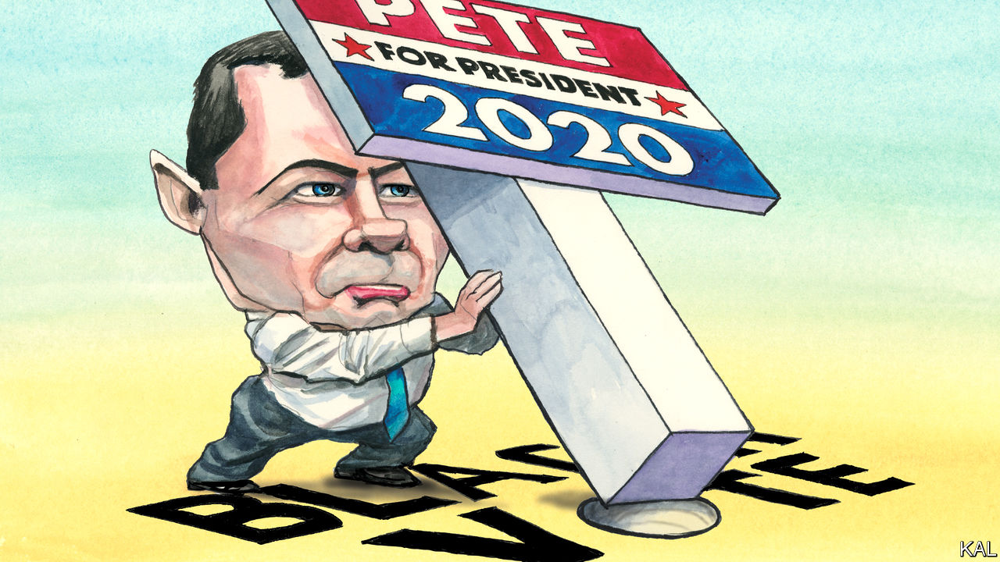

## Lexington

# Pete Buttigieg’s illuminating struggle down South

> The front-runner in Iowa and New Hampshire may have no path to the Democratic nomination

> Jan 4th 2020

THE TRAVEL writer Paul Theroux called Allendale a “ghost town”—“poor, neglected, hopeless-looking, a vivid failure”—and the capital of South Carolina’s poorest county seems not to have improved in the years since his visit. Derelict shops and pump stations line its approach roads. It looks as though it has been hit by a hurricane—though Allendale would probably be less forsaken if it had been. Its more prosaic calamity, half a century ago, was the construction of the I-95 highway, which diverted away the traffic between Columbia and the coast that had been its lifeline. Poor and isolated, its heavily African-American population has fallen by a quarter this century. “There are no jobs here,” says Willa Jennings, the local Democratic Party chairwoman. “But”, she adds, for the tantalising benefit of the three Pete Buttigieg campaign managers crowding eagerly around her, “we vote.”

That is why the staffers’ sudden interest in Allendale is familiar to Ms Jennings. Every presidential cycle or so, Democratic contenders flock to South Carolina, which has the earliest primary of any diverse southern state. Given that 60% of its Democratic voters are black, the candidates often claim to have an answer to racial injustice, which they advertise on well-publicised trips to poor black communities. Mr Buttigieg’s “Douglass Plan”, true to type, includes promises to hire more black teachers, splurge $50bn on historically black colleges and reverse the exodus from poor rural communities. The mayor of South Bend, Indiana, was recently in Allendale to promote it. But Ms Jennings sounded unconvinced. “Candidates often come and promise the world to us and after we come out to vote in full force, we never hear from them again,” she tells his three staffers, all of whom are black. As for trying to reverse the exodus: “I don’t think that would be a good idea,” she says. People in Allendale want help to move to places where there are good jobs, not inducements to stay where there are none.

After the campaign team left, Ms Jennings was more direct. Mr Buttigieg (whose name she found unpronounceable) was a “young man” whom most voters in Allendale did not know. And even if he could change that between now and the primary vote next month (which she doubted), she seemed to consider his record too thin to be persuasive. His homosexuality might prove additionally off-putting to older black voters; Ms Jennings had heard of local pastors denouncing it. Most in Allendale were already for Joe Biden—as around half of all black voters are. National polls suggest 2% back Mr Buttigieg. And Ms Jennings suspected they would not change their minds even if the talented parvenu mayor swept Iowa and New Hampshire, as the polls suggest he could. “To be honest,” she said, “African-Americans love Barack Obama, and they say that if Joe was good enough for him, he’s good enough for us.”

Mr Buttigieg’s contrasting prospects in the earliest voting states and more diverse subsequent ones is one of the oddities of the cycle. Many Democrats—including Mr Obama—boosted their chances in the diverse South with wins in Iowa or New Hampshire. Almost none in recent times has secured the nomination without winning at least one of those states. Yet notwithstanding Mr Buttigieg’s strong numbers in Iowa and New Hampshire and alluring reasonableness, his failure hitherto to impress black voters, who make up a quarter of the Democratic electorate overall, has put him on track to dazzle briefly and then flop. And there may be nothing he can do to prevent this. After a slow start, his South Carolina operation is as well staffed and resourced as most of his rivals’. Yet it has won hardly any endorsements from local politicians or otherwise improved Mr Buttigieg’s standing in the state.

The anomaly reflects other oddities, including the combination of a crowded Democratic field and a weak front-runner in Mr Biden. This has made it easier for the former vice-president’s challengers to break through locally—as Mr Buttigieg, a midwesterner, first managed in Iowa—than nationwide. Yet it more profoundly reflects a widening fissure in the Democratic coalition. Whereas white progressives have moved to the left, non-whites remain moderate, sceptical and often conservative—especially on the sexual-liberty issues that energise the left. According to a poll by Third Way, a centrist think-tank, of the 79% of African-Americans who identify as Democratic, a third “lean conservative”.

It may seem odd that Mr Buttigieg has come to symbolise this clash, given that he is pretty moderate himself. Yet this makes his struggles even more revealing of how the main Democratic groupings are diverging. Though centrist by the standards of Elizabeth Warren, whose fantastical health-care plan he eviscerated, his proposals are to the left of Mr Obama’s: he vows to make college debt-free, for example. And sceptical black voters are not only liable to dismiss such radicalism as too left-wing. Well-used to false promises, many find it incredible—which may explain why the Douglass Plan appears to be falling flat. It includes so many proposals outside the purview of the federal government that it would look unachievable even if proposed by a weightier figure than the mayor of Indiana’s fourth-biggest city. By contrast, says Robbie Dublin, an Allendale businessman, “Joe Biden doesn’t promise much, he just says he’ll do the best he can. I like that.”

To fully unite the Democratic Party appears to require the sort of generally inspiring yet credibly moderate figure Mr Obama was. Yet such figures are rare. In the absence of one this time round, the party is already setting its hopes on the next best thing, a common enemy, in Donald Trump. This may be enough; defeating the president is the priority for all Democrats. Yet the growing dissonance between white and non-white voters points to an inherent strain in this hope. Many voters in Iowa think an inspiring but untested figure like Mr Buttigieg would be likelier to beat Mr Trump than a stick-in-the-mud like Mr Biden. Black voters seem to think the opposite. They cannot both be right.■

[Sign up to receive Checks and Balance](https://www.economist.com//checksandbalance/), our new weekly newsletter on American politics