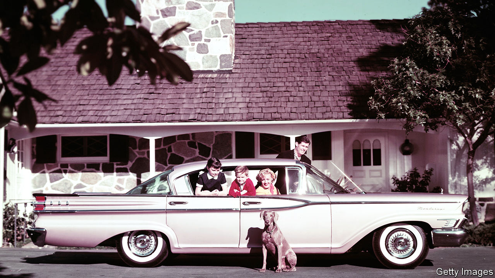
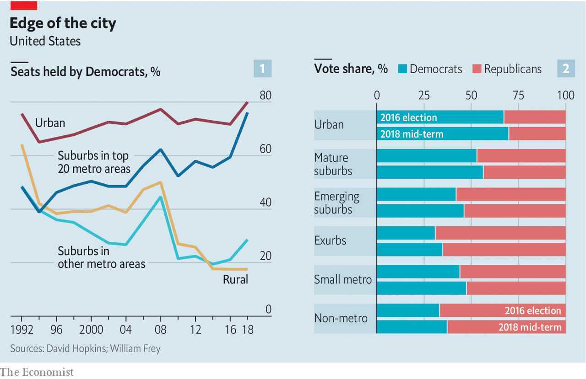
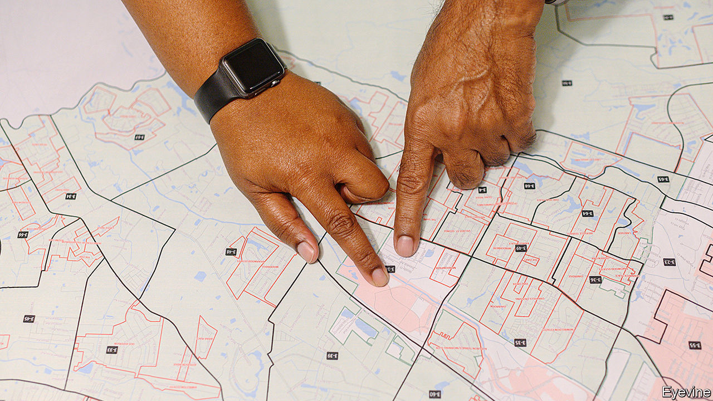

## Laboratories of democracy

# The 2020 presidential election will be decided in the suburbs

> Contrary to a widespread belief, Democrats do not have a decisive edge in suburbia

> Jan 4th 2020SAVANNAH, GEORGIA

UNDER THE SPANISH MOSS and live oaks of Skidaway Island, a suburb of Savannah, the Oyster Roast, a barbecue-cum-fund-raiser for the University of Georgia, is winding down and politics is raising its ugly head. “When we first came here,” says Allen Blount, a businessman from Jacksonville, “we were the only Democrats for miles around, and had to keep quiet about it. Now we’ve discovered a network of secret Democrats, but we still keep quiet so as not to upset our Republican friends.” Skidaway is majority Republican. Ten miles north, in a precinct of downtown Savannah, Hillary Clinton won 98% of the vote. Almost next door, in the suburb of Bloomingdale, Donald Trump won over 80%. “It’s still red versus blue,” says Mr Blount, “but everything is more complicated.”

And not only in suburban Savannah. More than half of votes in 2020 will probably be suburban ones. It is hard to be precise because America has no standard definition of suburbs, and definitions matter. Some people classify them as areas dominated by single-family homes and commuting by car, but that is not how the Census Bureau does things. Data on jobs, ethnicity and education are gathered by county; America has just over 3,000 of these. Even though Kalawao County in Hawaii has fewer than 100 residents, whereas Los Angeles County has over 10m and includes dense urban areas and empty countryside, counties are therefore the only proxy for suburbs. Based on the counties around the 100 largest cities, Bill Frey of the Brookings Institution, a think-tank, distinguishes between three sorts of suburb: inner “mature” ones in which 75-95% of the land is built upon; outer “emerging” ones with 25-75% urbanisation; and “exurbs” with less than 25% of land developed.

Once upon a time, all these places voted Republican. Orange County, a swathe of southern California, did not choose a single Democratic presidential candidate between 1936 and 2016. National elections pitted Republican suburbs versus Democratic cities plus the rural South.

That has changed as suburbs have grown and altered. Between 1980 and 2016, according to Mr Frey, the proportion of whites living in mature suburbs fell from 70% to 58%. Shares of African-American, Asian and Hispanic residents rose correspondingly. All tend to be more reliable Democratic voters than whites. In Loudoun County, part of those Virginia suburbs that have moved towards the Democrats, the share of Asians has almost quadrupled since 2000, to 20%. This used to be a place of white picket fences, white painted churches and white people. Now its malls are full of Vietnamese, Korean and Indian businesses. In 2018, according to Mr Frey, 56% of voters in this kind of mature suburb plumped for Democrats.

Mature suburbs have also become magnets for America’s most highly educated graduates. Their jobs may be in or near big cities but they commute from nearby tech suburbs, such as Aurora outside Denver or Cedar Park near Austin (a phenomenon sometimes called “bright flight”). According to Wendell Cox of Demographia, a public-policy firm, nearly three-quarters of college graduates live in what he calls “earlier” and “later” suburbs (analogous to Mr Frey’s mature and emerging ones). Like minorities, graduates lean Democratic. Democrats control every district where more than half of voters have college degrees, including Georgia’s sixth, in the northern Atlanta suburbs, which was once Newt Gingrich’s stronghold and is now represented by a fierce gun-control advocate.

It is possible, too, that people of different personality types are increasingly concentrated in different suburbs, or so says Will Wilkinson of the Niskanen Centre, a think-tank in Washington, DC (and before that of The Economist). Psychologists identify the so-called “big five” personality traits, features which underpin other aspects of personality and are stable throughout adulthood. They are openness to new experiences; conscientiousness; extroversion; agreeableness and neuroticism. Mr Wilkinson argues that at least two of these traits are not distributed randomly.

As economic change and migration shift people and jobs around, folk with a greater degree of openness are more willing to move, whereas conscientious people—those with more respect for rules, duty and self-discipline—prefer to stay put. This is may sound far-fetched. But Markus Jokela of the University of Helsinki has shown that personality traits predict people’s willingness to move long distances, and Jason Rentfrow of Cambridge University finds that openness is more common in the states of New England, the mid-Atlantic and the Pacific coast.

Their suburbs are, not by chance, more vital economically. The counties that voted for Mrs Clinton in 2016 accounted for three-quarters of America’s GDP growth in 2010-17 and two-thirds of its new jobs. Put all this together, and a pattern emerges: inner suburbs are better educated, ethnically more mixed, produce more jobs and income, may have more people with the trait of “openness”—and vote Democratic.

But that leaves a big chunk of the suburban landscape where Republicans still dominate. Using Mr Frey’s classification, Mr Trump won 61m votes to Mrs Clinton’s 57m in the three kinds of suburb. Using a slightly different classification, which separates suburbs around the 20 largest cities from the rest, David Hopkins of Boston College found that, outside the top 20, Mr Trump won a higher share of the vote than any Republican presidential candidate since Ronald Reagan’s landslide re-election of 1984. And while Democrats increased their total suburban vote in 2018, most of their gains came in mature (inner) ones. The Republican vote in emerging (outer) suburbs, exurbs and small towns either held steady or dropped by only a small amount. Republicans seem to be consolidating their position in outer suburbia.

All this suggests that suburbs contain two swathes of voters, each loyal to a different party. The gap between them is widening. In 1992, according to Mr Hopkins, the different suburbs voted similarly, with both suburban seats around the largest 20 cities and all the rest split roughly 50:50 between the parties. By 2018, however, these two places had diverged. Big-city suburbs (which, like mature ones, are racially mixed and better educated) had become almost as Democratic as the urban centres they surround. But suburbs outside the top 20 were almost as Republican as the rural areas into which they imperceptibly fade.

So what does that imply for 2020? On the face of it, it looks like good news for Democrats. Using Mr Frey’s classification, mature suburbs contain 82m people, compared with just 27m in Republican-leaning emerging suburbs and 9m in safe Republican exurbs. The Democrats’ potential pool of voters is larger and, in 2018, they increased their actual vote from 57m to 61m, carrying the overall suburban vote. Many of Mr Trump’s policies, such as caging immigrant children at the border and disdain for American allies, are unpopular with suburban voters.

But Republicans are resilient. Even 2018’s blue wave did not sweep them away nationally. In suburbs around the 100 largest cities, the Democrats were ahead by only 4m votes, out of 118m. If you include small towns in the total, the parties’ votes were almost identical, 91m Democrats to 90m Republicans.

Moreover, recent demographic shifts favour Republicans. The surge in urban and inner-suburban growth that took place in the early 2010s (and helped Democrats) is ebbing. Between 2010 and 2015, according to the Census Bureau, cities of over 1m grew faster than the surrounding suburbs. Since then, suburbs have grown more. Growth in emerging suburbs and exurbs has rebounded. Many of the biggest gains have come in mid-sized cities in states Mr Trump won, such as Akron, Ohio and Youngstown, Pennsylvania.

This could mean, argues David Wasserman of the Cook Political Report, that Mr Trump could lose the popular vote again as Democrats rack up suburban victories, but win the presidency thanks to an increasing electoral-college advantage in rust-belt states with few graduates or minorities. In sum, Democrats have increased their suburban support, but not everywhere and not yet by enough to be decisive.

Back on Skidaway Island, the Oyster Roast is over and politics is set briefly aside. The fundraiser has produced $35,000 for marine research in Georgia, and launched the state’s first oyster hatchery. At the next event, in November, there will presumably be even more oysters to eat—but no truce in the political battle at that other, bigger event that month. ■

[Sign up to receive Checks and Balance](https://www.economist.com//checksandbalance/), our new weekly newsletter on American politics

## URL

https://www.economist.com/united-states/2020/01/04/the-2020-presidential-election-will-be-decided-in-the-suburbs
