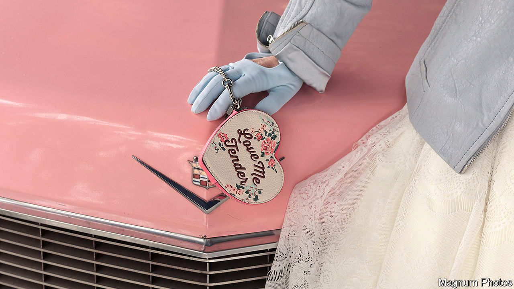

## Crying in the chapel

# The decline of Las Vegas weddings

> A much-mythologised institution hits the skids

> Jan 2nd 2020

“GET ‘MARRIED’ to your best friend for life, your longtime partner, your cellphone, anything really!” reads the brochure for The Little Vegas Chapel. Its pretend wedding package ($199) promises all the thrill of a wedding without the lifetime obligation. Many Las Vegas chapels now offer a range of non-binding ceremonies to pad out thinning wedding schedules. Vow-renewals account for much of their business, alongside friendship affirmations and business-partner commitments.

The self-proclaimed “wedding capital of the world” is suffering from millennials postponing marriage, perhaps indefinitely. About 40% fewer licences were issued to couples in their 20s and 30s in Clark County in 2018 than a decade earlier. Overall, marriage licences issued were down 42% on their peak in 2004, which meant that the local economy missed out on $1bn of annual revenue. A Vegas wedding was supposed to be a counter-cultural choice, but turns out to have been tied to those traditional habits it was supposed to subvert.

Las Vegas’s Hollywood image as the backdrop for impulsive romantic unions is divorced from reality. Its marriage-licence bureau’s 24-hour service, which started in 1979, stopped in 2006. Henceforth, it closed at midnight—not to deter any regrettable 4am decisions, but for lack of trade. By the time the office changed the rules, only 4% of its customers were pitching up after midnight.

Ron DeCar, an Elvis impersonator and owner of the Viva Las Vegas chapel, has seen customer numbers, and hence his takings, fall every year for over a decade. He has been inventive in attempts to arrest the decline, offering 14 variations on his standard Elvis package. For Blue Hawaii ($795), the chapel is filled with palm trees and an atmospheric “ocean mist”. A dancer dressed as a hula girl, or Priscilla Presley, as preferred, is there to assist Mr DeCar as officiating Elvis. For the Pink Caddy Luxury Option ($1,616), the bride is driven down the nave in a 1964 convertible Cadillac through candlelit dry ice. Live-streaming means that guests can watch the whole thing remotely.

For all the creativity, this chapel, like the others, faces a shaky future. One of the most venerable, A Little White Wedding Chapel, the venue for about 800,000 ten-minute weddings, failed to find a buyer after six months. Even fame as the chapel of choice for Britney Spears, Frank Sinatra and Michael Jordan did not help. In October its owners gave up, stuck for now with a little white elephant.

To drum up trade, the clerk’s office will run a pop-up licence booth at the local airport in 2020. It should make marrying more expedient—and perhaps tempt newly arrived couples. Christine Crews of the airport’s public affairs department enthuses that between the booth, flower-vending machines, jewellers and liquor stores, the airport offers all you need for an impromptu proposal. However slick the set-up, the integral ingredient—the willing couple themselves—may yet remain elusive.