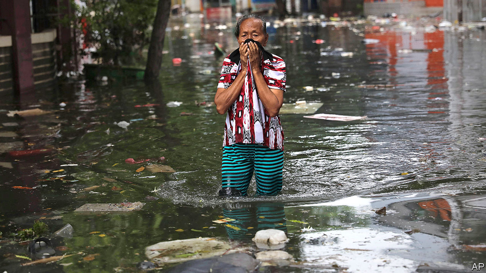

## The incredible sinking city

# Flooding in Jakarta is the worst for over a decade

> Indonesia’s soggy capital is getting wetter every year

> Jan 11th 2020JAKARTA

“IT WAS LIKE the end of the world,” says Nurhayati, dabbing her eyes with the hem of her hijab. On December 31st swollen clouds emptied over Indonesia’s capital, dumping 377 millimetres of rain in one day. That is the most since records began in 1886, according to the state weather agency. The river near Nurhayati’s home in an eastern suburb of Jakarta burst its banks, overturning vehicles parked alongside. Within hours the water had risen nearly eight metres, engulfing one-storey houses. Nurhayati’s neighbour, Pudji, says she had to wait for 22 hours before she could be rescued from her roof. 

Heavy rains overwhelm Jakarta almost every year. But this flood was easily the worst for a decade. It submerged a dozen districts in greater Jakarta, many of which had never previously been inundated, and caused landslides. At least 67 people are dead: some drowned, some died of hypothermia or were electrocuted. Nearly 400,000 people abandoned their homes and sought refuge in shelters.

Problems that have plagued Jakarta for decades exacerbated the disaster. Upgrades to the sewer system have not kept pace with the relentless expansion of the city. Sewers and rivers are often clogged with silt and rubbish.

Limited availability of tap water means that about two-fifths of Jakartans rely on wells. Sucking so much liquid out of the ground is making the whole city sink. Forty percent of it is already below sea level, and some districts are subsiding by 25cm each year. Pumps are supposed to carry floodwaters out of low-lying areas and into Jakarta Bay, explains Leonard Simanjuntak of Greenpeace Indonesia. But last week most of them broke. Why? They were submerged by floodwater, according to an official from the Water Resources Agency.

Climate change compounds all this. Extreme rainstorms will become more frequent and intense as temperatures continue to rise (a warmer atmosphere holds more moisture). Indonesia emits more greenhouse gases than most other countries, primarily because of the way it manages land. Indonesian farmers burn forests to make way for palm oil and other plantations, releasing huge amounts of carbon in the process. Creating tillable land by drying out peat bogs has much the same effect, and makes wildfires more likely. The country is also undertaking a vast programme of electrification that requires the construction of many new coal-fired power stations, the dirtiest kind of generators.

Environmentalists want the government to replant forests on Jakarta’s fringes, saying this would help absorb some of the rains. The government says new dams it is building will help prevent future disasters. Improving waste collection and expanding access to tap water are on officials’ to-do list, too. In the long term, the government has grand plans to move Indonesia’s seat of government to a brand new city it wants to build on the island of Borneo. It is easy to see why the capital’s bureaucrats like the idea of a fresh start.■

Sign up to our new fortnightly climate-change newsletter [here](https://www.economist.com//theclimateissue/)