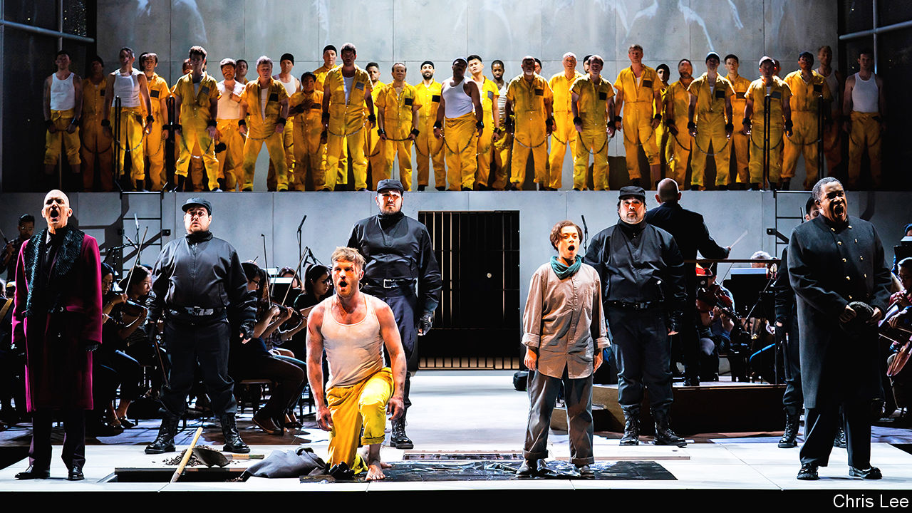

## Prisoner’s dilemma

# A bold American composer updates “Fidelio”

> As Beethoven’s 250th birthday approaches, criticism of his music is rare

> Jan 9th 2020

BEETHOVEN’S 250TH birthday is big business. Although there is no record of the exact date the composer was born, his baptism was recorded on December 17th 1770, and the long lead-up to its anniversary will be lucrative. Cities such as Bonn, his birthplace, and Vienna, where he spent much of his career, are preparing for a tourist deluge. All manner of “Beethoven 250” souvenirs are already in circulation, from the bizarre (replica invitations to his funeral) to the mundane (mugs, mouse mats, mass-produced red scarves of the kind he wore in a well-known portrait). Performances of his music, never infrequent, will be given in concert halls around the world. The first, famous four notes of his Fifth Symphony will be hard to avoid.

The only kind of commemoration that might be hard to come by is any note of meaningful critique. Beethoven, even more so than Bach or Mozart, is the classical composer whose legacy remains most unassailable. You can question individual performances or interpretations, but the man himself, and his music, are sacrosanct. That is what makes the Pulitzer-winning American composer David Lang’s new opera “prisoner of the state”, which will receive its European premiere at the Barbican Centre in London on January 11th, both interesting and timely.

A reworking of “Fidelio”, Beethoven’s only complete opera, Mr Lang’s piece—first staged in New York in the summer of 2019—stemmed from his dissatisfaction with the original. “It started with a performance I saw of ‘Fidelio’ in 1978,” Mr Lang recalls. “Here’s our first composer hero, the first one who truly imagines that a composer can look at society and say something about it. And here’s his supposedly most powerful statement about human freedom and political tyranny.” Yet “there were so many things that frustrated me.”

“Fidelio” tells the tale of Leonore, who rescues her husband Florestan from unjust imprisonment by disguising herself as Fidelio, a lowly prison guard. Vienna was occupied by French troops when Beethoven wrote the score; the premiere was on November 20th 1805, six days after Napoleon took up residence at Schönbrunn Palace. Setting the action in 18th-century Seville, the composer took care to give his characters vaguely Spanish names, avoiding the implications of French or German ones.

In the circumstances, “Beethoven was not able to go direct to the heart of the issue,” Mr Lang concedes. Even so, and for all the beauty of the music, “his characters are not really characters: they’re cardboard cut-outs for virtues or evils, cartoon villains.” In both narrative and political terms, he thinks, “Beethoven pulls his punches.” The problems overlap: “He hides the political story inside this domestic story, coming out of the opera buffa [comic opera] tradition—a woman dressed as a man, a case of mistaken identity and so on.” These shortcomings were enticing. “I wondered—21-year-old, obnoxious egomaniac that I was—what would it be like to not pull those punches?”

Mr Lang, now 63, says “prisoner” is not a bid to improve or supplant “Fidelio”. Rather, it is a revision of the story for modern times, a tightened, punch-packing exploration of tyranny and freedom, but also of human psychology and therefore of the audience’s response to what happens on stage. In the rewritten libretto, Mr Lang’s soprano heroine, “the Assistant”, begins to question her responsibility to other prisoners besides her husband; his autocratic “Governor” sings a tenor aria about the nature of knowledge and power so compelling that it takes a beat to see that it is also deeply villainous. Throughout, the idiomatic, jazz-inflected score ranges from darkly insinuating to radiantly expressive. As ever with Mr Lang’s work—as, indeed, with Beethoven’s—the ear absorbs more than the listener realises, the music resonating long after the final curtain.

If taking on the genius of Beethoven in this way seems a bit hubristic, in the flesh the New Yorker comes across as rather humble. He seems animated not by overweening personal ambition but by an urgent belief that classical music is up to the grand task that Beethoven imagined for it: to be a powerful agent of empathy, bringing people together and setting them free. The best example of this credo is Beethoven’s Ninth Symphony, in which he weaves Schiller’s great Enlightenment text “An die Freude” (“Ode to Joy”), about the unity and brotherhood of mankind, into music of rousing and enduring glory.

Mr Lang’s previous works have showcased music’s political potential. They include a community opera involving 1,000 singers that was staged along the High Line in New York, and a powerful choral piece based on Hans Christian Andersen’s “The Little Match Girl” (for which he won his Pulitzer in 2008). “I’m a total politics junkie, completely obsessed,” he says. “And the great gift of being a composer is that you get to spend a lot of time alone, thinking about what you believe in.”

Can a 65-minute opera truly have a political impact? Mr Lang reckons that, in an era of “children put in cages”, attending to the lives of prisoners is as necessary as ever. “In America we throw everyone we want to in prison and never think about them again,” he laments. “Hopefully we can take our momentary, flitting attention and do something good with it.” Beethoven would no doubt applaud. ■