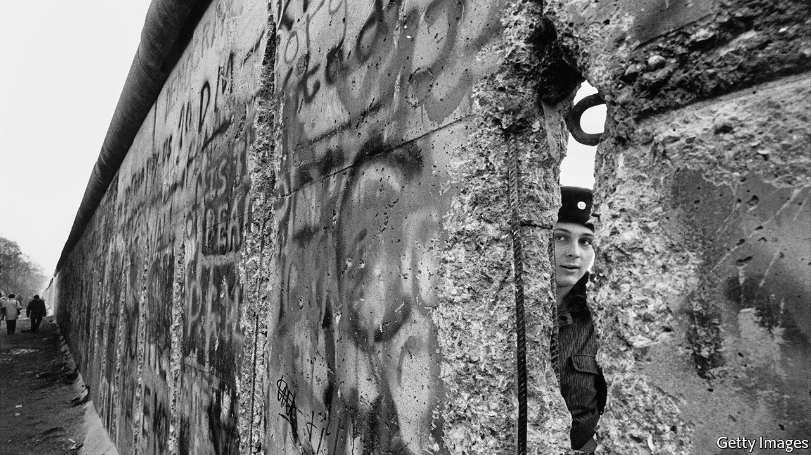

## The ironies of revolution

# A love affair with liberal democracy that soured

> “The Light that Failed” explores how, in eastern Europe, disillusionment set in

> Jan 9th 2020

The Light that Failed. By Ivan Krastev and Stephen Holmes. Pegasus Books; 256 pages; $26.95. Allen Lane; £20.

IN A VIRAL video for a song by Sergei Shnurov, a Russian rock star, a provincial young woman in a shabby Soviet-era apartment vies for the attention of a Westernised businessman she has befriended over Skype. He invites her to an art exhibition. She duly waxes and squeezes herself into tight jeans, emulating a model in a glossy magazine, and paints the soles of her shoes in red nail varnish to mimic the expensive Western originals. Alas, as she answers the door, the jeans treacherously split, the shoes stick to the floor—and the Russian Cinderella falls flat on her face.

A scathing take on Russia’s abortive date with the West, the video’s popularity was due in part to its liberating message. Don’t bother aping others, it wittily enjoined; stick with what you’ve got. The pitfalls for ex-communist countries of copying the (once) liberal West are the subject of “The Light that Failed”, a sharp, polemical and ideas-packed book by Ivan Krastev, a Bulgarian-born political scientist who has witnessed and participated in the remaking of central and eastern Europe, and Stephen Holmes, an expert on the history of liberalism at New York University.

Published for the 30th anniversary of the fall of the Berlin Wall, their book sets out to explain how the liberal transformation of eastern Europe turned into a defeat for the idea of liberalism itself; why, after making reforms that paved the way for Europe’s emancipation, Russia became a bitter enemy of the West; and why “the end of history”—as Francis Fukuyama once put it—gave way to the apparent cancellation of the sunlit future. Membership of NATO made many ex-communist countries more secure than ever. Accession to the European Union helped make them unprecedentedly rich. Yet disillusionment set in.

To understand why, Mr Krastev and Mr Holmes examine the psychology of imitation. Unlike the great revolutions of 1789, 1917 or even 1968, the upheaval of 1989 was not powered by newfangled ideas or utopian visions. That it was largely peaceful was in part because it eschewed radicalism and innovation. Rather, it was staged in the name of reverting to “normality”, and of fixing the derangements of a system which postulated that two plus two made five (at best) and subordinated human instincts to ideology. Russia and Poland, Hungary and Bulgaria, ex-communists and dissidents—everyone wanted to be “normal”. And being normal meant being like the West. Copying it became the imperative.

With hindsight, that urge was also a source of psychological strain and future resentments. The imitation of moral precepts—as opposed to Chinese-style imitation of technology—required a degree of self-abnegation. It undermined citizens’ faith in the special character of their nations and compromised their dignity. Some felt like poor relatives magnanimously invited to someone else’s feast, but seated at the end of the table, and judged. Others felt like the girl in “The Exhibit”, Mr Shnurov’s video. The bigger the country and grander the past, the greater the strain.

This was not the only structural problem in the impersonation process. Another, say the authors, was embedded in the model being emulated. The version of the West admired and craved by eastern Europeans was the anti-communist West of traditional nation states, in which liberalism was grounded in patriotism and protected by strong borders. It was, above all, a West of cohesive societies with smallish contingents of foreigners. That West, however, was transformed by the success of liberalism itself, amid migration, multiculturalism, secularism and gay marriage. People who grew up under totalitarian regimes had a heightened sensitivity to finger-wagging; to many, political correctness came across as repressive groupthink.

The financial crash of 2008 and the subsequent migrant crisis were seen—at least by populists such as Hungary’s Viktor Orban and Jaroslaw Kaczynski of Poland—as proof positive of the liberal West’s failures. An irony drawn out by Mr Krastev and Mr Holmes is that those leaders owe their rise not so much to the inflow of migrants from Africa and the Middle East (which barely affected their countries) but to the outflow of native-born citizens. “The dream of collective return of formerly communist countries to Europe made the individual choice to abscond abroad both logical and legitimate”; but when the best and the brightest want to leave, those who remain are liable to feel like losers, and be more likely “to cheer anti-liberal demagogues who denounce copycat Westernisation as a betrayal of the nation”. Anti-migrant scaremongering in eastern Europe is a displaced fear of depopulation, the authors argue.

Yet this analysis does not explain why anti-Western and anti-liberal rhetoric is louder in more populous countries, such as Poland, than in smaller Baltic and Balkan places. One reason, perhaps, is that Poland (like Hungary) can invoke a glorious past. By contrast, it is hard to imagine a demagogue promising to make Estonia great again. This may help explain why resentment of the West as an exemplar is particularly strong in Russia.

Mr Krastev and Mr Holmes think the trauma of losing the cold war made Russia different, and that its attempts at building democracy were always a charade. Both assertions need qualifying. Mikhail Gorbachev, who ended the cold war, suffered no inferiority complex; at the time, few Russians regretted the withdrawal of Soviet troops from eastern and central Europe. Meanwhile, the freedoms of the 1990s were as real in Russia as its political competition, which was sharp enough to take the country to the verge of civil war. The feeling of humiliation took hold later, amid economic recovery, as anti-American propaganda was whipped up by Vladimir Putin, a former KGB officer, not a bedazzled reformer. Under Mr Putin, imitation of America and the West morphed into parody and became a means of retaliation. In its war against Georgia in 2008, annexation of Crimea in 2014 and meddling in the American election of 2016, the Kremlin implicitly claimed to have mirrored America’s actions and exposed its hypocrisy.

The resentment of the imitators towards their model might have been expected. What is more surprising is that the anti-liberal agitators found an ally in the leader of the supposed home of liberal democracy—Donald Trump, whose victory was celebrated in Moscow as the end of reviled Western liberalism. While Mr Putin has become the template for authoritarians, Mr Trump has abandoned the notion of America’s exceptionalism in the name of a different kind of normality. In this mercantilist dispensation, to be normal is to be selfish, to treat copycats as a threat and to impersonate your adversaries. America has begun to imitate the imitators: not only has Cinderella turned into an embittered stepsister, but the prince has ditched the gallantry. Liberals must hope that this is not the final irony of the topsy-turvy history grippingly explored in this book. ■

## URL

https://www.economist.com/books-and-arts/2020/01/09/a-love-affair-with-liberal-democracy-that-soured
