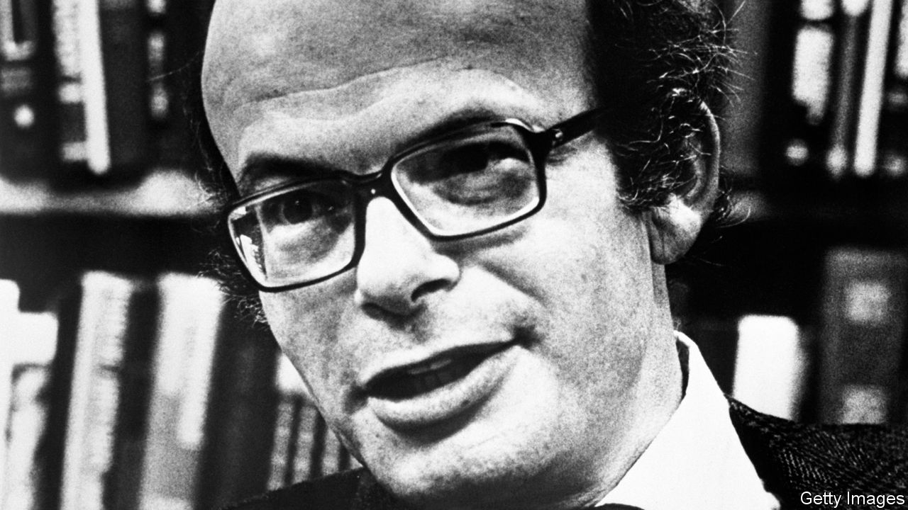

## Mad in craft

# The psychologist who pretended to be insane

> Susannah Cahalan grippingly explores an influential—but unreliable—experiment

> Jan 9th 2020

The Great Pretender: The Undercover Mission that Changed our Understanding of Madness. By Susannah Cahalan. Grand Central; 400 pages; $28. Canongate; £16.99.

IN 1973 DAVID ROSENHAN, an American psychologist, published a paper entitled “On Being Sane in Insane Places”. He had recruited seven volunteers to join him in feigning mental illness, to expose what he called the “undoubtedly counter-therapeutic” culture of his country’s psychiatric hospitals. The readiness with which the group’s sham symptoms were taken for the real thing seemed to show that even highly trained professionals could not accurately differentiate between the sick and the well.

For at least a decade, a crusade against traditional psychiatry had been gathering pace. In common with the period’s civil-rights campaigners, the leaders of this movement disputed the power of institutions and their prescriptions about society’s norms. Rosenhan’s findings played a crucial part in reinforcing the charges of sceptics who believed that mainstream psychiatric practice was crudely repressive. Indeed, they sparked debate about the very definition of mental illness.

In “The Great Pretender” Susannah Cahalan provides a vivid account of Rosenhan’s “undercover mission”. Her interest in him began with her own experience of being misdiagnosed with schizoaffective disorder, when in fact she had an autoimmune disease—as documented in her memoir “Brain on Fire” (2012). In her new book she recalls her delighted recognition as she read Rosenhan’s attack on the hubris that can blight psychiatry. Looking more closely at the man and his work seemed a way to sharpen her sense of the flaws in the profession’s diagnostic systems. Yet as she examined his notes and tried to track down his seven fellow “pseudopatients”, she began to have doubts about his methods.

Rosenhan (who died in 2012) was a gifted teacher, combining twinkly charisma with a flair for memorable anecdotes. But although he achieved academic eminence, holding chairs in both psychology and law at Stanford University, even his admirers acknowledged that he was slippery and given to drama. This was useful when he was trying to pass himself off as an ill man in need of psychiatric treatment. As Ms Cahalan reveals, however, his less enthusiastic colleagues thought he was “shady” and “avoided work like the plague”. His most severe critic, Robert Spitzer of Columbia University, bemoaned the sheer seductiveness of Rosenhan’s writings, opening a takedown with the remark that “Some foods taste delicious but leave a bad aftertaste.”

“The Great Pretender” is a sobering exercise in revisionism. It is also an impressive feat of investigative journalism—tenaciously conducted, appealingly written (despite the odd purple patch) and, when it focuses on Rosenhan’s story, as compelling as a detective novel. In the end Rosenhan emerges as an unpalatable symptom of a wider academic malaise.

Many of psychology’s most famous experiments have recently been discredited or devalued, the author notes. Immense significance has been attached to Stanley Milgram’s shock tests and Philip Zimbardo’s Stanford prison experiment, yet later re-runs have failed to reproduce their findings. As Ms Cahalan laments, the feverish reports on the undermining of such theories are a gift to people who would like to discredit science itself. ■

## URL

https://www.economist.com/books-and-arts/2020/01/09/the-psychologist-who-pretended-to-be-insane
