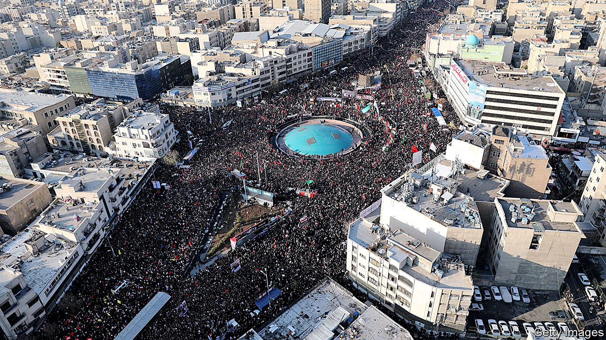
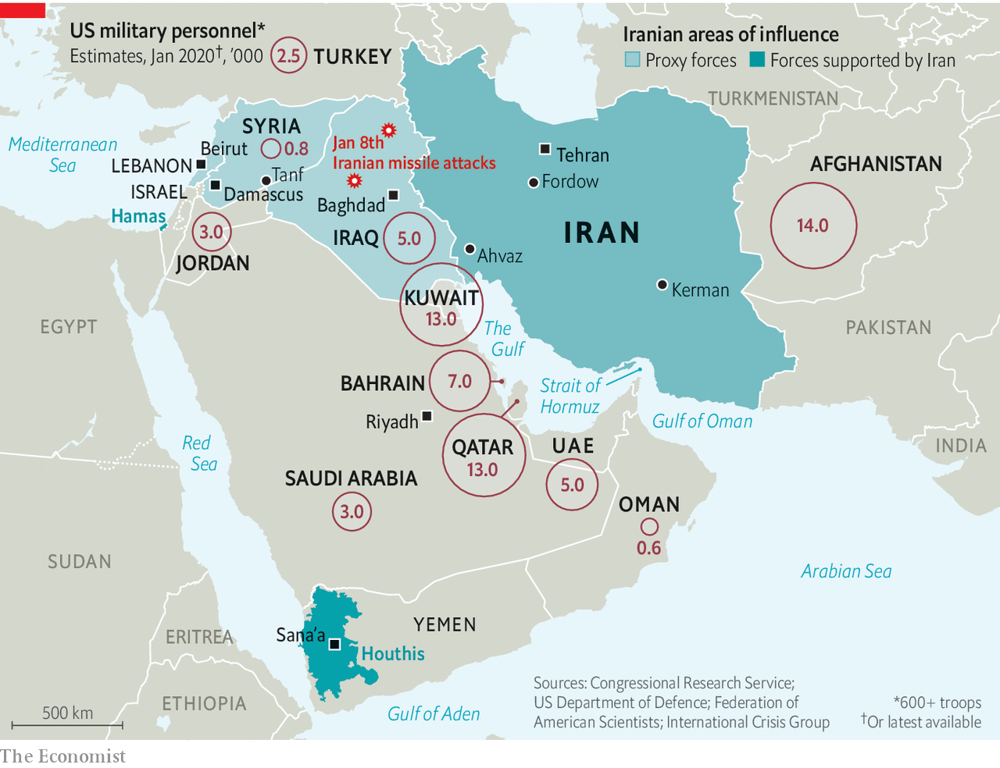
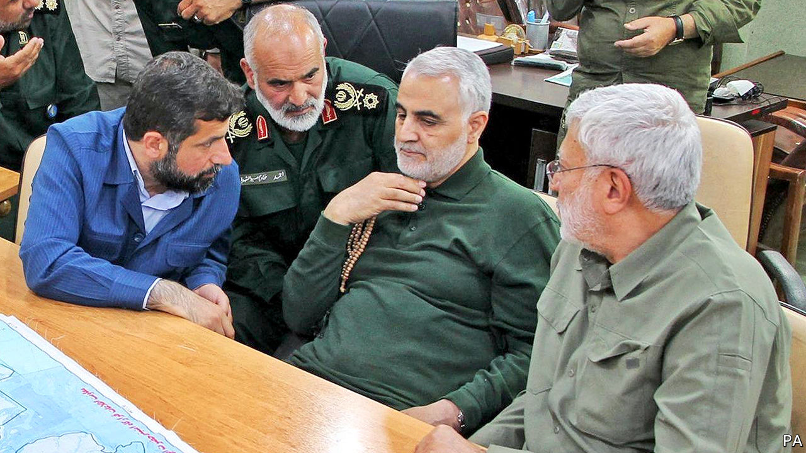
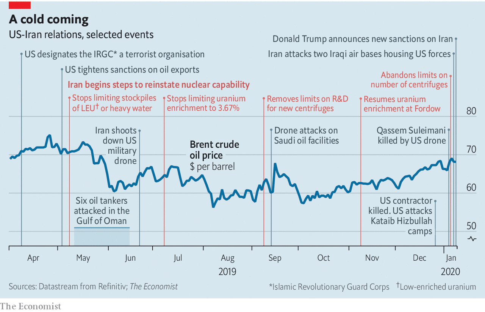
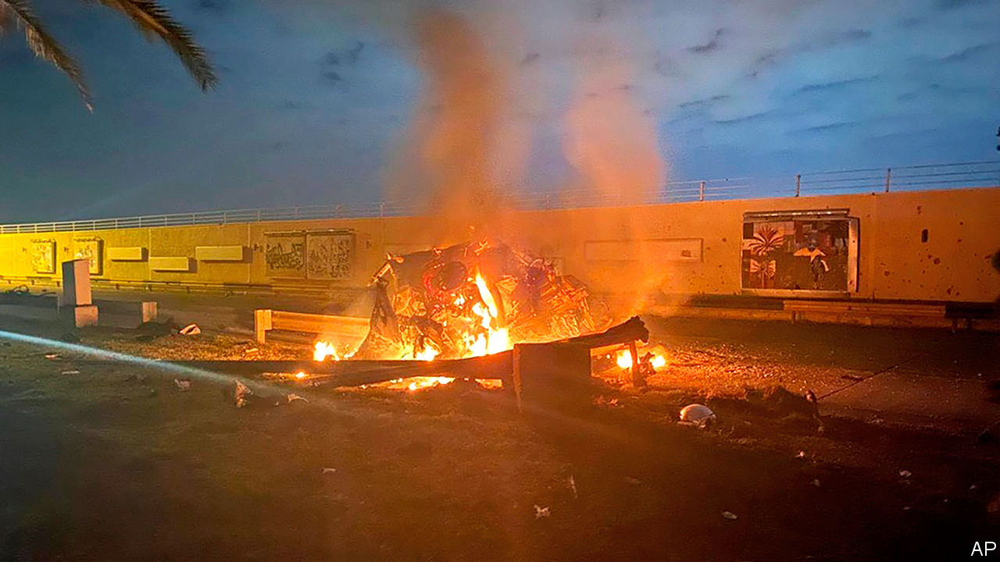

## After the assassination

# How Iran can respond to the killing of Qassem Suleimani

> Its options are constrained

> Jan 9th 2020

THE FUNERAL rites of Qassem Suleimani surpassed that of Ruhollah Khomeini, the founding father of the Islamic Republic of Iran, in size, extent and fatalities. The casket bearing the slain commander of the Quds Force, the expeditionary arm of Iran’s Islamic Revolutionary Guard Corps (IRGC), was paraded through eight cities, three in Iraq and five in Iran, drawing crowds reckoned in the millions. In the last, his home city of Kerman, more than 50 mourners were crushed in the throng.

General Suleimani, who co-ordinated the activity of Iranian-backed militias from Lebanon to Yemen, was killed shortly after getting off a plane at Baghdad airport early in the morning of January 3rd. According to Mike Pompeo, America’s secretary of state, President Donald Trump ordered the killing because the general was organising a plot which posed an imminent threat to American citizens.

Compelling evidence for this has not been forthcoming; but a secondary justification—that among the tens of thousands of people killed by General Suleimani’s forces were at least 600 Americans—has also been widely used and appears to satisfy many Americans. Though some are keen to debate the legality and morality of the killing (see [Lexington](https://www.economist.com//united-states/2020/01/09/deep-mistrust-of-donald-trump-complicates-his-iranian-gamble)), the wider debate is over whether it was reckless or resolute, and what this new twist in the toxic relationship between Iran and America will bring in terms of reprisals—either through strategic change in the Middle East, terrorist targeting of Americans or a new quest for a nuclear bomb. The crash of a Ukrainian airline shortly after it took off from Tehran airport on January 8th added to the situation’s uncertainty; as The Economist went to press there was no clear explanation for the loss.

Long-standing though the two countries’ enmity is, the immediate context of the assassination was a chain of events barely a week long. On December 27th an Iranian-backed militia attacked a military base in Iraq, killing an American contractor. American reprisals on December 30th killed at least 25 members of the militia responsible, Kataib Hizbullah. The next day members of the militia laid siege to the American embassy in Baghdad, setting its gates alight.

Mr Trump tweeted that he would hold Iran responsible for this and that it would pay a “BIG PRICE” for any harm; the Twitter account associated with Ayatollah Ali Khamenei, Iran’s supreme leader, responded “You can’t do anything.” The attack launched from a Reaper drone high above Baghdad two days later killed not just General Suleimani, Kataib Hizbullah’s sponsor, but also Abu Mahdi al-Mohandis, its founder, who was travelling with the general in his capacity as chief of operations of Iraq’s Popular Mobilisation Units (PMU), an umbrella group for militias.

General Suleimani was more than the paymaster for Iran’s proxies in Lebanon, Syria, Iraq, Yemen and beyond. He was widely seen as the second-most-powerful man in the country. Mr Khamenei considered him his most trusted adviser and a bulwark against other senior officers hungry to shift more power from the country’s clerics to its armed forces. Popular in life—the only face more widely seen on billboards in Tehran is Mr Khamenei’s—in death he appeared to bring a divided country together.

Even in Ahvaz, an Arab city in south-western Iran where hostility towards the regime runs deep, hundreds of thousands paid their respects as the coffin passed through. Young Iranians who chanted “Death to Khamenei” in huge protests last November—protests which the IRGC had savagely put down—joined the mourners, hailing a hero who had risked his life for his country while appearing to remain untainted by its corrupt internal rivalries (see [Obituary](https://www.economist.com//obituary/2020/01/09/obituary-qassem-suleimani-was-assassinated-on-january-3rd)). The crowds called him the people’s soldier, not the supreme leader’s.

Iran’s leaders, clerical, political and military, publicly vowed revenge. Its first fruits were not long coming. In the early hours of January 8th ballistic missiles rained down on two military bases in Iraq that host American troops—the Ain al-Asad base in the west, which is home to at least some of America’s Reapers, as well as other aircraft, and another facility in Erbil, in the north (see map). Shortly afterwards Iran’s foreign minister, Muhammad Javad Zarif, who days earlier had talked of the consequences of the assassination haunting America “around the globe”, played down the prospect of further reprisals, tweeting that Iran had “concluded proportionate measures in self-defence”.

It may have looked proportionate in Iran, where state television reported that 80 “American terrorists” had been killed. But according to the Pentagon and Iraqi officials there were no casualties. This may have been largely deliberate. The Iranians apparently gave Iraq warning that they would strike, allowing protective measures to be taken at bases across the country. Images from Planet, a satellite-observation company, show that many of the missiles seem to have scored clean hits on specific buildings that were uninhabited—evidence both of impressively high precision and, it seems, a carefully pulled punch.

Mr Zarif to the contrary, it is unlikely that this will be the last reprisal. But Iran’s leaders are operating under a complex set of constraints. They want to be seen to do right by the people’s soldier. They also want to get America out of Iraq and, if possible, the region. But they have lost the principal architect of their co-ordinated regional power. The relations with armed groups around the region which have provided Iran with a “sovereign capability to conduct remote warfare and influence operations”, in the words of the International Institute for Strategic Studies, a think-tank, were in large part General Suleimani’s creation. “He was masterminding everything,” says Mehrzad Boroujerdi of Syracuse University.

With Iran’s economy strangled by America’s “maximum pressure” sanctions, Iran’s leaders also face material limits. Perhaps most important, they can no longer depend on the military quiescence America showed over the past year. After Mr Trump pulled America out of the JCPOA, an agreement which limited Iran’s capacity to develop nuclear weapons, in May 2018, Iran responded with increasingly provocative adventurism. In 2019 limpet mines were attached to merchant ships, an advanced American drone shot down and a co-ordinated missile and drone attack launched against two Saudi oil installations. Throughout this America stayed its hand; indeed after the loss of the drone Mr Trump called off a retaliatory air strike at the last minute. This seemed to confirm an impression that, however bellicose his tweeting, he had little interest in violent confrontation, an assessment which may well have rankled.

By targeting General Suleimani, Mr Trump showed not just that he was willing to get violent. He showed himself willing to do things previous presidents had hung back from. He will not invade Iran. But Iran’s leaders now have to take seriously his threats to launch large-scale air strikes if further provoked. Mr Trump has talked of attacking not just military targets but cultural sites, which would be a war crime. Though he might be dissuaded from that, it is not hard to imagine him being drawn to attacks directly aimed at Iran’s leaders—who will have taken note of the B-52 bombers dispatched to America’s Indian Ocean base on Diego Garcia this week.

Thus, though the New York Times reports that Mr Khamenei has decreed retaliation must be direct, proportional and carried out by Iran’s own forces rather than allied groups, it is not likely that the country will launch any more open military attacks against American targets. But this does not mean it will do nothing. It will attempt to make the best of public anger towards America, especially in Iraq. In time, it may sponsor kidnappings and assassinations of its own, as it has done in the past. And it will expand its nuclear activity.

In Iraq, where the government is dominated by Iran, protesters have for months been chanting “Iran Out” and “Death to Khamenei”. Now they thunder “Death to America”. On January 5th Shia representatives in Iraq’s parliament passed a non-binding resolution urging the government to expel foreign—that is, American—troops (most Sunni Arab and Kurdish MPs boycotted the session). A letter dated January 6th had the top American commander in Baghdad telling his Iraqi counterpart that America was going to begin “repositioning forces” to prepare for a withdrawal. Hours later Mark Milley, chairman of the Joint Chiefs of Staff, said the letter was a mistake. But Iraq’s prime minister, Adel Abdul-Mahdi, said he would treat it as official policy and start negotiating the withdrawal of American combat troops.

An American administration capable of delicate diplomacy might be able to stay put, weathering the storm by the judicious use of threats, promises and concessions. This is not that administration. Mr Pompeo has hollowed out the political section of the sprawling American embassy in Baghdad, which now boasts but a handful of officers. Besides, there is little appetite for staying. Mr Trump instinctively sees foreign deployments as pointless, costly exercises (though he has allowed those instincts to be thwarted, and indeed thwarted them himself, on various occasions).

The Pentagon would like to maintain some sort of presence in Iraq—and at its base in Tanf, in Syria, which is supplied through Iraq—as a hedge against the resurgence of Islamic State (IS). But a mix of political hostility and security concerns stoked by Iran will circumscribe the activities of troops stationed in Iraq so tightly that such forces may be able to achieve little or nothing. Perhaps a contingent of troops could remain in Iraqi Kurdistan, whose leaders are desperate not to lose American support. But many in Washington believe this will be the last year of America’s military presence in Iraq. If America pulls out, so will all the other Western countries helping Iraq in the fight against IS, some of which have already withdrawn troops. Western companies may also feel unsafe, ceding infrastructure projects and reconstruction work to countries like China and Turkey that would both face lower risks and care less about them.

Further attacks on American forces might be counterproductive; in some ways Iran’s challenge lies not so much in forcing the Americans out as in not ensnaring them in a conflict that they feel they have to stay and win. But reining in Kataib Hizbullah, eager to avenge its fallen brothers and founder, may be hard in the absence of General Suleimani and Mr Mohandis, his prime point man in Iraq. Mr Khamenei has reportedly sent orders to Iraqi militias to await his call for jihad before striking American forces, but the chain of command has been broken.

Given the frequency of General Suleimani’s visits to the battlefield some thought had been put into the matter of his successor. Mr Khamenei promoted a series of young commanders to senior security posts in preparation for a generational shift. But after the assassination he quickly named General Suleimani’s long-standing deputy, and contemporary, Esmail Ghaani, as the new leader of the Quds Force. General Ghaani’s claim to fame is recruiting the Fatemiyoun and Zeinabiyoun, Shia volunteer forces from Afghanistan and Pakistan respectively, to fight for Iran in Syria. However he lacks his predecessor’s charisma and there is no reason to believe he matches his abilities.

It is possible that one of Mr Khamenei’s bright young things may soon replace General Ghaani. But it is also possible someone already on the scene will overshadow him. Hassan Nasrallah, who has led Hizbullah, a Lebanese militia and political party, for 28 years, is probably the region’s most experienced and best-known Shia military leader. He has chased Israel from South Lebanon twice (in 1996 and in 2006, with General Suleimani playing a significant role in the second of those campaigns). He has battled Sunni jihadists in Syria. In the absence of General Suleimani, he is de facto top dog.

Hizbullah’s principal strength—a huge rocket arsenal aimed at America’s ally, Israel—would be used by Iran only in an existential crisis. Speaking to his followers in Dahiya, a southern suburb of Beirut, on January 5th Mr Nasrallah outlined a different route to avenging his fallen comrade: “The minimal retaliation to the assassination of General Suleimani is to liberate Iraq from US forces.”

America’s meagre forces in Syria are also juicy targets for expulsion, which is one of the reasons why President Vladimir Putin visited the country on January 7th, summoning the Syrian president, Bashar al-Assad, to meet him at an airbase near Damascus. Russia, which works mostly with Syrian government forces, and Iran, which helped create a network of loyalist militias outside the army, have always been uneasy allies there. Russia will not want Syria to become a launchpad for reprisals against America or its allies. And Mr Putin may see ways of strengthening his hand now that General Suleimani, the linchpin of Iran’s Syria strategy, is out of the way.

Mr Trump has warned that harm to Americans will bring down great fury; he has not said the same about attacks on American allies. Remembering his inaction last summer, Saudi Arabia and the United Arab Emirates may fear the worst, despite the fact that Iran has said it will not strike its Arab neighbours. One possibility might be that Iran increases its support for the rebel Houthis in Yemen, encouraging the breakdown of their ceasefire talks with Saudi Arabia.

Saudi Arabia’s efforts at rapprochement with Iraq, where Saudi investors are eyeing the crippled water and power infrastructure, may also be stymied as the country goes through the tremors of America’s withdrawal. Saudi Arabia may be Iran’s great regional rival; but it does not look set to see much of an upside from the blow which America has dealt its enemy.

Iran can draw some comfort from this. With its enemy marginalised in Iraq and troublesome protests muted, its influence in the region will only grow. But it does not change the underlying reality that Iran is deeply unpopular with many Arabs. That state-run media in some Arab countries celebrated General Suleimani’s assassination was no surprise. Less expected was the enthusiasm expressed on social media and in private conversations. If Iranians mourned the general as a national hero, Arabs vilified him as a colonial overlord who cared little about their security or sovereignty. If Iran’s influence will grow, so too will the hostility it engenders.

Particularly badly hit will be those who have been protesting against corrupt and ineffective governments in Iraq and Lebanon, where Hizbullah is one of the parties in power, as well as in Iran itself. The increased tension will be used to delegitimise the protests. At best the demonstrators will be cast as a nuisance; at worst, as tools of American imperialism. Mr Nasrallah has already made such an argument; in Iraq the PMU is moving against the protesters. By killing General Suleimani, America may have undermined Iraqis and Lebanese seeking better government, as well as critics of Iran’s regime at home.

Not all the repercussions will be military, nor will they all necessarily take place in the Middle East. One of the features of Mr Nasrallah’s speech on January 5th was its conviction that General Suleimani’s death would inspire “many more martyrs to blow themselves up”. Hizbullah was the first organisation to weaponise the strong current of martyrdom in Shiism. “They teach that death is just a stepping stone to a new phase of life,” says Abbas Kadhim, an Iraqi scholar of Shiism in Washington.

Such attacks do not have to happen on home turf. In 1992 a Hizbullah suicide-bomber responded to the killing of the group’s leader by attacking the Israeli embassy in Buenos Aires.

Other sorts of targeted atrocity are possible. In the past Iran has been happy to see diplomats, intelligence officers and even ordinary civilians abducted or killed to make a point. The grisliest case involved William F. Buckley, the CIA’s station chief in Beirut, who was kidnapped by Hizbullah in 1984, tortured for 14 months and killed. America’s large expatriate population of businesspeople in the Gulf could be easy pickings for such retribution. But everyday targets may not be enough. “The Iranians will probably feel it necessary to avenge the killing of Suleimani by attempting to assassinate a similarly ranked US official,” says Michael Morell, a former acting director of the CIA who now hosts the Intelligence Matters podcast. “They will do so at a place and time of their choosing, which could be months from now.”

Iran’s leaders may currently be sufficiently cowed by Mr Trump’s promise to respond with air strikes if Americans are killed not to go down such paths. But the possibility will still have a chilling effect. And though Mr Nasrallah insisted in his speech that civilians such as “traders, journalists, engineers, and doctors ... cannot be touched,” his group’s historically catholic approach to targeting suggests this should be taken with a grain of salt.

Meanwhile, Iran’s nuclear facilities are expanding. On January 5th Iran abandoned the last of several restrictions on uranium enrichment that had been imposed under the JCPOA. It has not left the agreement; it says that if sanctions were lifted it would reimpose the restrictions, and it is still accepting the extremely intrusive inspection regime that the agreement calls for. But by asserting its ability to resume research on advanced centrifuges, take old equipment out of mothballs and enrich uranium to levels above those prescribed by the JCPOA it is greatly increasing its capacity to stockpile material which could relatively easily be enriched to weapons grade, were it to pull out of the Nuclear Non-Proliferation Treaty and boot out the inspectors.

Such a “breakout” would force America (and Israel) either to accept an Iranian bomb as a fait accompli or to launch an all-out campaign against its nuclear facilities. But although such a campaign could certainly delay Iran’s acquisition of nuclear weapons for years, it would be unlikely to stop the process altogether.

That is a pretty desperate choice—which means that the closer Iran gets to the threshold, the greater the concessions it might be able to demand in recompense for returning to the limited programme of the past, a return that it still insists is possible. But though that leverage is definitely something Iran sees as a tool, its interest in a bomb is hardly feigned. Confronted with Mr Trump’s open threats of attacks on “high level & important” sites, the urge to get a nuclear deterrent is surely powerful.

In whose hands the diplomatic leverage—or the actual bomb—might end up is not clear. Iran’s clerical rulers know that four decades of theocracy have left many of their people disenchanted. No cleric’s death could pull crowds like those that gathered to salute their war hero—crowds which did not care that the clerics disapproved of the honour guard carrying weapons and the speech by a woman (the general’s daughter). Some saw the crucial balance between clerical and military power tipping. “Without Suleimani, Khamenei is more alone than before and might lose control over the Pasdaran,” says Pejman Abdolmohammadi of the University of Trento in Italy, using the Persian name for the IRGC. “You will see Iran becoming more militarised.”

With his general’s blood on American hands it will be harder than ever for Mr Khamenei to cross the Rubicon and accept the offer to talk that Mr Trump made last year and reiterated on January 8th. But he has no other plausible way of getting relief from the unrelenting sanctions which set off the savagely repressed unrest last November, and which America has now tightened further. The erosion of America’s influence in Iraq, while appealing, will do little to ease those pressures. So he can but wait for this November’s American elections with a hopeful heart—aware as he does so that the sense of common cause brought out by General Suleimani’s funeral, though mostly genuine, was neither universal nor necessarily long-lasting.

When America shot down an Iranian airliner in 1988, having helped Saddam Hussein repel Iranian forces on the Faw peninsula in the south-east of Iraq, Iran swore revenge. Just two months later Khomeini accepted what he called “the poisoned chalice” of the ceasefire that ended eight years of war with Iraq. Iran’s best bet now might be to reach for such a chalice again, using the bargaining power offered by its regional power and centrifuges to get the bitter brew sweetened. But a guard corps brought closer to power, and made thirsty for revenge, by the loss of its brightest star is unlikely to see things that way. ■

## URL

https://www.economist.com/briefing/2020/01/09/how-iran-can-respond-to-the-killing-of-qassem-suleimani
