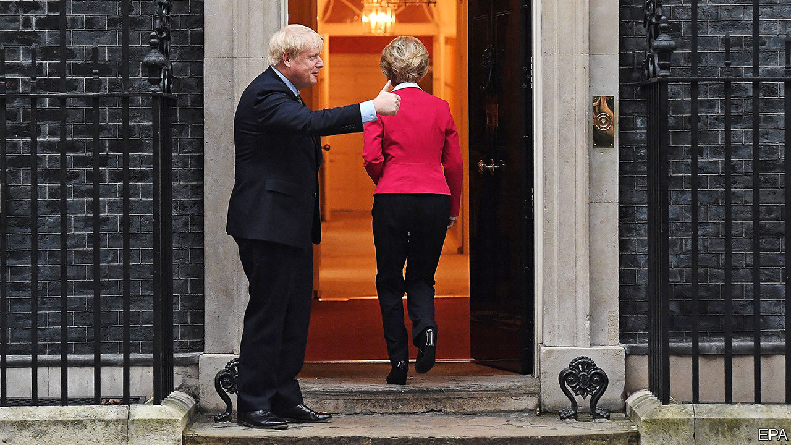

## The Brexit timetable

# Britain is almost out of the EU—but what next?

> At home, Boris Johnson looks like a strong prime minister. But his position in the forthcoming negotiations with Brussels is weak

> Jan 11th 2020

THE IMPACT of Boris Johnson’s election win was clear on January 7th when Parliament resumed consideration of the EU withdrawal bill. A huge Tory majority made the debate and votes perfunctory. The Lords may be less controllable than the Commons, but the bill will become law largely unamended so Brexit can happen on January 31st. Mr Johnson hopes then to drop the very word Brexit, arguing that trade talks will be technical stuff more suited to business than front pages.

In fact Brexit will still not be done on January 31st. Britain will move into an 11-month transition period when it must obey all the EU’s rules and keep paying into its budget. And the future talks will cover not just trade but standards, security, data exchange, fisheries, financial services, research and much else. Moreover, as Ursula von der Leyen, the commission president, made clear at her meeting with Mr Johnson at Downing Street on January 8th (pictured), they will be even more difficult than the withdrawal negotiations.

Changes to the withdrawal bill will not help. It now bans by law any extension of the transition period beyond 2020. Promises to safeguard workers’ rights post-Brexit have gone, in line with Mr Johnson’s plan to escape EU regulations. And the bill dumps provisions giving MPs a big role in scrutinising and voting on future deals with the EU. The aim is to avoid the misery that beset Mr Johnson’s predecessor, Theresa May, as she repeatedly failed to win parliamentary approval for her Brexit deal.

All this fits with a much-loved Brexit trope that the way to win a good deal in Brussels is just to hang tough. The notion is that setting firm conditions and deadlines will force the EU to make concessions, that the 27 member countries are likely to prove disunited under pressure, that the Europeans need the British more than the other way round and that sticking with Brussels’s rules is wrong in principle and also unnecessary to preserve close trade links.

On her visit to London, Mrs von der Leyen spoke eloquently of her deep friendship and admiration for Britain. Yet she was steely when talking of future relations. The end-year deadline made a comprehensive deal impossible. As a third country, Britain would have less privileged trade access. Without free movement of people, it could not have free movement of capital, goods and services. Although the EU wants a trade deal with zero tariffs and zero quotas, she added a third condition of “zero dumping”. This is code for a level playing-field under which Britain is required to observe EU rules in such fields as labour, taxes, the environment and state aid. The more Britain diverges from such rules, the greater the barriers to its exports.

The truth is that Mr Johnson, like Mrs May before him, is in a weak bargaining position. The withdrawal agreement deals with money owed after Brexit, the rights of EU citizens in Britain and, via customs checks in the Irish Sea, the guarantee of an open border between Northern Ireland and Ireland. The EU 27 have learnt the value of unity from previous talks, and unlike Britain they have experienced trade negotiators. And size matters: the EU accounts for almost half of Britain’s exports, while Britain takes barely a tenth of the EU’s.

The agreed political declaration also sets awkward staging posts on the way to a deal. By July 1st it envisages agreements on fish and on future regimes for financial services and data exchange. Mrs von der Leyen suggested these might rely on a system of regulatory equivalence, but she made clear this would be unilateral and could be withdrawn at any time. Even Mr Johnson’s big majority may be a weakness, suggests Maddy Thimont Jack of the Institute for Government, a think-tank. EU leaders often win arguments by claiming their parliaments cannot agree, but they know Mr Johnson is not so constrained.

The end-year deadline causes another problem. Comprehensive trade deals of the sort Mr Johnson wants are invariably “mixed” agreements that need ratification by national and regional parliaments, which typically takes years, not months. If a deal is to be ratified by next January, it must be a simple one not subject to this procedure. That points to goods trade only, with nothing on services, security and so on. And Mr Johnson’s insistence that Britain must have freedom to diverge from European regulations makes it harder to meet the timetable. David Henig, a trade expert, wonders if Britain could go for divergence in principle but not in practice. After all, most companies prefer EU rules they understand to an entirely new regime.

Some ministers suggest putting more pressure on Brussels by opening trade talks with other countries, notably America. But although Donald Trump is beguiling, trade aficionados say the Americans are even tougher than the EU. They would insist on acceptance of their food, which would stymie any deal with Europe since the EU bars much of it on health grounds. Any third country would also want to see how Britain will trade with the EU before doing bilateral deals. Besides, British negotiators will have their work cut out merely trying to roll over the 60-odd free-trade deals that the EU now has with third countries like Japan, Mexico and South Korea.

The conclusion is that, if Mr Johnson refuses to move on the transition deadline or on regulatory divergence, he will get only a bare-bones deal eliminating tariffs, but not regulatory barriers, for goods. This might be expanded in future negotiations, but only after a break in today’s close relationship. The alternative would be to leave on December 31st with no trade deal at all, but that would imply not just regulatory barriers but tariffs and quotas as well.

The industries that will suffer most from new regulatory barriers to frictionless trade are those like aerospace, cars, chemicals, food and drink, and pharmaceuticals that rely on uninterrupted supply chains across Europe. They are concentrated in the midlands and north—exactly where Mr Johnson won his new Tory majority. If his weakness in the negotiations causes him to lose favour in those areas, his new domestic strength will be at risk.■

## URL

https://www.economist.com/britain/2020/01/11/britain-is-almost-out-of-the-eu-but-what-next
