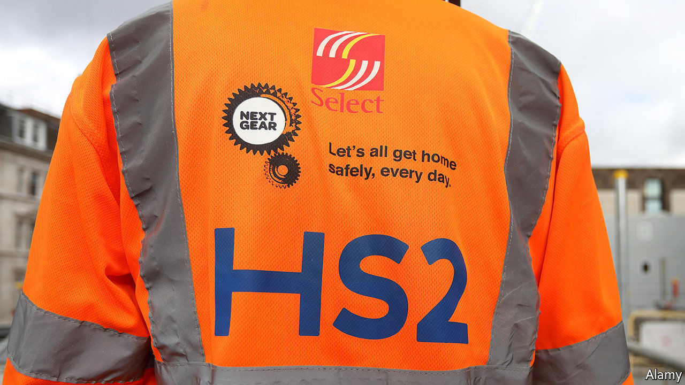

## High-speed rail

# Not just HS2, but HS3

> HS2 may be wildly over-budget, but it is safe, and its successor may get funded too

> Jan 9th 2020

THIS WEEK Boris Johnson urged his cabinet to slaughter “sacred cows”—big, expensive projects inherited from previous governments. By far the fattest of those legacy projects is HS2. The high-speed railway planned by Labour just over a decade ago between London and the north is behind schedule and way over budget. Dominic Cummings, the prime minister’s chief adviser, has called it a disaster zone. HS2 was slated to cost £50bn ($63bn); now the firm running the project puts its cost at £88bn.

It may get worse. Tony Berkeley, former deputy chairman of a review panel set up last summer and chaired by Douglas Oakervee, former chair of HS2, has turned against the review because, he says, it is biased toward the project. In a dissenting report published on January 5th he said that the final bill will be £108bn and it will generate just 60p of value for every pound spent.

But opposition to HS2 may be nearing the end of the line. Whatever the final cost, the project fits with Mr Johnson’s northern strategy. Those backing it know there is little chance of junking a shovel-ready project that will prove the Tories’ enthusiasm for the Midlands and the north. Some attacked Lord Berkeley. “We don’t much appreciate being told by a peer who divides his time between London and Cornwall, what the North wants,” said Richard Leese, leader of Manchester city council.

Mr Johnson says the priority is to try to reduce costs. The review panel is examining how that might be done. The high cost of land, poor governance and even the wrong type of soil have all contributed to overruns. A partial solution could be to reduce the role of the Department for Transport, which has little expertise in high-speed rail, and involve the private sector more, argues Henri Murison, director of the Northern Powerhouse Partnership, a lobby group chaired by George Osborne a former chancellor of the exchequer.

Even though the extra £38bn represents a big slice of the £100bn of additional infrastructure spending the government plans over five years, clawing back much of it looks unrealistic. Indeed, Mr Johnson may go for an even bigger splurge, by giving the go-ahead to Northern Powerhouse Rail (NPR), a high-speed line over the Pennines unofficially called “HS3”. Many rail experts argue that HS3 is the truly transformational scheme. The average speed by train between the north’s main cities is currently 46mph. NPR would raise that to 140mph.

“HS2 will be saved by integrating it with HS3,” says someone close to the Oakervee panel. With HS3 budgeted at £39bn, the total cost would soar well above £100bn. In order to have something on the ground by the next election, the government might both go for HS3 and prioritise HS2’s more northerly track upgrades. As with the trains themselves, speed will be of the essence.