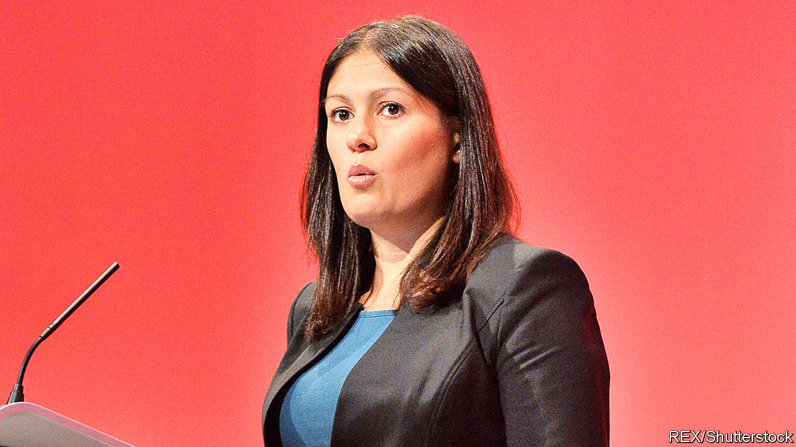

## The Labour leadership race

# Starmer, Long Bailey and the rest of the field

> Two candidates are in the lead but there’s all to play for

> Jan 9th 2020

LABOUR’S 1983 election manifesto was called “the longest suicide note in history”. Now Jeremy Corbyn is producing the longest death-rattle in history. On January 7th the party’s national executive committee decided the terms of the contest to replace him. The next leader will be announced on April 4th. Candidates must secure the support of 22 MPs or MEPs to get on the ballot. They then need nomination by at least 33 constituency parties or three affiliated organisations of which two must be trade unions. Only then does their name go to the membership in a deciding postal vote. While this process works itself out, Mr Corbyn is the party’s zombie leader and Britain has no serious opposition.

There are two front-runners in this slow race: Rebecca Long Bailey, the opposition business spokesman, and Sir Keir Starmer, the shadow Brexit secretary. Ms Long Bailey is a continuity candidate who thinks her party lost the election because it presented good policies badly. She has got off to a faltering start, rousing general mirth by calling the man who led his party to its worst defeat since 1935 a “visionary” who deserved a mark of “ten out of ten”. Her robotic delivery is already grating after only a week; her history as a suck-up who failed to criticise Mr Corbyn over anti-Semitism also dogs her. But as a self-proclaimed “proud socialist” she enjoys the support of party barons like Len McCluskey, head of the Unite trade union, and Jon Lansman, boss of Momentum.

Sir Keir is a europhile barrister who looks as if he’s wandered by mistake out of the Blair cabinet onto the Corbyn front bench. With 42 nominations, he is already well over the MPs’ threshold, and he has the backing of Unison, Britain’s biggest trade union. His support for Europe creates a bond with the rank-and-file. A YouGov poll gives him 36% of party members’ support against Ms Long Bailey’s 23%. He has even been sucking up to the left by praising Mr Corbyn’s policies on nationalisation and pointing out that he was named after a party founder, Keir Hardie. But left-wing activists suspect that he wants to yank the party back to the centre and pragmatists worry that a paid-up member of the metropolitan elite is not the person to win back northern working-class voters who have abandoned the party for the Tories.

Among the second-division candidates, Lisa Nandy gave the best performance in parliamentary hustings on January 7th. Ms Nandy, the quietly charismatic MP for Wigan, a run-down town that voted heavily for Brexit, has thought seriously about reviving left-behind towns. She long warned her party that it risked losing its northern heartland. Jess Phillips is running a spirited campaign armed with the slogan “speak truth, win power”. But her weakness for speaking without thinking may undermine her case, and she lacks a power base.

Emily Thornberry is doing badly given her profile as shadow foreign secretary and her fluency as a parliamentary performer. Her problems can be summed up in two phrases: Lady Nugee (her title as the wife of a high court judge) and Islington South (her constituency, whose location will make it hard for her to argue that she can help win back the north). Clive Lewis, a telegenic former soldier, is gaining little traction as few know what he stands for. At the time of writing, he had only two endorsements, including his own. Barry Gardiner, a Corbyn loyalist who is thinking of joining the race, looks unlikely to do much better.

Labour is also holding a separate election for deputy leader. Here, Angela Rayner, the party’s education spokesman, is storming ahead. Ms Rayner is more impressive than her flatmate, Ms Long Bailey, and refuses to bow down to the Stalinist clique that surrounds the departing leader.

Labour’s left wing is usually as good at stitching up its own party as it is bad at winning elections. In this case, however, it has made the potentially fatal mistake of backing a stooge in the form of Ms Long Bailey rather than a softer socialist who is honest enough to admit that, whatever Mr Corbyn deserves for his performance as leader, it is not full marks.■