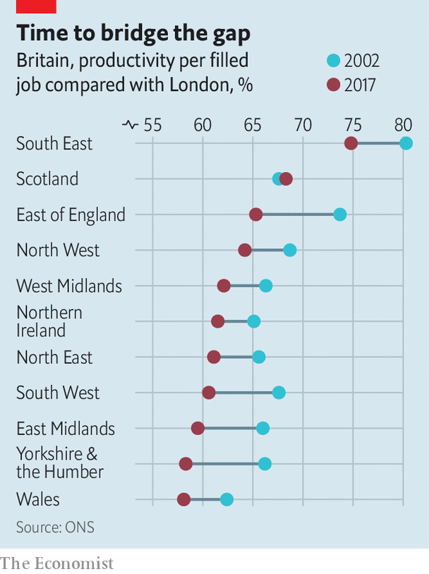

## Government spending

# The coming splurge on northern infrastructure

> The government’s plan to spend more money on infrastructure outside the south-east is right but risky

> Jan 9th 2020

THE WAIT for a train at Haxby in North Yorkshire has been a long one. The station closed in 1930. Over the past 20 years, as the town has grown and traffic has clogged up the roads around York, various schemes have been proposed to reopen it. One even got the go-ahead in 2009 only to be put on hold again a year later. But since the general election, there has been a growing belief that the train will finally arrive.

Farther north, the former coal mining towns of Ashington and Blyth lost their railway links in the 1960s. On January 6th Grant Shapps, the transport secretary, popped up in Blyth announcing “we will get this line reopened”. Blyth elected a Tory MP for the first time last month and in neighbouring Ashington, the Labour majority fell from over 10,000 to just 800.

The hard hat in which Sajid Javid, the chancellor, revealed the date of his budget—March 11th—and the location of his announcement—the new Trafford Park tram line project in Manchester—pointed to the economic consequences of Britain’s new political geography. Productivity differences across Britain are large and have grown (see chart). “Levelling up” will be a major theme in Mr Javid’s first budget, and his preferred policy lever will be spending on transport infrastructure.

Under the fiscal rules the Tories proposed to adopt during the election campaign, public-sector capital spending is due to rise from just over 2% of GDP to 3%. That amounts to around £20bn ($26bn) of additional spending per year, or £100bn over the five-year parliament, on new capital projects. The government rightly argues that cheap debt will finance the expansion without undermining its fiscal position.

Boris Johnson is determined to focus this spending on the north of England, Wales and the Midlands and is prepared to rewrite Treasury rules to ensure this. The current rules are governed by the “Green Book”, a guide to project appraisal designed to ensure that taxpayers get value for money. At the core of this approach is a traditional cost-benefit analysis (CBA) which the Book describes as “transparent, objective, evidence-based”. Transport schemes are assessed mainly on the basis of how they would cut existing journey times rather than on their potential to reshape economic activity. CBA tends to show higher returns in areas that already have high wages, where the time saved in shorter commutes is seen as more valuable; it assumes that projects do not change prices, wages or consumption.

A recent paper by Diane Coyle and Marianne Sensier that has caught the attention of Number 10 argues that using CBA tends to deepen, rather than alleviate, divergence between regions, because it underplays the potential of big projects to boost the economy of the areas that benefit from them. The authors instead argue for rules that take a more strategic approach, focusing more on what policymakers want the economy to look like in the future and less on how it currently appears. They get support from Andrew Adonis, a former transport secretary, who has argued that traditional CBA “doesn’t place a high enough premium on the significant transformational” potential of new lines and connections.

Transport for Greater Manchester is trying a more strategic approach: it decides what it wants the region’s economy to look like in 2040, and then uses CBA as a “sifting test” to throw out the proposals that fit with the strategic objective but look like a waste of money. Since this innovation happened only in 2014, it is too early to decide whether or not it is working.

Treasury insiders argue that the problem is not the economic analysis, but political decision-making. Transport projects related to London have a habit of getting approval ahead of others, even when the raw numbers suggest more value could be found outside of the capital. The most recent assessment of reopening Haxby station, for example, scored the benefit to cost ratio (BCR) at 3.0 and yet the scheme remains closed. By contrast, the extension of the Docklands Light rail to City Airport received a greenlight with a BCR of 1.7. A former Treasury official explains that ministers respond to pressure and that London-based businesses find it easiest to get heard. Chancellors are more likely to cross paths with a chief executive who wants a quicker journey from the airport to Canary Wharf than one troubled by congestion on the York ring-road.

The worry is that the coming attempt to redirect investment spending away from the south-east will reflect political rather than economic factors. Areas in the north that the Tories have recently won or are targeting will get lots of spending whilst other regions which lag London, such as the south-west and Scotland, will not. The Humber Bridge is a fine illustration of political infrastructure. It was announced during a by-election in Hull in 1966, and is credited with enabling Labour to retain its parliamentary majority of one and thus cling on to power for another six months. Thirty years after it opened, the Treasury wrote off half of the associated debt in order to cut tolls to encourage more traffic.

Critics of the current rules tend to argue that transport and infrastructure spending decisions should, wherever possible, be devolved to local authorities that understand local needs, industry and skills better than Whitehall does. But if politics is to drive spending, as seems likely, that’s not going to happen. The Conservative government will not want control over and credit for infrastructure spending to go to councils which, in poorer regions, are often Labour-controlled. Hard hats are not becoming headgear; but Britons will see many more of them on their politicians over the next few years.■

## URL

https://www.economist.com/britain/2020/01/09/the-coming-splurge-on-northern-infrastructure
