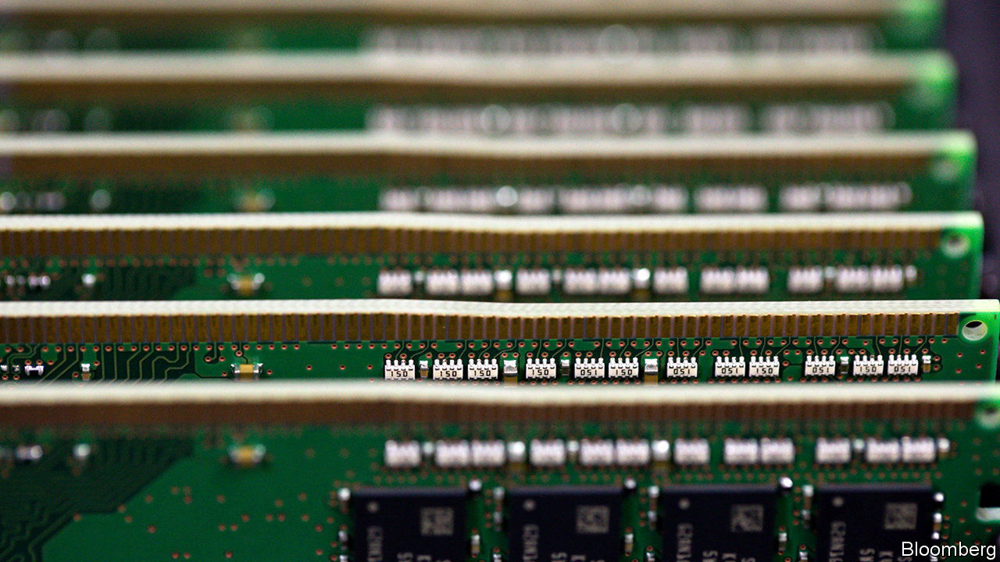
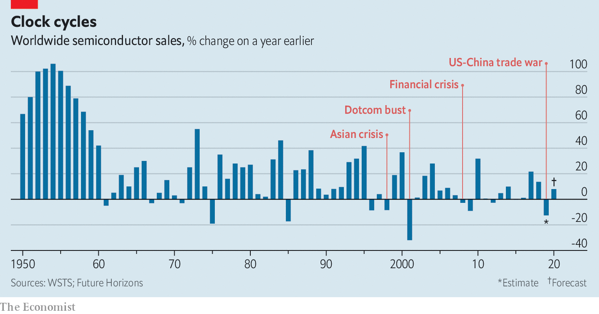

## Memory loss and gain

# A revival is under way in the chip business

> The high-tech industry is as cyclical as any commodity

> Jan 9th 2020

TO SEE JUST how fast microchips are eating the world, look at the Consumer Electronics Show (CES), an annual gadget-fest held in Las Vegas. This year’s event includes everything from ultra-high-definition televisions, “smart” light bulbs and powered exoskeletons to concept cars that can drive sideways and house robots designed to deliver toilet paper. Every one of these must-have consumer trinkets is a computer in disguise, with innards made from microprocessors, memory chips and circuit boards.

Yet the industry upon which all this is built has been having a torrid time of late. Future Horizons, a chip-industry analysis firm, reckons that global semiconductor sales shrank by about 12% in 2019, to $410bn. Samsung Electronics, a South Korean company that is the world’s biggest maker of memory chips, reported a 56% fall in quarterly operating profits in October, dragged down by the poor performance of its chip division. Entire economies have been feeling the pain. Semiconductors account for a fifth of South Korea’s exports, which have fallen for 12 months in a row, partly owing to the sector’s weakness.

Now the slump seems to be ending. On January 8th Samsung predicted another fall in quarterly profits. But it was smaller than expected. The firm’s share price rose. The price of memory chips is up. Shares in SK hynix, another South Korean chipmaker, have gained around 20% in the past month. Those of Micron, an American company, have done even better. Memory makes up about a third of semiconductor sales, and industry-watchers see it as a bellwether for the industry.

The nascent recovery reflects the nature of the chip business, where feast routinely follows famine. Despite its high-tech character, says Malcolm Penn, Future Horizons’s founder, the market for microchips is as cyclical as that for pork, soyabeans or other commodities (see chart). When times are good, chipmakers boost capacity, adding high-tech factories that are expensive to build but cheap to run. That helps supply catch up with demand. To recoup costs, chipmakers carry on producing regardless. Prices sag. When demand eventually catches up with the extra capacity, the cycle begins anew. Memory chips, which are interchangeable by design, are particularly prone to this periodicity.

The patterns are amplified or suppressed by what happens in the rest of the economy. The most recent bust, which began in 2018, was particularly deep, says Len Jenilek, a semiconductor analyst at IHS Markit. The memory market consists of two main types of memory, known as DRAM and flash. Their cycles do not always synchronise, but last year they did. The car industry, which has become a big consumer of chips, had its worst year in a decade. Other big buyers, particularly large data-centre operators like Google, Microsoft and Alibaba, cut back on purchases. The start of a tech-flavoured trade war between America and China did not help.

Whether the rebound will be correspondingly strong likewise depends on broader trends. Economic growth in China, a big importer of chips, is cooling. The bull run in America’s stockmarket is now the longest in history, spurring talk of a correction. American officials are working on a new round of trade restrictions that could rattle the industry.

But for those with strong nerves, chips look like a good long-term bet. Underlying the booms and busts is a growth in demand that, according to Mr Penn, has averaged 8% or so a year for 40 years. The industry’s products have become millions of times more powerful in that period, while the world has grown hungrier for computing power. Mr Jenilek cites 5G phone networks and chips customised for AI as two big new sources of demand. This week Las Vegas brimmed with both. ■