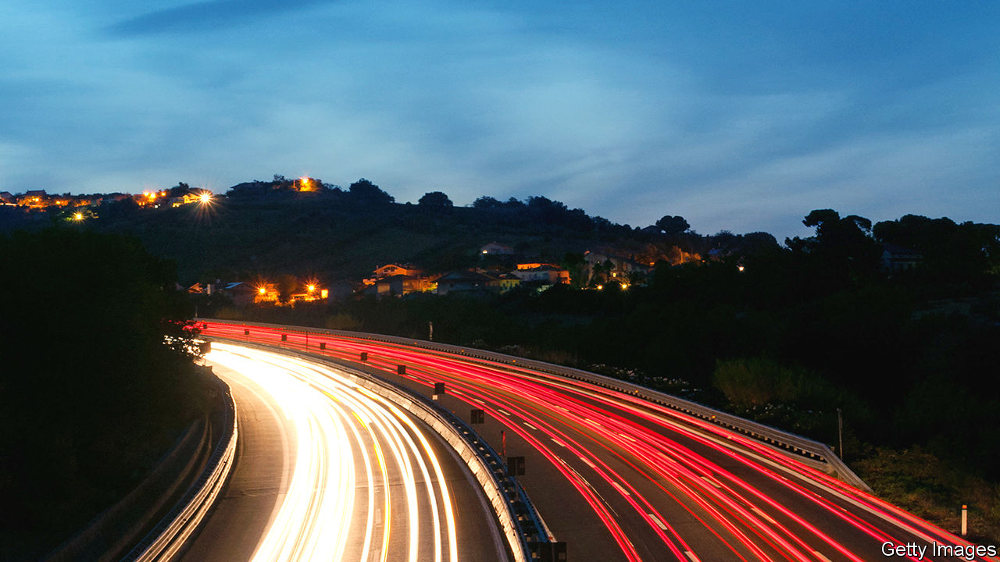

## End of the road?

# Autostrade risks losing its motorways

> Italy is going after its biggest operator of toll roads and bridges

> Jan 9th 2020

THE BENETTON family became one of the biggest stars of Italian business by building a global fashion brand best known for colourful knitwear and a feisty social conscience, promoted with bold adverts featuring dying AIDS patients and death-row inmates. From humble origins with a second-hand knitting machine in the 1960s, the four Benetton siblings, Luciano, Carlo, Gilberto and Giuliana, diversified the business in an unlikely direction. Fashion now accounts for only a small chunk of their multi-billion-euro fortune. Motorways and roadside grub earn the bulk of their earnings these days, thanks to a large shareholding in Atlantia, whose subsidiary runs toll roads and bridges, and control of Autogrill, respectively.

It is a route that has tarnished the Benettons’ starry image. The tragic collapse of the Morandi bridge killed 43 people in August 2018. The structure in Genoa was managed by Autostrade per l’Italia (ASPI), Atlantia’s road-and-bridge unit. Ever since, politicians have threatened to revoke ASPI’s motorway concession, which generates a third of Atlantia’s profits. The threat became concrete when Giuseppe Conte’s government passed a decree on December 31st which allows it to take away ASPI’s concession (set to expire in 2038) at any time and pay it much lower compensation. Parliament is likely to vote on the decree this month.

Mr Conte continued his assault on January 6th by accusing ASPI of “serious negligence”, before an investigation into the causes of the bridge collapse has concluded. This followed prosecutors’ claims that employees of SPEA, the firm supervising the safety of ASPI’s motorways, which is also owned by Atlantia, allegedly altered safety reports of bridges after the disaster to save maintenance costs. Italians have chipped in to knock Benetton: #boycottbenetton is trending on social media.

The relentless sniping has drawn a response. In a letter published on December 1st in La Repubblica, a newspaper, Luciano Benetton made clear that no member of his family has ever managed ASPI, and that the family owns only 30% of Atlantia, which controls it. He asked politicians, in particular Luigi di Maio, the foreign minister who leads the populist Five Star movement, to stop bashing his clan. “I’m not looking for leniency for Autostrade, mistakes must be paid for, but I find unacceptable the hate campaign against our family,” the patriarch wrote. Even if Italians lay off the Benettons that will not help ASPI out of a hole that threatens to sink Atlantia.

The Genoa tragedy caused a toll freeze. It could drive up maintenance costs, penalties and investment requirements for roads and bridges. Moody’s, a credit-rating agency, downgraded Atlantia’s debt by another notch on January 3rd, a month after stripping it of investment grade. The same day it downgraded ASPI’s debt to junk.

ASPI argues that it has consistently met its obligations, spending more on maintenance than it had originally committed to do. Its boss, Roberto Tomasi, warns that his firm, already wilting under debts of €10.5bn ($11.7bn), could go bust if compensation for a revoked contract is lowered significantly. The government decree would cut compensation to around €7bn, based on ASPI’s book value. ASPI claims that it is entitled to compensation for the net present value of its future cashflow, which analysts reckon could amount to €23.5bn.

The outcome of the standoff between the government and Italy’s biggest infrastructure company is unclear. Matteo Renzi, a former prime minister, has already said that his centre-left party, Italia Viva, will vote against the law change because “improvised” legislation will scare away international investors. The Five Star movement, which harbours the most punitive view of ASPI, is in a state of chaos.

How the vote will go is anyone’s guess. Observers suspect that the government will try to extract big payments from ASPI in return for leaving its licences, perhaps €4bn, plus a cut in tolls. This would hurt ASPI but not fatally, and relieve pressure on Atlantia. Its subsidiary could keep running motorways, albeit under supervision by third parties. Just as well for Italian motorists—Atlantia’s infrastructure vehicle cannot easily be replaced. ■

## URL

https://www.economist.com/business/2020/01/09/autostrade-risks-losing-its-motorways
