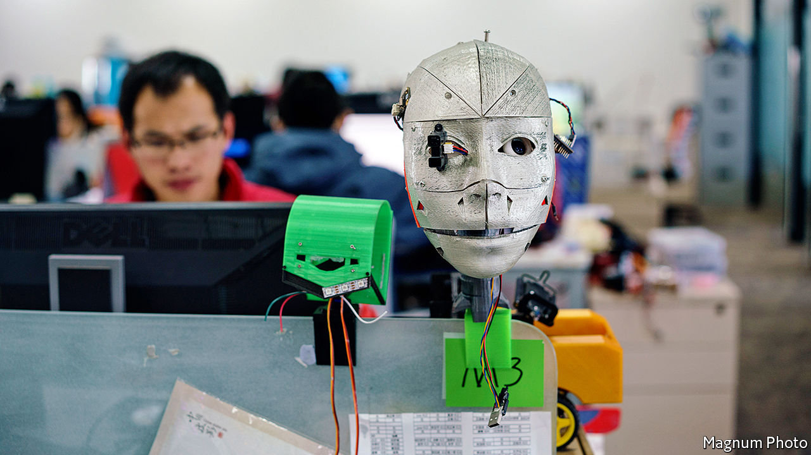
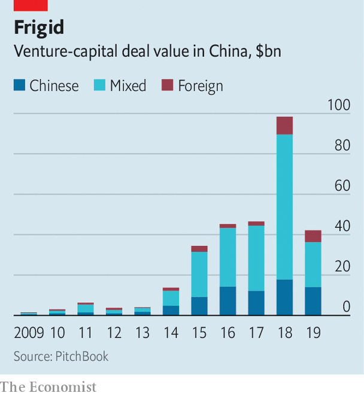

## Less where that came from

# Life is getting harder for foreign VCs in China

> They must contend with mature homegrown rivals and skittish American investors

> Jan 9th 2020SHANGHAI

THE FIRST “demo day” in Beijing last November of Y Combinator (YC) hosted two dozen local startups vying for the attention of high-profile investors. It marked the entrance into China of Silicon Valley’s most famous accelerator, which has helped launch the likes of Airbnb and Dropbox. Then, days later,YC abruptly announced it was pulling out of the country.

In a statement YC said that it was returning, under a new boss, to investing in startups from its Californian base. Its Chinese startups will be nurtured by MiraclePlus,YC China’s new, fully localised incarnation. Yet in the context of a deepening Sino-American rift, the retreat looks ominous. “Under the current global environment, to realise our mission—By China, For China, Of China—we must have the ability to master our own destiny,” wrote MiraclePlus in a social-media post, citing Lu Qi, its boss, whom YC had hired to set up its Chinese arm in 2018. (Mr Lu declined to be interviewed for this article.)

At first glance, YC’s fate seems at odds with the broader health of foreign venture capital (VC) in China, with its red-hot tech industry. The Chinese operations of Sand Hill Road heavyweights such as Lightspeed Venture Partners and Sequoia Capital—whose fifth Chinese growth-stage fund raised $1.8bn, twice as much as its last—are thriving. Chinese founders have coveted attention from foreign funds, seen as the best route to listing on American exchanges and keener than Chinese counterparts to back ideas that take longer to make money. Their dollar-denominated funds have durations of ten years or more, whereas yuan investors usually want a return in five. (Most foreign VCs now also raise yuan funds, which enable exits on mainland stockmarkets and investments in more industries.) Foreigners offer expertise on top of cheques, especially to startups keen to expand overseas.

For venture capitalists, China used to be a breeze, notes one based in Shanghai. “You were dealing with the entrepreneurs directly, not with the state. Partners could parachute in, do some deals and leave.” Zhou Wei, who worked for Kleiner Perkins, says that life was especially rosy in the “copy to China” years after the first firms arrived around 2005. But it remained pretty plush for longer. In 2018 China overtook America as the top country for VC returns (measured by current return on investment), according to eFront, a data firm. That year seven of the world’s ten largest VC deals involved Chinese startups. YC called China “an important missing piece of our puzzle” and dreamed of combining “the best of Silicon Valley and China”.

For many foreign firms the glory days are over. They must contend with homegrown rivals, a few thousand government-funded incubators doling out cash and free digs to budding entrepreneurs, and China’s internet giants, with their voracious appetite for dealmaking. In an interview with local media, Mr Lu recalled from his stint at YC that many Chinese entrepreneurs put themselves through tough interviews only to turn down foreign funds and go, with YC’s imprimatur, to deeper-pocketed Chinese investors. William Bao Bean, a Shanghai-based partner at SOSV, an American firm, says the kind of sums that the likes of YC help raise are “a rounding error” in the world’s most competitive VC market—even in the midst of a “capital winter” that has enveloped China in the past 18 months and caused activity in 2019 to sink to its lowest level in four years (see chart).

Poaching savvy Chinese partners has become harder, says Kuantai Yeh of Qiming Venture Partners, a big Chinese VC firm. The flow of talent may have reversed. In 2017 Mr Zhou and others left the ailing Chinese arm of Kleiner Perkins to form China Creation Ventures. The previous year the team at New Enterprise Associates peeled off to build Long Hill Capital. (New Enterprise now invests in Chinese startups from Silicon Valley.) And Chinese startups increasingly cater to idiosyncratic local tastes—good luck explaining the value of a “mobile karaoke social network” to the head office in California, says Mr Zhou. No wonder 19 of China’s 30 best-performing VC and private-equity firms in 2018 were local, according to Forbes, a magazine.

The recent funding downturn has a flipside. By squeezing smaller domestic rivals it may give an edge to giant cash-rich funds, including foreign ones. It is unclear they will seize the opportunity. China has become “kryptonite” in Silicon Valley, says Mr Bean. Silicon Dragon, a VC news tracker based in the valley, predicts that this year VC will flow into separate Chinese and American pots. Startups backed by cross-border investors are bracing for a cash crunch. One veteran venture capitalist at a firm with foreign roots says that American investors are asking their VC firms’ investment committees: “Do we need to invest in China?” For some, the answer will increasingly be “no”.■