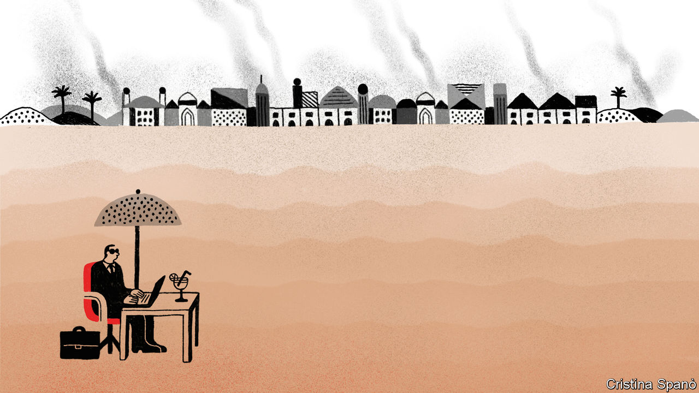
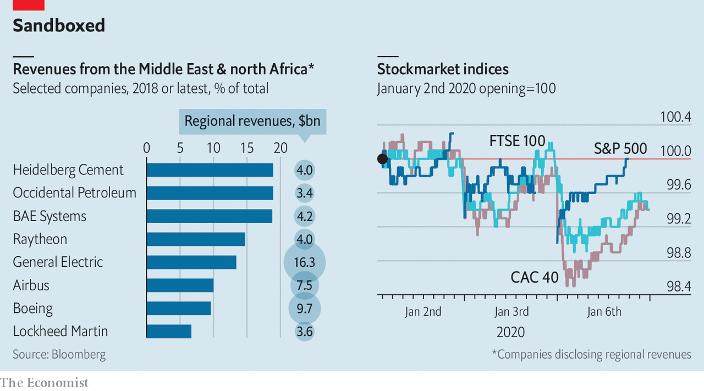

## A multinational desert

# Western firms have little to lose from a Middle Eastern war

> With the exception of a few highly exposed companies in a handful of industries

> Jan 9th 2020

THE MIDDLE EAST is not the world’s only powder keg. But it vexes Western strategists more than other volatile places. Western investors likewise pay it close attention. The world’s stockmarkets shuddered on January 3rd, after an American missile killed Qassem Suleimani, a top Iranian commander, in Iraq. They wobbled again this week, after Iran first threatened and then carried out an attack on American bases on Iraqi soil.

War anywhere is bad for business. A flare-up in the long conflict between the world’s biggest economy and a proud power in a region whose deep reserves of oil grease the wheels of global commerce creates enough uncertainty to make bosses the world over uneasy. The inevitable spike in the price of oil, which gained nearly 5% after the American strike, hurts companies like airlines which use a lot of the stuff. Countries in and around the Persian Gulf are a market of 230m consumers. Neighbouring Egypt and Turkey, often singed by regional conflagrations, add a further 181m.

Yet for all its apparent geopolitical significance, the Middle East is an afterthought in many Western corner offices. Save a few oases, notably in energy, aerospace and defence, the region looks like a multinational desert.

Decades of American sanctions mean no America Inc presence in Iran. Fearful of angering Washington, many European and Japanese firms have also steered clear. France’s PSA sold lots of Peugeots and Citroëns in Iran’s large market but pulled out of two joint ventures in 2018 to avoid American sanctions after President Donald Trump reimposed those lifted as part of a deal to curb Iran’s nuclear programme.

Even beyond Iran, the region scarcely registers on multinationals’ profit-and-loss statements. The Middle East and Africa accounted for 2.4% of listed American firms’ revenues in 2019, according to Morgan Stanley, a bank. For European and Japanese companies it was 4.9% and 1.8%, respectively. Middle Easterners still buy comparatively few of the world’s cars (2.3m out of 86m sold globally in 2018). Peddlers of luxury goods like Prada, an Italian fashion house, and L’Oréal, a French beauty giant, book 3% of sales in the Middle East (not counting sheikhs’ shopping trips to Milan or Paris).

The overall regional footprint of Western finance appears equally slight. At the end of 2018 big American banks had $18.5bn-worth of credit and trading activity in the region, equivalent to 0.2% of their assets. This includes JPMorgan Chase’s $5.3bn business in Saudi Arabia and Citigroup’s $9.6bn exposure to the United Arab Emirates (UAE). European banks have, if anything, been retreating. BNP Paribas of France sold its Egyptian business seven years ago and earned a footling €121m ($143m) in the Middle East in 2018. HSBC reports a substantial $58.5bn in Middle Eastern assets, though that is still a rounding error in the British lender’s $2.7trn balance-sheet. Chinese banks, conversely, have been expanding their operations in the Gulf—though from a much lower base. Last year Bank of China beefed up its presence in the UAE and on January 7th it won a licence to open a branch in Saudi Arabia, joining Industrial and Commercial Bank of China, there since 2015.

The biggest pocket of fertility in this parched corporate landscape—and so the most obvious casualty of any escalation—is the energy industry. Over the past century American and European oilmen have moved in and out of the region, as a result of sanctions, strife and governments’ shifting appetite for foreign partners.

In the short run a conflict-fuelled rise in the oil price could boost the profits of the West’s geographically diversified producers. In the longer term the picture looks hazier. Despite America’s shale boom many oil giants remain knee-deep in Arabian crude. In 2018 the Middle East and Africa accounted for a quarter of global production for Total, a French company. ExxonMobil has invested about $6.5bn (and counting) in a giant Emirati oilfield. By 2024 it hopes to produce 1m barrels of oil a day there, equivalent to about a quarter of its total oil and gas production in 2018. Service firms, which work for both supermajors and national oil companies, are disproportionately dependent on the Middle East. Halliburton’s contract with Saudi Aramco in 2018 was the biggest of its kind in the region, the firm said. Schlumberger also has lots of business there.

Iraq in particular has welcomed foreign capital as it strives to raise output after years of conflict. In 2009 BP and PetroChina won a contract to work with a state-owned Iraqi firm to increase output at the Rumaila field. It now produces 1.5m barrels a day, a third of Iraq’s total. ExxonMobil, Eni and Chevron have Iraqi projects, too. These are at risk if Washington slaps sanctions on Iraq, which it may do should its government expel American military forces in the wake of General Suleimani’s killing. Many companies are evacuating staff, fearing anti-American reprisals.

A few non-energy firms will also be eyeing the conflict warily. LafargeHolcim, a Franco-Swiss firm that is the world’s biggest cement-maker, has 44 plants in the region, which generated 11% of its revenues in 2018. Heidelberg Cement, a German rival which has also cashed in on the region’s construction boom, derives 19% of its sales from the Middle East and north Africa. GE sells machinery worth $16bn a year in the Middle East and its environs, 13% of the group’s total sales (see chart).

Boeing and Airbus, too, look vulnerable. Around 5% of the global airline fleet is operated by Gulf carriers. The continued expansion of Emirates, Etihad and Qatar Airways has made them important buyers of passenger jets in recent years. Airbus reckons that the region will take delivery of 8% of all new aircraft over the next 20 years—around 3,200 jets. Emirates is a launch customer for Boeing’s new 777X, expected to enter service this year, with orders for around 125, over a third of the current total. It has also ordered 30 787s and, from Airbus, 40 A330s and 30 A350s.

One other industry enjoys a large foreign presence in the region. Endless wars and oil-generated wealth conspire to make the Middle East the world’s second-largest export market for armsmakers after Asia-Pacific. As arms sales fell in every other region in the last decade, they nearly doubled in the Middle East, estimates SIPRI, a think-tank. Saudi Arabia alone splurged $68bn on weaponry in 2018. Bahrain, Kuwait, Oman, Qatar and the UAE are also enthusiastic buyers. The region received half of America’s exports in 2014-18 and is a large market for British, French and German defence firms, too. America’s Raytheon and Lockheed Martin, Britain’s BAE and France’s Dassault all saw their share prices rise as tensions mounted. If your business is war, war is good for business.■

## URL

https://www.economist.com/business/2020/01/09/western-firms-have-little-to-lose-from-a-middle-eastern-war
